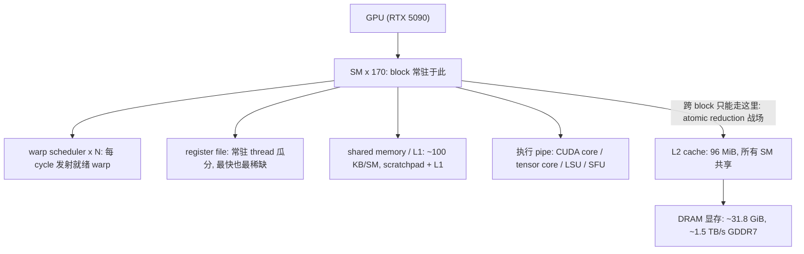
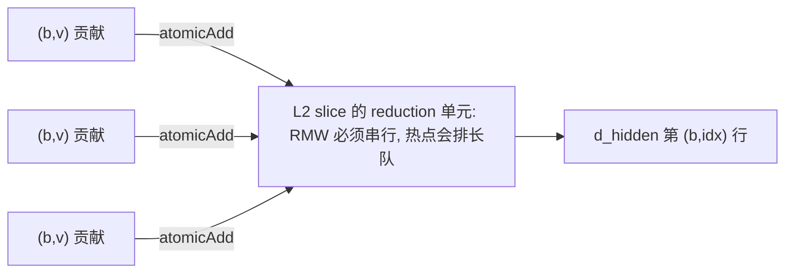
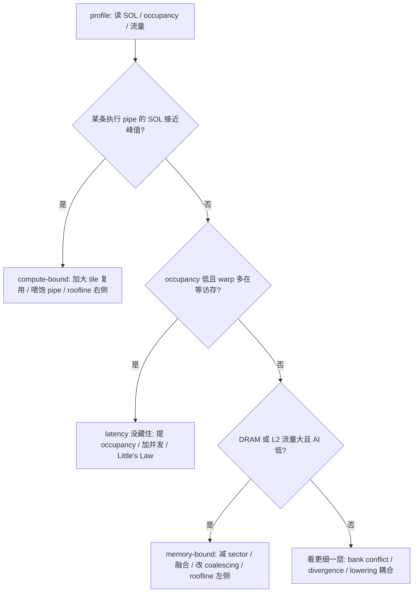
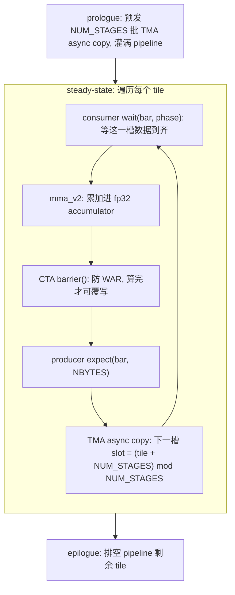
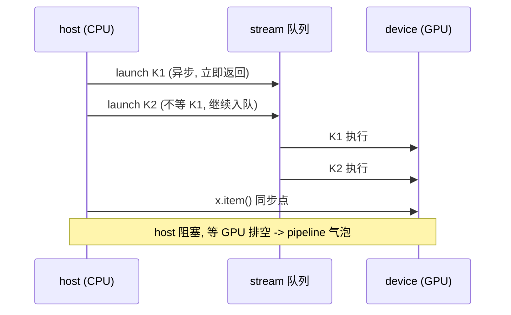
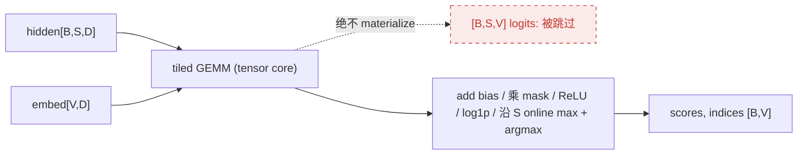
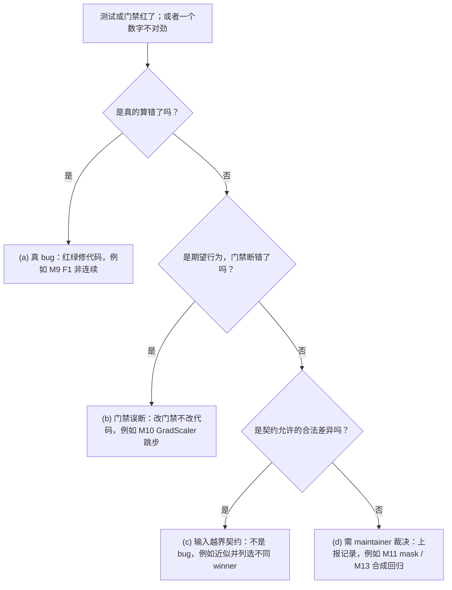

<!--
角色说明：本文是一篇“教学派生文档”（pedagogical derived artifact），不产生新的实验事实。
文中所有“本机实测”数字均引自本仓库 DEVELOPMENT.md / ARCHITECTURE.md 中记录在案的 runs of record，
并以 “DEVELOPMENT.md M11 §3” 这样的形式标注，方便读者回到原始证据核对，而不是只相信本文转述。

标注约定（全文统一，请务必区分两类数字）：
  • 【本机实测 · …】+ (DEVELOPMENT.md / ARCHITECTURE.md §…) —— 只属于这台 RTX 5090 / sm_120 机器的记录在案测量值；
  • [外部来源名] —— 引自公开文档、论文或博客的稳定基础概念与行业事实，不是 sparton 在本机上的测量值。
两类标记不可混用：带 [外部来源] 的数字描述的是硬件或算法层面的通用事实，不是本仓库在本机上的实测结果。

不要把本文当作仓库变更日志；它不能替代 ARCHITECTURE / DEVELOPMENT / METHODOLOGY 三份参考文档。
-->

# 从后端工程师到 GPU Kernel：一个稀疏检索头的优化全记录

> 副标题：**硬件 · 抽象 · 编译 · 方法 · 实战 —— RTX 5090 上的 sparton 案例**

这是一篇讲 GPU kernel 优化的长文，写给有一定后端或底层系统经验、但 GPU 经验不多的工程师。全文会不断用你熟悉的系统概念——cache、并发、lock contention、热点 key、capacity model——去类比 GPU 上的现象，并在每个类比后标出它的边界。

本文的目标很具体：**读完之后，你应该能独立完成一次和本文案例同等性质的 kernel 重构与优化**。这包括读懂硬件，读懂工具链，用一套可复用的方法（profile → 建模 → 原型 → 门禁 → 评审）把一个真实算子做快，并且知道什么时候**应该停手**。最后一章会给出一张可以照着执行的清单。

我们不讲空泛的“GPU 编程入门”。本文以真实项目 **sparton**——一个 SPLADE 风格的稀疏检索打分头——从 M5 到 M13 的优化历程贯穿始终：每一个设计决策、每一次取舍、每一段实现，甚至每一次**失败和回退**，都来自仓库中记录在案的工程证据。

---

## 这篇文章为什么值得读完

先把结果放在前面（细节、出处和测量制度都在正文展开；这里先建立直觉）：

| 里程碑 | 做了什么 | 结果（本机实测） | 出处 |
|---|---|---|---|
| **M10** | 把 Gluon 优化版前向提升为默认 backend | 前向 **−24%**（1.181 → 0.900 ms）；峰值额外显存 **9.86 MiB vs 140.50 MiB**（≈14×） | DEVELOPMENT.md M10 |
| **M11** | 用“排序 + segmented reduction”重写反向 | 反向 **−32%…−41%**；真实 query 记录上 L2 reduction sector **408.03M → 1.55M**（264×） | DEVELOPMENT.md M11 §1/§6 |
| **M12** | 原计划继续重写前向 | **一行 kernel 代码都没改，里程碑合法关闭**：首次 profile 证明前向已把 tensor pipe 顶到 92–94%，没有可优化的 scheduling slack | DEVELOPMENT.md M12 |
| **M13** | 把反向的 segmented kernel 拆成两个互补 kernel | 真实数据上再快 **1.46×…1.60×** | DEVELOPMENT.md M13 §1 |

最值得注意的是 **M12 那一行**。一个里程碑投入了完整的 profile、建模和决策流程，最后产出是一句有证据的“此路不通”，没有写一行 kernel 代码；这仍然被记录为一次**合法且有价值的交付**。一套能区分“做完了”和“只是放弃了”的方法论，比任何单个加速比都重要。这正是本文想交给你的东西。

> **一句话承诺**：数字不可移植。本文里的本机实测值只属于这一台机器（RTX 5090 / sm_120 / torch 2.12 / Triton 3.6）、这一个 shape、这一种数据分布。**可移植的是方法，以及一套“看见”GPU 的方式**。因此全文严格区分两类标记：**【本机实测 · …】**（附 `DEVELOPMENT.md / ARCHITECTURE.md §…` 出处）是这台机器记录在案的测量值，**不要外推**；**`[外部来源]`**（如 `[NVIDIA CUDA Best Practices]`、`[Triton Tensor Layouts]`、`[SPLADE, SIGIR'21]`）标的是公开文档或论文中的稳定基础事实，用来建立知识体系，**不是 sparton 在本机的测量结果**。看到哪一种标记，就知道这个数字“属于谁”。

---

## 目录与阅读路径

<a id="toc"></a>

- [第 0 章 引言：从结果倒推](#ch0)
- [第 1 章 GPU 不是更快的 CPU：硬件层级与执行模型](#ch1)
- [第 2 章 工具链：从 PyTorch op 到 SASS，抽象层级与编译 pipeline](#ch2)
- [第 3 章 案例工程：SpartonHead，一个从不 materialize logits 的稀疏检索头](#ch3)
- [第 4 章 方法论速览：性能优化循环与瓶颈分类](#ch4)
- [第 5 章 实战案例：M5→M13 的五场战役](#ch5)
- [第 6 章 GPU 性能优化方法论与技术（完整版）](#ch6)
- [第 7 章 收尾：什么叫“做完了”](#ch7)
- [附录 本仓库的环境坑（隔离区）](#appendix)

**两条阅读路径**：

- **初学者（线性）**：从第 1 章顺序读到第 7 章。第 1、2 章是地基，请不要跳过。
- **资深工程师（速读）**：`第 0 章 → 第 1 章 → 第 2 章 → 案例三（M11）→ 案例四（M12）→ 案例五（M13）→ 第 6 章 → 第 7 章清单`。案例一、二（naive→Gluon 前向、评审与门禁）相对轻，但每个案例开头都有“本案速览”四行；速读时先扫这个框，再决定是否深读。案例五会回指案例二“绿灯 ≠ 覆盖”的教训；案例一会给出 H100 上结论反转的硬件围栏。第 1、2 章即使赶时间，也建议至少扫一遍“类比总表”和“抽象层级映射表”——后面所有案例都建立在这两张表上。

---

<a id="ch0"></a>

# 第 0 章 引言：从结果倒推

GPU kernel 优化在很多人眼里像一门玄学：换个 tile 大小快了 10%，没人说得清为什么；换个写法慢了，也没人说得清为什么。本文要打破这种玄学。

我们的核心主张只有一句：**GPU 性能优化是一门“先命名瓶颈资源，再问什么层级的改动能动它”的可证伪工程**。它不靠灵感，靠的是三件事：

1. **看得见**：用对的仪器（profiler、IR dump）观测对的层级，知道每个数字属于哪个“测量制度”。
2. **算得出**：在写任何 kernel 之前，先写一个**可运行的解析流量模型**，给每个候选方案标价。
3. **验得了**：每个原型都先**逐格数值校验**再计时；每个结论都对着保存下来的 transcript 复核。

这三件事，后端工程师其实都不陌生。它们对应你做过的 load test、capacity model 和 A/B 实验纪律。区别在于：**GPU 上的“瓶颈资源（binder）”种类和你熟悉的不一样**。它不一定是 CPU，不一定是磁盘 IOPS，而可能是 tensor pipe、L2 reduction sector（sector = 访存的 32 字节粒度，第 1.5 / 1.8 节展开）、register 配额，或者编译器选定的 layout。所以本文前两章会花最大的篇幅，帮你建立这套“binder 词汇表”。词汇表建好之后，第 5 章的五个真实案例会一个接一个地证明：**同一个问题——“什么层级的改动能动这个 binder”——在 M11、M12、M13 上得到了三个完全不同的答案**。理解这三个答案，你就掌握了整套方法论的核心。

下面开始建地基。

---

<a id="ch1"></a>

# 第 1 章 GPU 不是更快的 CPU：硬件层级与执行模型

如果你带着 CPU 的直觉来写 GPU，几乎每一条直觉都会反过来坑你。CPU 的世界是：**少数几个很强的核**，每个核有 out-of-order execution、branch prediction 和很深的多级 cache，目标是把**单个线程的 latency** 压到最低。GPU 的世界恰好相反：**成千上万条很弱的执行 lane**，几乎没有乱序执行，cache 也浅，目标是用**海量并发**把**总 throughput** 顶到最高，并用“总有别的活可干”来 **hide（掩盖）** 单次 memory access 动辄数百 cycle 的 latency。

这一字之差（hide latency vs. minimize latency）是本章乃至全文所有性能直觉的根：

> **CPU 用大 cache 去“消灭”延迟；GPU 用海量在飞的并发去“掩盖”延迟。** CPU 把晶体管预算花在“让单个 thread 跑得快”（乱序、预测、大 cache）；GPU 把同样的预算花在“同时让上万条 lane 有活干”。所以 GPU 的单条 lane 很笨——没有 out-of-order，branch 处理很贵——但它靠**数量**和**零开销的硬件调度**赢回来。latency-oriented 的设计和 throughput-oriented 的设计，是两套完全不同的世界观。

这一章会把 GPU 的两套层级——**硬件层级（hardware hierarchy）**和**执行/编程层级（execution hierarchy）**——以及它们之间的**映射关系**讲清楚。这两套层级和它们的对应关系，是后面一切内容的地基。本章所有具体平台数字都来自本仓库的验证平台（ARCHITECTURE.md §2.1）：

> 【本机实测 · RTX 5090 / sm_120】NVIDIA GeForce RTX 5090，compute capability `(12, 0)`（即 sm_120），**170 个 SM**；warp size 32；每 block 最多 1024 thread；**每 SM 最多 1536 thread（= 48 个 warp）**；shared memory 默认 49152 B/block，可选（opt-in）101376 B/block，102400 B/SM；显存约 31.8 GiB；**L2 cache 96 MiB**（ARCHITECTURE.md §2.1）。

## 1.1 先看硬件：一块 GPU 是怎么堆出来的

自顶向下，硬件是一层层套起来的：

- **GPU（整块卡）**：本机是一块 RTX 5090。它内部由许多个 **SM（Streaming Multiprocessor）** 组成——本机有 **170 个**。SM 是 GPU 的“核”，但和 CPU 的核不是同一种东西：它不追求单线程快，而是一台“能同时养着几十个 warp 的吞吐机器”。
- **SM 内部**的关键部件：
  - **warp scheduler**：每个 cycle 从“就绪（ready）”的 warp 里挑一个，发射（issue）它的下一条指令。一个 SM 通常有多个 warp scheduler（各管一批 warp），所以一个 SM 每 cycle 能发射多条指令。**调度的颗粒是 warp，不是 thread。** 还要记住一条性质：scheduler 每个 cycle 可以从**不同的就绪 warp**里挑指令发射——上一拍发 warp A，这一拍可以换 warp B，几乎没有切换成本，因为所有常驻 warp 的 register 和 PC 始终留在 SM 上，从不换出。这就是 1.7 节“用并发掩盖延迟”的硬件本钱。
  - **register file**：一大块 register（以本代约 64K 个 32-bit register/SM 为典型量级 `[NVIDIA CUDA C Programming Guide]`），**在常驻这个 SM 的所有 thread 之间瓜分**。它是 GPU 上最快、也最稀缺的资源之一；1.6 节会看到它如何直接决定 occupancy。
  - **shared memory / L1**：一块片上高速存储（本机约 100 KB/SM），物理上是同一块 SRAM，既能当程序员**手动管理的便笺本（scratchpad）**用（shared memory），也能当**硬件 L1 cache** 用。这是 CPU 没有的一层：一块你能显式控制内容的“cache”。
  - **执行单元（execution units / pipes）**：做标量浮点/整数的 **CUDA core**；做小矩阵乘加的 **tensor core**（深度学习算力主力）；以及 **LSU**（load/store unit，访存）和 **SFU**（special function unit，做 `exp`/`log`/`rsqrt` 等超越函数）。注意 tensor core 和 CUDA core 是**两条独立的 pipe**：一个吃满，不代表另一个也吃满；案例四会用到这一点。
- **片外（off-chip，所有 SM 共享）**：一块 **L2 cache**（本机 96 MiB）和一大块 **DRAM**（显存，本机约 31.8 GiB，物理上是 GDDR7）。**L2 是所有 SM 之间唯一的“共享中转层”**。跨 block 的数据交换、atomic reduction 都会在这里相遇；它就是反向 kernel 的核心战场（案例三）。

把一个 SM 想成**资源出厂就焊死**的吞吐机器，后面的调度直觉会简单很多。SM 上有四样东西的总量是固定的：**warp 槽位**（本机 48，ARCHITECTURE.md §2.1）、**register file**、**shared memory**，以及各条执行 pipe 的吞吐。你启动的每个 block 进驻某个 SM 时，都要从这四样里**各切走一块**。一个 SM 能同时塞下几个 block，本质上是一道**装箱问题**：四样里谁先被切光，谁就是上限。这道装箱题就是 1.6 节的 occupancy；它最常见的两个瓶颈（register 与 shared memory）正是上面两条 bullet 的主角。先把“四样固定资源”这个框记住，occupancy、divergence、latency hiding 都会从它自然长出来。



一个值得记住的**规模感**：170 个 SM × 48 warp/SM × 32 lane/warp ≈ **26 万条** lane 可以同时“在册”。GPU 的全部设计哲学，就是怎么让这 26 万条笨 lane 不闲着，而不是让某一条跑得飞快。下一节先讲这些 lane 是怎么被组织、又如何被锁在一起执行的。

## 1.2 SIMT：32 条 lane 的锁步，与 divergence 这个独有陷阱

GPU 的执行模型叫 **SIMT（Single Instruction, Multiple Threads）**。它介于 CPU 的 SIMD 和多线程之间：你**像写标量 thread 一样**写 kernel（每条 lane 有自己的 index、自己的私有 register），但硬件**以 warp 为单位**发射指令。一个 warp 的 32 条 lane，在一次 issue 里执行**同一条**指令，只是各自作用在不同的数据上。

把三种模型摆在一条谱上，SIMT 的位置就清楚了。**SIMD**（如 CPU 的 AVX）是单指令流，程序员要**显式**把数据塞进向量 lane，亲手对齐宽度；**SMT / 多线程**是多条**彼此独立**的指令流；**SIMT** 卡在中间——你写的是标量的 per-lane 代码（编程模型像多线程），硬件却把 32 条 lane 绑成一个 warp 锁步执行（执行模型像 SIMD）。这道“**编程模型 ≠ 执行模型**”的缝，是 divergence、coalescing、layout 这些坑的共同源头：你以为自己在指挥 32 个独立 thread，硬件其实在跑一条作用于 32 路数据的指令。本章后面每一个“反直觉”，都能追回到这条缝。

这带来一个 CPU 完全没有的性能陷阱：**warp divergence（分支分歧）**。

| 场景（一个 warp 遇到 `if (x > 0)`） | warp 内 lane 的活跃情况 | 执行方式 | 有效吞吐 |
|---|---|---|---|
| **无 divergence**（32 lane 同走一支） | 全部活跃 | 1 次发射执行该支 | 满吞吐 |
| **有 divergence**（一半走 if，一半走 else） | 执行 if 支时，走 else 的 lane 被 mask；执行 else 支时反之 | 两支**串行**执行（逐支执行，不走当前支的 lane 被 masked） | 对半砍（按分支数稀释） |

机制是这样的：warp 里的所有 lane 共享指令流，遇到分支时，硬件会**逐支执行**。执行某一支时，不走这一支的 lane 被 **mask（掩蔽）** 成不活跃——它们占着 cycle，却不产出有效工作。两支都走过一遍，才汇合（reconverge）。**所以 warp 内的分支不是“分头跑”，而是“轮流跑、互相等”**，代价是把吞吐按分支数稀释。

写成一个粗略的代价模型：一个 warp 若分裂成 k 条互不相同的路径，硬件要逐条串行走完，有效吞吐大约掉到

$$T_{\text{eff}}\approx \frac{T_{\text{peak}}}{k}$$

其中 k 是这个 warp 实际走过的不同路径数（最坏是 32，即 32 条 lane 各走各的）。务必把它和 CPU 的 branch misprediction 分开：CPU 罚的是一次“猜错”带来的流水线冲刷（十几个 cycle，且只在猜错时发生）；GPU 罚的是**两条路都得走一遍**的结构性串行，与猜得准不准无关。所以 GPU 上没有“分支预测器”可以依赖，能省的只有“别让一个 warp 内分叉”。

两个必须知道的细化点（都会在案例五出现）：

- **Predication（谓词化）**：对很短的分支，编译器常常不真用 branch，而是**两支都算，再按谓词选结果**（类似 `result = cond ? a : b` 编译成无分支的 select）。它避免了控制流 divergence，但付出了冗余计算。**把抑制逻辑塞进 load 的 `mask` 参数，而不是写成 `if`，正是利用这一点**。案例五里 M13 用 per-row mask 替代分支，既避免 divergence，又**不破坏 load 的 vector width**（为什么分支会破坏 vector width，留到第 2 章讲 layout）。
- **Volta+ 的 independent thread scheduling**：sm_70 之后，每条 thread 有自己的 PC 和调用栈，reconvergence 更灵活，还能在 warp 内做生产者-消费者同步 `[NVIDIA CUDA C Programming Guide]`。**但它没有让 divergence 变免费**——分歧路径仍然要串行执行。把 sm_70 这条分界线列清楚 `[NVIDIA CUDA C Programming Guide]`：

| 维度 | pre-Volta（≤ sm_6x） | Volta+（sm_70+，ITS） |
|---|---|---|
| PC（程序计数器） | 每 warp 一个 | 每 thread 一个 |
| 调用栈 | 整个 warp 共用一个 | 每 thread 独立 |
| reconvergence（重新汇合） | 编译器钉死的固定汇合点 | warp 内可更细地交错、按需汇合 |
| warp 内做生产者-消费者同步 | 做不了 | 能（配 `__syncwarp()` 维持 lane 间显式同步） |
| divergence 还要不要串行 | 要 | 仍然要 |

最后一行是重点：ITS 让 warp 内控制流**更灵活、更安全**（不会因为编译器假设锁步而死锁），但它**没有**改变“分歧路径串行执行”这个吞吐代价。把“更灵活”和“免费”混为一谈，是读 ITS 时最常见的误解。

> **类比与边界**：warp ≈ “32 个必须步调一致的 worker，共用一条指令带”。**边界**：CPU 线程可以各自独立分支、独立前进；warp 里的 32 条 lane 不行，分歧就轮流跑。写 kernel 时，**让一个 warp 内的 lane 尽量走同一条路、读相邻的地址**，是两条最基本的纪律；后者就是下面要讲的 coalescing。

锁步也有红利：**warp 内的 32 条 lane 可以不经过 shared memory，直接交换数据**，靠的是 **warp-level primitives**（warp 级原语）`[NVIDIA CUDA C Programming Guide]`：`__shfl_sync`（lane 之间直接读对方 register）、`__ballot_sync`（把每条 lane 的谓词收集成一个 32-bit mask）、`__reduce_*_sync`（warp 内一步求和或取最值）。一次 warp 内归约因此可以是一棵 `log₂32 = 5` 层的 **shuffle tree**，全程走 register，不碰 shared，也不需要 barrier。你会在 SASS 里看到它们的真身：`SHFL`（shuffle）、`VOTE`（ballot）、`REDUX`（warp-level reduce）。

那棵 shuffle tree 就是这样折半 5 次：每一步用 `__shfl_down_sync` 把后半段搬给前半段相加，全程在 register 里完成，不碰 shared、不设 barrier `[NVIDIA: Using CUDA Warp-Level Primitives]`。

| 步 | 操作（`__shfl_down_sync`） | 之后还活跃的 lane |
|---|---|---|
| 0 | 32 lane 各持一个值 | 32 |
| 1 | 偏移 16，前半段加上后半段 | 16 |
| 2 | 偏移 8 | 8 |
| 3 | 偏移 4 | 4 |
| 4 | 偏移 2 | 2 |
| 5 | 偏移 1，全 warp 的和落在 lane 0 | 1 |

记住这个折半结构：**warp 内归约是 5 层 register 操作，warp 间归约才需要 shared / atomic**。两级归约（warp 内 shuffle、warp 间 shared）是几乎所有高效 reduction kernel 的骨架；sparton 的前向 max 和反向 sum 都按这个骨架搭。

这对 reduction 密集的算子（sparton 沿 `S` 取 max，反向沿 run 求和）很关键：**一个高效的归约，通常是“warp 内用 shuffle，warp 间才用 shared/atomic”的两级结构**。案例五里那个 `tl.cumsum` 之所以贵，一部分原因就是它降成了一长串 `SHFL` 链（`tt.scan` + SHFL tree）。shuffle 不是免费的，5 层就是 5 层的依赖延迟。

## 1.3 执行层级，以及它到硬件的映射（本章最关键的关系）

当你启动一个 kernel（GPU 上的一个并行函数）时，你是在描述一套**执行层级（execution hierarchy）**。它自顶向下是：

- **grid**：一次 kernel launch 的全部工作。启动时你指定 grid 的形状（比如“一维 4096 个 block”）。grid 不常驻硬件，它只是“这一轮要干的全部活”的清单。
- **block（也叫 CTA，Cooperative Thread Array）**：grid 被切成许多 block。**一个 block 会被整体调度到某一个 SM 上常驻，绝不跨 SM 拆分**，而且一旦上了某个 SM，就会在那里跑到结束（non-preemptive）。一个 block 内的 thread 能通过 shared memory 互相通信，也能用 `__syncthreads()` 这样的 barrier 同步。**“能协作”止于 block 边界**——这是 GPU 编程最硬的一条物理约束。
- **warp**：block 内的 thread **每 32 个**打包成一个 warp，是上一节说的 SIMT 锁步单位，也是 **scheduler 调度的最小单位**。
- **thread / lane**：最小执行单位，就是 warp 里的一条 lane，拥有自己的私有 register。

把两套层级对起来，就是本章最该记住的一张映射表。它是后面**所有** API 抽象（第 2 章）的锚点：

| 执行/编程层级 | 映射到的硬件层级 |
|---|---|
| grid（一次 launch） | 整块 GPU 的一轮工作（不常驻硬件） |
| block / CTA | 常驻于**某一个** SM，跑到结束（non-preemptive） |
| warp（32 lane，SIMT 锁步） | 由 SM 的某个 warp scheduler 发射 |
| thread / lane | 一条执行 lane + 私有 register |

“一个 block 钉死在一个 SM 上”这条，推出了本章后面几乎所有结论：block 内可以用快的 shared memory 协作；block 之间只能走慢得多的 L2/DRAM，而且通常还要用 atomics 或拆多个 kernel；一个 block 用多少 register/shared，决定了一个 SM 能同时容纳几个 block（occupancy）；block 之间没有顺序保证，谁先谁后由硬件调度。由此还会推出一条贯穿反向案例的推论：GPU 没有“全 grid barrier”这种东西。想让所有 block 都算完，再统一进入下一阶段，唯一可移植的办法是**结束当前 kernel，再启动一个新 kernel**。kernel 边界就是事实上的 grid 级同步点。复杂算子（典型如反向）天然要拆成一串 kernel，物理原因就在这里：每一道 kernel 边界都买来一次“全员到齐”。案例三里那个 “prep kernel → sort → 归约 kernel” 的三段式，本质上就是用两道 kernel 边界换两次全局同步。

> **类比与边界**：把 block 想成“被钉死在某台机器上、跑到结束才下线的一个工作单元”，warp 想成“32 个共用指令带的 worker”。**边界**：这台“机器”（SM）能同时跑几个这样的工作单元，不由你指定，而由它们各自吃掉多少 register/shared 算出来——这就是下面要讲的 occupancy。

## 1.4 内存层级与 scope：level 和“谁能看见”是对应的

GPU 的内存是一个严格的层级，**每一层的可见范围（scope）恰好对应执行层级的一层**。这个 level ↔ scope 的对应，是 GPU 内存模型的精髓。把它和上一节的执行层级并排记：

| 内存层级 | 容量 | 带宽（本机） | scope（谁能看见） | 对应执行层级 | 后端类比 |
|---|---|---|---|---|---|
| **register** | ~KB / thread | 近乎免费（operand 级） | **thread 私有** | thread | register / thread-local |
| **shared memory / L1** | ~100 KB / SM | 片上，远高于 L2 | **block 内共享** | block | NUMA-local 内存 / 核内 scratchpad |
| **L2 cache** | 96 MiB | ~6.6 TB/s | **全设备（global）** | grid | 跨核共享的 last-level cache |
| **DRAM（显存）** | ~31.8 GiB | ~1.5 TB/s | **全设备（global）** | grid | 主存 |

> 【本机实测 · RTX 5090 / sm_120】L2 ~6.6 TB/s、DRAM ~1.5 TB/s 是 M12 测得的可达 fabric 速率（89–91% busy 下），固化在 `scripts/m13_traffic_model.py` 的 `L2_ACHIEVABLE = 6.6e12` / `DRAM_ACHIEVABLE = 1.5e12`（DEVELOPMENT.md M12 §4）。作为对比，主机 DDR 大约 100 GB/s：GPU 的 DRAM 比它快一个数量级，L2 又比 DRAM 快约 4–5 倍。

带宽是“每秒搬多少字节”，另一个维度是**延迟**——“一次访问要等多少 cycle”。把每层的延迟量级和生命周期并排记（数量级，非本机实测，随架构浮动）`[Modal GPU Glossary]`：

| 内存层级 | 谁的生命周期 | 访问延迟量级（cycle） |
|---|---|---|
| register | thread（warp 退出即消失） | ~0，operand 直接进指令 |
| shared memory | block（block 一退出就回收） | 几十 |
| L2 cache | grid / 设备 | 几百 |
| DRAM（显存） | grid / 设备（跨 kernel 持久） | 几百到上千 |

这张表给出两条设计纪律。第一，**把要复用的数据从 DRAM 搬进 shared**，就是把几百 cycle 的访问换成几十 cycle；这就是 tiling / staging 的全部动机（1.9 节与案例一）。第二，**延迟要么省，要么藏**：省不掉的那几百 cycle DRAM 延迟，只能靠“手上还有别的就绪 warp 可发射”去藏；occupancy 的存在理由（1.7 节）正在于此。带宽决定你能不能喂饱 pipe，延迟决定你要养多少 warp 才不空转。这两笔账要分开算。

记住这条对应关系：**register ↔ thread，shared ↔ block，global（L2/DRAM）↔ grid**。它直接给出两条工程纪律：**想让 block 内的 lane 协作，用 shared memory（快，但出了 block 就看不见）；想让不同 block 交换数据，只能走 L2/DRAM（慢，而且要用 atomics 或拆多个 kernel）。** 反向 kernel 要把成千上万个 `(b,v)` 的贡献汇聚到同一行——这是跨 block 协作，所以它**注定**要落到 L2 上；案例三的全部战斗就在这一层。

## 1.5 Sector 与 coalescing：GPU 访存的最小颗粒，也是反向 kernel 的命门

有一个访问粒度必须刻进脑子：**GPU 访问 global memory 不是按字节，而是按 sector = 32 字节成批搬运**（一条 cache line = 128 字节 = 4 个连续 sector）。从 Pascal（sm_6.x）起，L1 对 global load 就以 **32 字节**为粒度服务 `[NVIDIA CUDA Best Practices Guide]`。这意味着：**你读 4 个字节，硬件至少搬 32 个字节。** 一个 warp 一次 load 的代价，不是“32 条 lane 读了多少字节”，而是“这次 load 一共**触碰了几个 sector**”。

这就引出 GPU 访存的头号纪律：**coalescing（访存合并）**。看同一个 warp 的三种访问模式：

| 一个 warp（32 lane）各读一个 fp32（4 B） | coalesced（相邻、对齐） | 相邻但首地址偏 4 B | scattered（按乱序 index gather） |
|---|---|---|---|
| 32 lane 的地址 | $0,4,8,\dots,124$（连续 128 B） | $4,8,\dots,128$（仍连续 128 B，但跨了 sector 边界） | 落在 32 个不同 sector 里 |
| 触碰 sector 数 | 4 个（128 B） | 5 个（160 B） | 最多 32 个（1024 B） |
| 有效 / 搬运字节 | $128/128 = 100\%$ | $128/160 = 80\%$ | $128/1024 \approx 12.5\%$ |
| 结论 | 满带宽 | 只因没对齐就白搬 20% | 同样的有效数据，多搬 **8×** 流量 |

左边：32 条 lane 读连续且对齐的 128 字节，硬件合并成 **4 个完整 sector**，每个字节都用上，带宽利用率约 100%。右边：按一个乱序 index 去 gather，32 条 lane 落在 32 个**不同的** sector 里，硬件被迫搬 **32 个 sector = 1024 字节，却只用了 128 字节**——多搬了 **8×** 的流量，带宽利用率掉到约 12.5% `[NVIDIA: How to Access Global Memory Efficiently]`。中间那列最容易被忽视：访问明明连续，只因首地址没落在 32 字节边界上，就多触一个 sector，白搬 20% 流量。`cudaMalloc` 返回的指针至少 256 字节对齐，所以这种“非对齐”通常来自你自己的 index 偏移或结构体内偏移。这也是 2.4 节 TMA 描述符强制 16 字节对齐的同源道理：让硬件的批量搬运尽量落在整 sector 边界上。

**sparton 反向的命门就在这里**：它要按前向 argmax 选出的 index 去 gather `hidden[b, idx, :]` 这一行——这是一个天然 scattered 的访问。怎么把这次 gather 从“标量级、扇区浪费”救回“宽 load、扇区打满”，是案例五（M13）的全部技术内容；而“成千上万个贡献砸向同一个目的 sector”导致的 L2 拥塞，是案例三（M11）的全部内容。两个旗舰案例，根都在这一节的 sector 上。

> **类比与边界**：coalescing 就是后端里的“把随机小 IO 攒成顺序大 IO”。**边界**：这里没有软件批处理层；合并是硬件**按 warp 当场**做的。你唯一能影响它的手段，是**让相邻 lane 访问相邻地址**。而“相邻 lane 访问哪个地址”由 tensor 的 **layout**（哪一维连续、由谁认领）决定。因此 coalescing 在第 2 章会变成一个 layout 问题，在案例五会变成一个被编译器**反向锚定**的 layout 问题。

**Coalescing 管 global memory；shared memory 有一条孪生纪律：bank conflict。** shared memory 在硬件上被切成 **32 个 bank**（恰好对应一个 warp 的 32 条 lane），每个 bank 4 字节宽，地址按 bank 交错排布（word 0 在 bank 0，word 1 在 bank 1……word 32 又回到 bank 0）。写成公式就是 $\text{bank}=(\text{addr}/4)\bmod 32$（addr 为字节地址，每 word 4 字节）。规则 `[NVIDIA CUDA C Programming Guide]`：

| 一个 warp 访问 shared memory 的模式 | 结果 |
|---|---|
| 32 lane 命中 32 个**不同** bank | 1 个 transaction（满速） |
| 32 lane 全读**同一地址**（broadcast） | 1 个 transaction |
| $k$ 条 lane 撞进**同一个 bank 的不同地址** | $k$-way conflict，串行成 $k$ 个 transaction |

典型踩坑：把数据按 `shared[lane][k]` 以 32 列存放，列访问时所有 lane 撞同一个 bank（32-way conflict，慢 32×）。经典解法是 **padding**（存成 33 列，`shared[N][33]`）：32 列时，同一列的相邻行隔 32 个 word，而 $32\bmod 32 = 0$，于是 32 条 lane 全压在同一个 bank 上；把行宽改成 33 后，相邻行隔 33 个 word，$33\bmod 32 = 1$，32 条 lane 正好散到 32 个不同 bank，冲突消失。另一招是 **swizzle**（用位运算重排 shared 地址，把访问打散到不同 bank）。**Gluon 的 `NVMMASharedLayout` / swizzle 做的就是这件事**：案例一的前向用它把 embed tile staging 进 shared，同时避免 bank conflict。

> **类比与边界**：bank conflict 像后端里的“多个请求 hash 到同一个 shard，被迫排队”。**边界**：这里的“shard”是固定的 32 个 bank，由地址低位决定；你不能增加 shard，只能**改数据摆放**（padding / swizzle）让访问散开。还有一条铁律（METHODOLOGY.md §B5.2）：**bank conflict 要用 profiler 量，别从代码形状猜**。编译器的 swizzle 常常和你脑补的不一样。

## 1.6 Occupancy：一个“配额”关系，不是一个旋钮

**Occupancy = 一个 SM 上实际常驻的 warp 数 / 该 SM 能容纳的最大 warp 数。** 本机每 SM 最多 1536 thread = **48 个 warp**，这是分母，固定不变。

分子由什么决定？由 **resource quota（资源配额）**决定。每个 SM 的两样东西是有限且固定的：**register file** 和 **shared memory**（约 100 KB）。一个 block 想常驻，要占用 `每 thread register 数 × thread 数` 的 register，外加它声明的 shared memory。**一个 SM 能同时塞下几个 block，取决于哪样资源先用完**——register、shared、或 warp 数上限，三个 ceiling 取最紧的那个。写成公式，一个 SM 能并存的 block 数是三道天花板的最小值，occupancy 再由它换算：

$$\text{blocks/SM} = \min\!\left(\left\lfloor\frac{R_{\text{file}}}{R\cdot T}\right\rfloor,\ \left\lfloor\frac{S_{\text{SM}}}{S_{\text{blk}}}\right\rfloor,\ \left\lfloor\frac{W_{\max}}{W_{\text{blk}}}\right\rfloor\right),\qquad \text{occupancy}=\frac{\text{blocks/SM}\cdot W_{\text{blk}}}{W_{\max}}$$

式中 $R$ 是每 thread 的 register 数，$T$ 是每 block 的 thread 数，$R_{\text{file}}$ 是整块 register file，$S_{\text{SM}}$ 与 $S_{\text{blk}}$ 是每 SM、每 block 的 shared memory，$W_{\max}$ 与 $W_{\text{blk}}$ 是每 SM 的 warp 上限、每 block 的 warp 数。下面那道算术题，就是把 register 那一项 $\lfloor R_{\text{file}}/(R\cdot T)\rfloor$ 单独算出来给你看。

这不是一个“拧大就更好”的旋钮，而是一个**此消彼长的配额**。把它当算术题做一遍；以后设计每个 kernel，这就是起手式。

在 register 限制下，一个 SM 能放几个 block？这样算：

- register file：本代典型 $64\text{K} = 65{,}536$ 个 32-bit register / SM `[NVIDIA CUDA C Programming Guide]`；
- 一个 block 占用 $R \cdot T$ 个 register，其中 $R$ = 每 thread 的 register 数，$T$ = block 内 thread 数；
- 案例五真实配置 $R = 255,\ T = 256$：$R \cdot T = 255 \times 256 = 65{,}280$，几乎吃掉整块 register file；
- 放第二个 block 还要 $65{,}280$，放不下 $\Rightarrow$ 每 SM 仅 1 个 block = 8 warp = $8/48 \approx 16.6\%$ occupancy。

> 【本机实测 · RTX 5090 / sm_120】案例五里 M13 的某个反向 kernel 配置每 thread 用 **255 个 register**，一个 256-thread（8 warp）block 用满 register file 后，这个 SM 上**只放得下这一个 block**，occupancy = 8/48 ≈ **16.6%**（DEVELOPMENT.md M13 §2）。上面那段算术，就是这个 16.6% 的来历。

shared memory 是**另一个**节流阀：假如一个 block 声明 50 KB shared，而 SM 只有约 100 KB，那么不管 register 多省，也最多并存 2 个 block。**两个阀门哪个先关到底，哪个就是 occupancy 上限。** 还要区分两个词：profiler 报的 **theoretical occupancy**（按配额算出来的上限）和 **achieved occupancy**（实际跑出来的平均），后者还会被尾部、负载不均拉低 `[AMD GPUOpen: Occupancy Explained]`。

记住这条因果链：**register/shared 用得多 → 每 SM 容纳的 block 少 → occupancy 低**。为什么 occupancy 重要？下一节给出唯一理由：它不是目的，而是延迟掩盖的本钱。

## 1.7 用并发掩盖延迟：Little's Law 视角

CPU 怎么对付一次 cache miss（几百 cycle）？靠 out-of-order execution，在等待期间从**同一个 thread** 后面捞无依赖的指令来填。GPU 没这本事——它的 lane 太简单。GPU 的办法是换一个维度：**手上同时握着几十个 warp，谁的数据到了、就绪了，下一个 cycle 就发射谁**。一个 warp 在等访存，scheduler 立刻切到另一个就绪 warp。**切换几乎零开销**，因为所有 warp 的上下文（register、PC）始终常驻在 SM 上，从不换出 `[NVIDIA / AMD GPUOpen]`。这就是 SIMT 的省钱之处：用空间（常驻的 register）换时间（零开销切换）。

要掩盖多少延迟，需要多少并发？这是一道 **Little's Law** 题（后端做容量规划的老朋友）：

> **在飞的工作量 = 延迟 × 吞吐。** 要让一条延迟约为 L cycle 的 memory pipe **每个 cycle 都不空转**，你就得让大约 **L 条独立访存请求同时在飞**。warp 是装这些在飞请求的容器，occupancy 就是你**最多能同时在飞多少**的上限。

$$N_{\text{in-flight}} \approx L_{\text{mem}} \times r_{\text{issue}}$$

读法是：要藏住 $L_{\text{mem}}$ cycle 的访存延迟，并且每 cycle 想发出 $r_{\text{issue}}$ 条访存，就得同时握住约 $L_{\text{mem}}\cdot r_{\text{issue}}$ 个独立的在飞请求。它和后端容量规划里的“队列深度 = 到达率 × 服务时间”是同一条式子，只是换了主角。**occupancy 的物理意义，就是这条“延迟掩盖队列”的深度上限**。它也解释了下一段的反直觉结论：队列已经够深时，再加深毫无意义。

所以 **occupancy 本质上是“延迟掩盖队列”的深度**。常驻 warp 越多，越能保证“总有一个就绪 warp 可发射”，执行 pipe 越不容易闲。occupancy 太低，就会出现“所有 warp 都卡在等访存、执行 pipe 空转”的状态——案例三里那个老反向 kernel 害的就是这病（SOL compute 仅 6.14%，几乎全程在等）。

> **类比与边界**：这就是后端的 async IO / 高 queue depth。你不会让一个线程同步等一次网络往返，而是发出去几千个在飞请求，谁回来先处理谁。**边界**：GPU 的“切换”是硬件每 cycle 做的，没有软件 scheduler，也没有上下文保存开销；代价前置在“你必须养着足够多的常驻 warp”，而这又被 register/shared 配额卡死。

但务必避开最常见的误区：**occupancy 不是越高越好，它是手段，不是目的**。如果执行 pipe 已经喂饱（比如 tensor pipe 跑满），再加 occupancy 毫无意义——队列再深，出口已经堵死。本文给你两个硬证据：**M12**（案例四）occupancy 只有 16–24%，但 tensor pipe 已 92–94%，提 occupancy 是白费；**M13**（案例五）两个 occupancy 差很多（16.6% vs 24.8%）的配置**跑出完全相同的时间**，直接反证“occupancy 不是那个 binder”。**“occupancy 低”从来不是结论，只是一个待解释的现象**。它后面可能是延迟没掩盖好（该提），也可能是 pipe 已饱和（提了没用）。分清这两种情况，是 1.9 节 roofline 的活。

## 1.8 Atomics 是 L2 上的吞吐竞争，不是一把锁

后端工程师听到“多个线程往同一个地方累加”，第一反应往往是加锁，然后担心 lock contention。GPU 上的对应物是 **atomic 操作**（如 `atomicAdd`），但它的代价模型完全不同，必须重建直觉。

当成千上万个 lane 对 global memory（DRAM，经由 L2）做 `atomicAdd` 时，每一次累加都是一次 **read-modify-write（RMW）**。硬件不会让每个 lane 真的把数据搬回 SM 再算再写回；现代 GPU 的 global atomic **在 L2 里就地完成 RMW**（L2 自带 ROP/reduction 单元）。但关键在于：**对同一个地址的 RMW 必须串行**，它们会在该地址所属的 **L2 slice（分片）** 上排队、序列化。



所以代价不是“线程阻塞在一把 mutex 上”，而是 **L2 reduction sector 的吞吐被打满**。如果很多 lane 恰好往**同一个目的地址**累加，这个地址所在的 L2 slice 就成了热点。这正是后端里的 **hot row / hot key / hot shard**，只是这里的“key”是前向算出来的 index，数据倾斜表现为某几个 slice 的扇区排长队。

> **类比与边界**：`atomicAdd` 像“fire-and-forget 地往一个 slice 的 reduction 队列里塞累加请求”，瓶颈是 slice 的处理吞吐。**边界**：它不是 mutex，没有“线程阻塞等待”的语义；优化方向也**不是“减小临界区”**，而是**减少打到 L2 的 reduction sector 总数**——把要累加到同一目的地的贡献先在片上（shared/register）合并好，再一次性写出去。记住“减少扇区总数”这五个字：它是案例三整场战斗的目标函数。

先埋一个量级感：

> 【本机实测 · RTX 5090 / sm_120】优化前，一次真实 query 的反向调用要往 L2 发出 **4.08 亿（408.03M）个 reduction sector**。案例三（M11）会告诉你怎么把它干到 **155 万（1.55M）**——**264×**（DEVELOPMENT.md M11 §1）。这个 264× 不是“调参数调出来的”，而是把 scatter atomic 换成“先排序、再 segmented 合并”的结构性收益。

## 1.9 Tensor core 与 roofline：两段话，定生死

**Tensor core** 是每个 SM 里的 **matrix-multiply-accumulate（MMA）专用单元**。它一次吃下两个小矩阵 tile A、B，算 $D = A\cdot B + C$（乘加进一个 accumulator），再吐出 D tile。深度学习里绝大部分算力（GEMM、conv、attention）最终都落在 tensor core 上。它和 CUDA core 是**并列的一条独立 pipe**，所以“tensor pipe 饱和”和“occupancy 低”可以同时成立——案例四会专门用到这一点。tensor core 对操作数的 **layout 有严格要求**（哪一维连续、怎么铺到 lane），第 2 章会专门回来讲。

不同硬件代次的 MMA 指令族，shape 和发射单位差别很大。把它和案例一的“代次时间线”对照看（那张表讲卡 → 指令族 → 能不能在本机编译，这张讲 shape 与发射模型）`[SemiAnalysis: Tensor Core Evolution][gau-nernst: tcgen05]`：

| 指令族 | capability | 发射单位 | fp16 tile（M×N×K） | 操作数住处 |
|---|---|---|---|---|
| `mma.sync`（本机的 `mma_v2`） | sm_70–sm_120 | warp（32 lane） | 16×8×16 | register |
| `wgmma.mma_async`（WGMMA） | sm_90（Hopper） | warpgroup（4 warp） | 64×N×16（N=8..256） | A 寄存器 / B 共享 |
| `tcgen05.mma`（TCGen05） | sm_100（Blackwell 数据中心） | 单线程代发整个 CTA | 更大、全异步 | shared / tensor memory（TMEM） |

注意贯穿三代的一条主线：**发射单位越来越大（warp → warpgroup → 整个 CTA），越来越异步，操作数也从 register 往 shared / tensor memory 迁移**。这些变化都是为了喂饱越来越宽的 tensor core，代价是 layout 约束越来越重。所以“会选 layout”这件事只会越来越值钱（呼应 2.4 节）。本机 sm_120 卡在最左那一行；案例一里“为什么只能用 `mma_v2`”的硬件背景就在这里。

**怎么喂饱 tensor core？靠 tiling（分块）带来的数据复用。** 这是整个 GPU GEMM 优化的核心机制，值得专门说清。一个 $M\times K \cdot K\times N$ 的 GEMM 有 $2\cdot M\cdot N\cdot K$ FLOP，但只有 $M\cdot K + K\cdot N$ 个输入元素。**每个输入要被用很多次**。tiling 就是把这种复用兑现出来：

对比朴素和 tiled 的 DRAM 读取次数：

- **朴素**：算 $C_{i,j}$ 时，把 $A$ 的第 $i$ 行、$B$ 的第 $j$ 列各从 DRAM 读一遍 $\Rightarrow$ 每个输入元素被读 $O(N)$ 次。
- **tiled**：把 $A,B$ 切成 $[B_M \times B_K]$、$[B_K \times B_N]$ 小块搬进 shared/register，让一块被 $B_M \times B_N$ 个输出复用，再沿 $K$ 滑动累加 $\Rightarrow$ 每个输入元素的 DRAM 读取次数从 $O(N)$ 降到 $O(N/B_M)$。
- 结果：arithmetic intensity 被拉高，从 memory-bound 推向 compute-bound。

**tile 越大，复用越多，AI 越高；但 tile 越大，register/shared 占用也越多，occupancy 越低。** 这就是为什么 `BLOCK_M/N/K` 是 autotune 的头号旋钮，也是为什么“增大 tile”永远是一个**有上限的**好主意：到 register 溢出或 occupancy 塌掉为止。sparton 前向把这套 tiling 和后面的 epilogue（bias/mask/ReLU/max）**融在一个 kernel** 里，所以 GEMM 的 tile 一算完，不写回 DRAM，直接在片上做归约。这就是 3.2 节“绝不 materialize”在 kernel 层面的样子。

这里先打一个**会随硬件反转的围栏**，因为它是案例一的核心：**本机（sm_120）能用的 tensor core 指令是 `mma_v2`，也就是 Triton `tl.dot` 降下来的同一个 `mma.sync` 指令族**（ARCHITECTURE.md §2.2）。更新的指令族——Hopper（sm_90）的 **WGMMA**（warp-group 级、异步、最大 shape 64×256×16）、datacenter Blackwell（sm_100）的 **TCGen05**（单线程代表整个 CTA 发射、操作数移到 shared/tensor memory、把 MMA 做成全异步）`[SemiAnalysis: Tensor Core Evolution][gau-nernst: tcgen05]`——**在本机会直接让编译器致命崩溃**（案例一详述）。换一代硬件，这条结论会反过来，所以务必带着“它只属于 sm_120”的围栏理解。

**Roofline** 是判断“你被什么卡住”的一页纸模型。核心量是 **arithmetic intensity（算术强度，AI）= FLOP ÷ 访存字节**。把它画在一张图上：横轴 AI，纵轴可达 FLOP/s，有两条天花板——一条斜的（被 bandwidth 限制：`AI × 带宽`），一条平的（被 peak compute 限制）`[NERSC Roofline][Modal GPU Glossary]`。两条线相交处叫 **ridge point（脊点）**：

> **ridge 的算术强度 = peak compute（FLOP/s） ÷ peak bandwidth（B/s）。** AI 在 ridge **左侧** → **memory-bound**，你被带宽锁死，药方是减少/合并访存、提高复用；AI 在 ridge **右侧** → **compute-bound**，你被算力锁死，药方是喂饱计算 pipe。本机的 memory 天花板就是 1.8 / 1.4 节那两个数：DRAM ~1.5 TB/s；若数据能留在 L2，则约 ~6.6 TB/s。

写成式子，ridge point 的算术强度（也叫 machine balance，机器平衡点）是

$$I^{*}=\frac{\pi_{\text{peak}}}{\beta_{\text{peak}}}$$

其中 $\pi_{\text{peak}}$ 是峰值算力（FLOP/s），$\beta_{\text{peak}}$ 是峰值带宽（B/s）。把“你的算子落在 ridge 哪一侧”做成一张判读表，两侧是两种病、两种药：

| AI 相对 ridge | 瓶颈 | 性能上限 | 药方 |
|---|---|---|---|
| AI < $I^{*}$（脊点左侧） | memory-bound | $\text{AI}\times\beta_{\text{peak}}$（被带宽锁死） | 减少 / 合并访存、提高复用、融合算子 |
| AI > $I^{*}$（脊点右侧） | compute-bound | $\pi_{\text{peak}}$（被算力锁死） | 喂饱计算 pipe、加大 tile 复用 |

这张表是后面所有案例的“诊断分诊台”：一个算子先用 AI 估出自己应该落在哪侧，profile 再去坐实。提高 AI（把 memory-bound 推向 compute-bound）几乎总是靠**减少访存字节**（融合、复用、别 materialize），而不是靠加算力。案例三和案例四会分别从两侧验证这条直觉。

最关键的一句：**同一个算子，在不同 shape 下可能落在 ridge 两侧。** 案例三和案例四的分水岭就在这里：**M11 的反向是 memory-bound**（被 L2 reduction sector 卡住，AI 极低：每个 atomic 搬一个 sector 只做一次加法），**M12 的前向是 compute-bound**（tensor pipe 顶到 92–94%，因为它把 GEMM tile 的复用做到极致，AI 很高）。**两种病，两种药**。拿治 memory-bound 的招（融合、减访存）去治一个 compute-bound 的 kernel，只会白费力气；这就是 M12 “零代码关闭”的根。

把 sparton 的两端用 AI 算一遍，你就能**先验地**判出它们各落在 ridge 哪一侧：

- **前向 GEMM，若 materialize 中间 logits**：$\text{FLOP} = 2\cdot B\cdot S\cdot D\cdot V$；额外 DRAM $\approx$ 写+读 $[B,S,V] = 4\cdot B\cdot S\cdot V$ 字节（bf16）$\Rightarrow$ AI 被这笔巨大中间流量压低 $\Rightarrow$ 偏 **memory-bound**。M5 那行就是 $2374$ MiB 写+读 $\approx 4.6$ GiB。
- **前向 GEMM，融合且不 materialize**：FLOP 不变，额外 DRAM $\approx 0$（中间结果留片上）$\Rightarrow$ 输入只读一遍，AI 拉高 $\Rightarrow$ **compute-bound**。案例四实测 tensor pipe 92–94% 坐实这一点。
- **反向 hidden_grad（scatter）**：每个活跃 $(b,v)$ 做 $D$ 次 `atomicAdd`（约 $D$ 次加法），触碰 $D/8$ 个 sector（$=4D$ 字节）$\Rightarrow$ FLOP/byte $\approx D/(4D)=1/4$ $\Rightarrow$ 极低 $\Rightarrow$ 重度 **memory-bound**。

这套**“先算 AI，再判 ridge 侧”**的起手式，让你在 profile 之前就有一个可证伪的假设：前向该往 compute 方向优化（喂饱 tensor core），反向该往 memory 方向优化（减少 sector）。后面五个案例，全程都在验证或推翻这类先验。这就是 roofline 作为“一页纸模型”的全部用法。

## 1.10 数值精度：为什么 GEMM 用低精度输入，却用 fp32 累加

深度学习的算力红利，一大半来自**低精度**。但低精度不是“到处都用半精度”，而是一套有讲究的分工。先认全这几种格式 `[NVIDIA / 各架构白皮书]`：

| 格式 | 位宽（符号/指数/尾数） | 动态范围 | 典型用途 |
|---|---|---|---|
| **fp32** | 1 / 8 / 23 | 大 | master 参数、accumulator |
| **tf32** | 1 / 8 / 10 | 同 fp32 | tensor core 吃 fp32 输入时的内部格式（Ampere+） |
| **bf16** | 1 / 8 / **7** | **同 fp32** | 训练激活/权重：范围大，不易溢出 |
| **fp16** | 1 / 5 / 10 | **小（±65504）** | 推理/训练：精度高但**易溢出** |
| **fp8**（e4m3/e5m2） | 1 / 4 / 3 等 | 很小 | Hopper+ 的低精度 GEMM |

关键的硬件事实是：**tensor core 把低精度输入相乘，却在 fp32 accumulator 里累加**（如 `fp16 × fp16 → fp32`）。为什么？因为一次 GEMM 沿 K 维要累加成百上千个乘积。用 fp16 累加，两个机制会迅速毁掉结果：一是 **swamping（大数吃小数）**——accumulator 积大之后，新进来的小乘积在对阶时直接被舍入掉，等于没加；二是**溢出**——fp16 动态范围窄，长链求和容易冲破上限。fp16 尾数只有 10 bit，对应机器精度约 $2^{-11}$，几百项一累，相对误差很快失控；fp32 的 23 bit 尾数才扛得住这种长链累加。**低精度省的是带宽和乘法器面积，fp32 accumulator 保的是数值正确**。这两件事不矛盾，是分工。

这套分工直接写进了 sparton 的**数值契约**（ARCHITECTURE.md §3）：`naive` / `optimized` 前向**用 fp32 累加 logits**（比 hybrid 的输入精度 logits 更准——这是有意为之）；反向的梯度 buffer 一律 fp32。它还解释了案例二里两个真实现象：**(1)** AMP（automatic mixed precision）下，master 参数是 fp32、激活是 fp16，所以 wrapper 顶端要 `autocast_canonicalize` 把它们对齐；**(2)** fp16 的 ±65504 上限，正是 GradScaler 早期会溢出、跳步的根。这不是 bug，而是 fp16 窄范围带来的物理后果。

> **如果关于精度只记住一件事**：**低精度只用在“能容忍”的地方（输入、激活、存储）；凡是要做长链累加的地方（accumulator、归约、master 参数）都留 fp32。** 把这条记牢，你就不会写出“快但 NaN”的 kernel。

## 1.11 把一切串起来：一个“喂饱 26 万条 lane”的决策流

第 1 章这些概念不是一张孤立清单，而是一棵决策树的枝节。回到开头那个规模感：170 SM × 48 warp × 32 lane ≈ 26 万条 lane。GPU 的全部任务就是别让它们闲着。当一个 kernel 不够快时，按顺序问三件事就够开局：它是闲在“算力喂不饱”，还是“延迟没藏住”，还是“带宽搬不动”？三种闲法对应三种完全不同的药，拿错药就是白干。



这棵树就是第 4 章“性能优化循环”第 ① 步（“命名 binder”）的硬件版预演。三个分支各由本章一组概念坐实：右侧靠 **roofline + tensor core**（1.9 节），中间靠 **occupancy + Little's Law**（1.6 / 1.7 节），左侧靠 **sector + coalescing + atomics**（1.5 / 1.8 节）。后面五个案例，每一个都是在这棵树上走到某个叶子：案例三走到左侧（memory-bound，减 sector），案例四走到右侧（compute-bound，已喂饱，无药可下），案例五走到最底下那个 lowering 耦合的叶子。把这棵树记进脑子，面对一个慢 kernel 时，你就有了第一步该往哪走的诊断图，而不是凭手感乱调。

## 本章小结：后端 ↔ GPU 类比总表

把这一章压缩成一张表。**每一条类比都附一列“边界”**。类比是快速上手的脚手架，越界就会骗你，务必连边界一起记。

| 后端世界 | GPU 对应物 | 类比边界（到这里就别再套了） |
|---|---|---|
| thread pool（worker 数受内存配额限制） | SM 上常驻的 warp / occupancy | “切换”是硬件每 cycle 做的，无软件调度开销；worker 数被 register/shared 配额卡死 |
| 同 warp 内的 if-else 串行 | warp divergence | 不是 branch misprediction 惩罚；是同 warp 两支**轮流跑**，药方是让一个 warp 走同一路 / 用 predication、mask |
| NUMA-local 内存 | shared memory（per-block） | 不是“远程可达的慢内存”，而是**别的 block 完全看不见**；只在一个 block 生命周期内有效；还兼任 L1 cache |
| lock contention / hot row | atomics / L2 reduction sector 争用 | 不是阻塞式 mutex；代价是 sector 吞吐，药方是**减少 sector 总数** |
| shuffle / group-by | 按目的地 sort + segmented reduction | 没有网络；“partition key”是算出来的 index，数据倾斜表现为 hot sector |
| cache 层级（L1/L2/L3） | register / shared / L2 / DRAM | 多了一层程序员手动管理的 shared；L2 不是后端意义上的“一致性共享缓存” |
| 把随机小 IO 攒成顺序大 IO | coalescing（访存合并） | 没有软件批处理层，硬件按 warp 当场合并；你只能靠选对 **layout** 影响它 |
| queue depth / 背压 | occupancy / warp stall | occupancy 是“延迟掩盖队列”的深度，不是吞吐目标本身（Little's Law） |
| 是 CPU-bound 还是 IO-bound？ | roofline：compute-bound 还是 memory-bound？ | 同一算子不同 shape 可换边；ridge 两侧两种药，别拿错药 |
| CPU 的 SIMD（手动填向量 lane） | SIMT（按标量写，按 warp 锁步执行） | 不是“自动向量化”；你写 per-lane 标量，硬件按 warp 锁步，divergence 与 coalescing 都从“编程模型 ≠ 执行模型”这条缝长出来 |
| 补偿求和 / 高精度累加技巧 | tensor core 的 fp32 accumulator | 不是软件技巧，是硬件免费给的；低精度只用于输入与存储，长链累加一律留 fp32 |

> **如果你只记住一件事**：**GPU 用海量在飞的工作来“掩盖”延迟，而不是用大 cache 去“消灭”延迟。** occupancy、coalescing、atomics、tensor core、roofline——本章所有概念都能从这一条重新推导。带 CPU 的直觉来，会处处碰壁；带这一条来，后面五个案例你都能自己推。

> **动手试试**：挑你手头模型里一个真实算子的 shape，做两道算术题。（1）如果它中间要 materialize 一个 `[B, S, V]` 的张量，有多少字节？对比最终输出有多大？差距越大，越值得做 fusion——这正是第 3 章 sparton 存在的理由。（2）如果某个 config 每 thread 用 N 个 register、每 block 用 T 个 thread，本机每 SM 最多常驻几个这样的 block？线索：48 warp/SM 是 warp 上限，$N\cdot T$ vs 64K register file 是另一个 ceiling，取最紧的。这两道题，就是你以后每次设计 kernel 的起手式。

---

<a id="ch2"></a>

# 第 2 章 工具链：从 PyTorch op 到 SASS，抽象层级与编译 pipeline

第 1 章给了你硬件的两套层级。这一章给你**软件侧的抽象层级**，以及最关键的一点：**软件抽象是怎么一层层映射回硬件层级的**。我们写 kernel 不是直接写机器码，而是站在一座抽象之塔上：`PyTorch op → Triton → Gluon`，下面还有一整条编译 pipeline，把你的 Python 翻译成 SASS（GPU 真正执行的机器汇编）。**优化 GPU kernel，一大半工作就是理解并管理这座塔上每一层的映射**：你在上层写了什么，中层编译器据此选了什么，最后在硬件上变成了什么指令。

## 2.1 抽象层级总览：它如何对齐第 1 章的硬件层级

先看全景。三层 API 抽象，各自把工作映射到第 1 章的硬件概念上：

| 硬件层（第 1 章） | CUDA 模型 | Triton 概念 | Gluon 概念 |
|---|---|---|---|
| 整块 GPU / grid | grid | kernel launch 的 grid | 同左 |
| **SM（常驻一个 block）** | block / CTA | **一个 program 实例 = 一个 tile** | program + `warps_per_cta` |
| warp（32 lane / SIMT） | warp | 编译器决定如何切 warp | `threads_per_warp` |
| thread 私有 register | thread-local | 编译器决定 tile 怎么落到 register | `size_per_thread` |
| shared memory | `__shared__` | `tl.*` 自动 staging | 显式 shared descriptor |
| tensor core | `mma.sync` | `tl.dot` | `mma_v2` |

读这张表的方法只有一句：**越往右，程序员对“映射”的控制越显式。** 三层 API 是同一座抽象之塔的三层。**抽象越低，你拿回的控制权越多，要操心的细节也越多**：

- **CUDA C++**：你直接写 thread、`__shared__`、`mma.sync`，控制全在手里，但要手动管理 index、bank、同步——啰嗦且易错。
- **Triton**：你只说“这是一个 tile，对它做这些运算”；**编译器替你决定** tile 怎么切成 warp、怎么落到 register、要不要经过 shared memory。开发快，但“执行计划”不在你手里。
- **Gluon**：你**亲手把映射写出来**（也就是那些 `BlockedLayout` 参数、显式 shared descriptor、显式 async copy）。它最啰嗦，但当编译器替你做的决定恰好成了瓶颈时，只有这一层够得着。

这条“控制权阶梯”，正是后面**案例一**（为什么从 Triton 下沉到 Gluon）和**案例五**（被编译器的 layout 决定坑住，再用显式结构解围）的全部背景。**选哪一层，取决于你的瓶颈落在哪一层**。这句话会在 2.4 节末尾变成一条可操作的判据。

什么时候用哪一层？METHODOLOGY.md §2 给了一张可操作的对照表（这是本仓库的工程判据，不是普适定律）：

| 用 Triton | 用 Gluon |
|---|---|
| 想快速包一个 custom op，编译器自动选的 layout 已经够用 | 瓶颈就是 layout / shared memory / async copy / warp 专用化 / 架构特定调度 |
| 以 elementwise、reduction、小 GEMM、softmax、融合为主 | 要精细控制 register / thread / warp / CTA 的分配，或调 bank conflict |
| 看重可移植性和代码量，愿意舍弃最后几个百分点 | 在一代固定硬件上追近峰值 |
| autotune 扫一遍 tile / warp / stage 就够 | Triton 的抽象恰好藏住了你必须改的那层机制 |

读法也只有一句：**抽象层级要尽量高，直到瓶颈逼你下沉**。下沉一层，就多扛一层细节；非必要不下沉。案例一就是一次“被瓶颈逼着下沉”的真实记录。

## 2.2 PyTorch 层：custom op 是 ABI，saved-tensor set 是稳定边界

最上层，你的 kernel 要以一个 PyTorch 算子的身份接入框架，这样它才能参与 autograd（自动微分），被 `torch.compile` 捕获，并且和别的算子拼在一起。本仓库用 `torch.library.custom_op` 注册，每个算子都有一个**显式的 schema 字符串**。这四个 schema 就是本项目的 ABI（ARCHITECTURE.md §3.6）：

```text
sparton::fused_sparton_fwd (Tensor hidden, Tensor embed, Tensor? bias, Tensor mask) -> (Tensor, Tensor)   # hybrid 前向
sparton::naive_fwd         (Tensor hidden, Tensor embed, Tensor? bias, Tensor mask) -> (Tensor, Tensor)   # naive 前向
sparton::optimized_fwd     (Tensor hidden, Tensor embed, Tensor? bias, Tensor mask) -> (Tensor, Tensor)   # optimized 前向
sparton::fused_sparton_bwd (Tensor grad_out, Tensor max_scores, Tensor max_idx, Tensor hidden,
                            Tensor embed, Tensor? bias, Tensor mask)              -> (Tensor, Tensor, Tensor?)  # 共享反向
```

注意几个工程细节，后面的案例都会用到它们：

- **`Tensor?` 表示可空**（bias 可以是 `None`）。schema 是显式写出来的，不是从 Python 类型推断的，因为推断式 schema 不支持 `Optional[Tensor]` 返回值（ARCHITECTURE.md §2.6）。这是“为什么不能图省事”的一个真实约束。
- **三个前向各自注册，但都把 autograd 接到同一个反向 op `fused_sparton_bwd_op`。** 这意味着反向只需要写一次，所有 backend 共享。
- **autograd 保存的张量集合（saved-tensor set）= {max scores, max indices, hidden, embed, bias, mask}**。这是整篇文章里反复利用的稳定边界。

为什么 saved-tensor set 是“稳定边界”？因为 **只要保存的张量集合不变，你就可以把整个反向算法换掉，而不动前向 op、不动 autograd 接线**。这是 schema-safe 的。M11 把反向从“老的原子 kernel”换成“排序 + segmented reduction”，M13 又把它换成“拆分双 kernel”，**两次都没碰前向、没碰 op 名、没碰 autograd 注册**，正是因为 saved-tensor set 守住了（ARCHITECTURE.md §3.6 / §4.2）。

> **类比与边界**：schema ≈ 你的 RPC/IDL 契约；saved-tensor set ≈ 接口背后“隐式的状态契约”。**边界**：改 saved-tensor set 不像加一个可选字段那样向后兼容；它要求换一个新的 op 名，因为任何捕获过旧 op 的图都依赖那组保存张量。

**为什么非得套一层 custom op，不直接调 kernel？** 因为 `torch.library.custom_op` 给你的不是简单“包装”，而是四样让 kernel 能在 PyTorch 生态里**作为一等公民**存在的东西 `[PyTorch: custom ops]`：

- **autograd 注册**：用 `register_autograd` 把 forward 和你写的 backward 接起来，kernel 才能反传梯度。三个前向共享一个反向就是在这里接的。
- **fake / meta kernel**：一个只算**输出 shape/dtype、不碰数据**的“假实现”。`torch.compile` 在 trace 阶段用它做 shape propagation，而不必真跑你的 CUDA kernel。没有它，编译期会 graph break 或报错。
- **functionalization 契约**：custom op 向框架声明“我是否原地改输入”。声明清楚，`torch.compile` 才能安全地重排、融合、复用 buffer。
- **graph capture 不断裂**：注册成 custom op 后，它在 `torch.compile` 的图里是一个**不透明但合法的节点**。编译器会绕过它的内部，但保留它两侧的优化，而不是在这里把图切断（graph break）。

> **类比与边界**：custom op ≈ 给一段手写汇编配一个“函数原型 + 调用约定 + 副作用声明”，让高级语言的优化器敢在它周围做事。**边界**：fake kernel 必须和真 kernel 的 shape 语义**逐字一致**，否则编译期形状对、运行期崩。这是另一处“契约必须可执行”的地方，也是第 3 章主题的预演。

## 2.3 Triton 层：写 tile，不写 thread

Triton 是一个**基于 tile 的 SPMD**（单程序多数据）DSL。它的核心抽象只有一句话：

> **一个 program 实例 = 一个 tile 的工作 = 映射到一个 SM 上的一个 block。**

你写的不是“第 7 号 thread 做什么”，而是“这一个 tile（比如 `[BLOCK_M, BLOCK_N]` 的一小块）做什么”：`tl.load` 把一块数据从 global memory 搬进来，`tl.dot` 做矩阵乘，`tl.sum` / `tl.cumsum` 做 reduction / scan，`tl.store` 写回去；用 `mask` 处理边界，用 `tl.constexpr` 声明编译期常量。**至于这个 tile 内部怎么切成 32 条 lane、怎么落到 register、要不要经过 shared memory——编译器替你决定。** 记住 `tl.sum`（reduction）和 `tl.cumsum`（scan）这一对：它们对 layout 的敏感度天差地别，是案例五的引爆点。

你能影响（但不能精确指定）这个映射的旋钮，挂在 `@triton.autotune` 的每个 `triton.Config` 上。**每个旋钮其实都直接对应第 1 章的一种硬件资源**。把它们并排看，就知道每拧一下动的是什么：

| autotune 旋钮 | 它决定什么 | 动的是第 1 章哪个资源 | 拧大的代价 |
|---|---|---|---|
| `BLOCK_M/N/K`（tile 形状，挂在 meta-params） | 一个 program 处理多大一块 | tile 复用 / register / shared 占用 | 太大 → register 溢出、occupancy 塌、mask 开销 |
| `num_warps` | 这个 block 切成几个 warp | warp scheduler 的并行度 | 太多 → 每 warp register 预算变少 |
| `num_stages` | software pipeline 的级数 | shared memory 用量（多 stage 多 buffer） | 多 stage 能掩盖延迟，但吃 shared、拉长 live range |
| `maxnreg` | 每 thread register 上限 | register file 配额 → occupancy | 压太狠 → spill 到 local memory（慢） |
| `num_ctas` | 一个 cluster 里几个 CTA（Hopper+） | block 间协作粒度 | 架构相关，谨慎使用 |

`autotune` 会在一组候选 `Config` 里**实测**挑最快的（注意是实测，不是估算），并用 `key=[...]` 决定“shape 变到什么程度要重新挑一次”。它的运行机制值得讲清楚，因为后面三个坑都从这里长出来：

- **首次遇到一个新 `key`，它把所有候选 `Config` 各跑几遍**，选最快的缓存进 `best_config`；之后同一个 `key` 直接命中缓存，不再 tune。**所以第一次运行总是慢**（在 tune），不要拿它当稳态。
- **搜索空间要小到能进 CI**：候选不要铺太多，否则 tune 一次就很贵。可以用 `early_config_prune`（或一个性能模型）在跑之前就**剪掉明显不可行的 config**，比如 shared 超额、register 溢出。sparton 的 optimized 前向就是一个**有界的 policy bank**（11 条策略，ARCHITECTURE.md §4.3）——不是无脑全扫，而是从已知好用的家族里选。
- **`TRITON_PRINT_AUTOTUNING=1` 能打印选中的 config，但缓存命中时它不打印**（已经 tune 过就直接用）。案例四就栽在这里：以为没 tune，其实命中了旧缓存。

三个由此而来的坑，本文都会撞到：**(1)** `key` 漏一个性能相关维度 → 为 shape A 调的 config 静默复用到 shape B（案例三，代价约 7%）；**(2)** Triton 3.6 的 JIT 缓存键**包含函数起始行号**，所以在 kernel 上方加两行注释就会 re-key，悄悄重新 tune（案例四的暗坑）；**(3)** 两个必须互补的 kernel **各自 autotune 一个共享参数**，会选出不兼容的值，静默丢工作（案例五的致命 bug）。`autotune` 几乎免费就能换来约 2×（案例一），但它的 `key` 与缓存卫生，得你自己守。

来看一段**真实的、最小的** Triton kernel：sparton 反向的预处理核（`src/sparton/_backend_hybrid.py:413`）。它对每个 `(b, v)` 条目算出梯度缩放因子 `g`，并算出它要累加到的“目的行排序键”`keys = b*S + idx`：

```python
@triton.jit
def bwd_prep_kernel(scores_ptr, grad_ptr, idx_ptr,         # 输入指针
                    g_ptr, idx32_ptr, keys_ptr, n_active_ptr,  # 输出指针
                    total, seq_len, vocab_size, num_rows,
                    BLOCK: tl.constexpr):
    offs = (tl.program_id(0) * BLOCK + tl.arange(0, BLOCK)).to(tl.int64)  # 这个 program 负责的一段
    in_range = offs < total
    scores = tl.load(scores_ptr + offs, mask=in_range, other=0.0).to(tl.float32)
    grad   = tl.load(grad_ptr   + offs, mask=in_range, other=0.0).to(tl.float32)
    idx    = tl.load(idx_ptr    + offs, mask=in_range, other=0)
    valid  = scores > 0                                    # 只有正分数才有梯度
    g      = tl.where(valid, grad * tl.exp(-scores), 0.0)  # 梯度缩放因子
    b      = (offs // vocab_size).to(tl.int32)
    keys   = tl.where(valid, b * seq_len + idx.to(tl.int32), num_rows)  # 目的行键；无效条目给哨兵
    tl.store(g_ptr    + offs, g,                 mask=in_range)
    tl.store(keys_ptr + offs, keys,              mask=in_range)
    # 设备侧原子累加“活跃条目数”，后面用作循环上界；不需要 host 同步
    block_active = tl.sum((valid & in_range).to(tl.int32))
    tl.atomic_add(n_active_ptr, block_active, sem="relaxed")
```

读这段代码，你应该能认出几个 Triton 的典型手法：`tl.program_id(0) * BLOCK + tl.arange(0, BLOCK)` 让每个 program 认领连续的一段（这就是 grid 到工作的划分）；`mask=in_range` 处理最后一段不满 `BLOCK` 的 tail 边界；`tl.where` 做**无分支条件选择**（回忆 1.2 节：无分支 = 无 divergence）；最后两行把每个 block 数到的 `block_active` 原子累加到一个**全局计数器**。这个 device-side count 是案例五的一个关键技巧：它让下游 kernel 能用一个**设备侧算出的循环上界**（而不是 host 同步回来的数）来跑有界 `for` 循环，而 `for`（不是 `while`）正是 software pipeline 能否打开的关键（案例五细讲）。**一个 prep kernel 顺手把 7 个 elementwise launch 融成 1 个，还把后续循环上界算好**。融合的价值不止省 launch，也省了一次 host-device round trip。

> **类比与边界**：写 tile 之于写 thread，像写 SQL 之于手写循环——你声明 *what*，编译器决定 *how*。**边界**：SQL 优化器成熟到你几乎不用管执行计划；Triton 的“执行计划”（layout / vector width / pipeline）却常常是性能命门，而且它会从你**想不到的地方**被反向决定。

> **如果你只记住本章前半的一件事**：**你写的是 tile，编译器决定 layout，layout 决定最终指令。** 这条 `source → layout → 指令` 的传播链，是后面所有“为什么这么写就慢/就快”的答案。

## 2.4 Gluon 层：把 layout 写出来——硬件与 API 的显式绑定

当 Triton 的编译器“替你决定”的那些东西恰好成了瓶颈，你就需要下一层：**Gluon**（Triton 的实验性底层 kernel 语言，与 Triton 共用同一条编译 pipeline）。Gluon 把 Triton 藏起来的东西**交还给你显式控制**：tensor 的 register/warp layout、shared memory 的摆放、异步拷贝、生产者-消费者同步、pipeline 调度。

其中最核心的概念是 **layout**。最基础的 layout 类型是 `BlockedLayout`，它有四个参数（METHODOLOGY.md §B5.1；ARCHITECTURE.md §2.3）：

| `BlockedLayout` 参数 | 含义 |
|---|---|
| `size_per_thread` | 每条 lane 拥有多少元素 |
| `threads_per_warp` | 一个 warp 怎么把 32 条 lane 铺到各维 |
| `warps_per_cta` | 一个 block 用几个 warp |
| `order` | 维度次序（谁在内存里连续） |

**这就是“tensor 元素 → (warp, lane, register) 的映射函数”被显式写出来的样子。** 它是真正把第 1 章的硬件层级和这一章的 API 层级**绑死**的那件事。看官方教程的一个 worked example `[Triton: Tensor Layouts]`：

配置 `size_per_thread=[2,4]`、`threads_per_warp=[16,2]`、`warps_per_cta=[2,2]`、`order=[1,0]`，逐维相乘得到一个 layout 覆盖的 tile 形状：

$$[\,2\times16\times2,\ \ 4\times2\times2\,] = [\,64,\ 16\,]$$

- 每条 lane 拥有 $2\times4 = 8$ 个元素（在 register 里）；
- 一个 warp 用 $16\times2 = 32$ 条 lane，铺成 $[16, 2]$ 的 lane 网格；
- 一个 CTA 用 $2\times2 = 4$ 个 warp；
- `order=[1,0]`：维度 1 在内存里最连续（相邻 lane 沿维度 1 认领相邻地址）；
- 分发顺序是 CTA → warp → lane → register，且所有 lane 拥有同样多的元素。

三个参数带来三条硬后果（全都回指第 1 章）：

- **`order` → coalescing**：`order` 决定哪一维在内存里连续、由相邻 lane 认领。让相邻 lane 沿**连续维**取数，1.5 节的访存合并才成立；`order` 选反，一个 warp 的 32 条 lane 就会散到 32 个 sector，load 退化成标量。
- **`size_per_thread`（沿连续维）→ vector width**：每条 lane 在连续维上拥有几个元素，就决定能否把它们打包成一条**宽 load**（`LDG.E.128` 搬 4×fp32 vs 标量 `ld.global.b32` 搬 1 个）。
- **`size_per_thread × threads_per_warp × warps_per_cta` → register 用量 → occupancy**：这三者之积就是一个 CTA 认领的元素数，直接换算成 register 压力，进而（1.6 节那道算术题）决定 SM 能并存几个 CTA。

**所以选 layout 是一道二选一的难题：`size_per_thread` 给大，load 宽了，但 register 涨、occupancy 塌；给小，occupancy 保住了，但 load 退化成标量、sector 带宽浪费。** 案例五里 M13 的反向 gather，正是被这道二选一卡住；更阴险的是，卡住它的不是你写的 layout，而是**编译器从下游 scan 反推回来、强加给这块 tile 的 layout**（2.5 节的“layout 反向传播”）。

Gluon 还给你另外两样硬件机制的直接入口，它们合起来构成**异步 software pipeline**的骨架：

- **TMA（Tensor Memory Accelerator）**：一个**硬件 DMA 引擎**，能把 global memory 里的一块多维 tile **异步**搬进 shared memory，搬运期间**不占用计算 thread**（计算和搬运重叠）。代价是它要求源张量满足对齐约束：base 16 字节对齐、非最后维的 stride 16 字节对齐、最后一维连续（`strides[-1] == 1`），见 ARCHITECTURE.md §2.3。
- **mbarrier（memory barrier object）**：一个 shared memory 里的**生产者-消费者信号量**。TMA 发起拷贝（生产者）后，消费者（做 `mma_v2` 的那部分）用 mbarrier 等“数据到齐”的信号再读。

把 TMA 的对齐约束列清楚（ARCHITECTURE.md §2.3），就懂了为什么前向的 tile 维度不能乱选：

| 约束 | 要求 | 为什么 |
|---|---|---|
| base 地址 | 16 字节对齐 | 硬件 DMA 按对齐块搬运 |
| 非最后维 stride | 16 字节对齐 | 同上 |
| 最后一维 | 连续（`strides[-1]==1`） | TMA 沿最内维做连续搬运 |
| `BLOCK_K`（fp16 + 128 字节 swizzle） | ≥ 64 | swizzle 描述符的最小粒度 |

这正是 1.5 节“对齐到整 sector”那条纪律在 API 层的硬化身：TMA 干脆把对齐写进描述符的合法性检查，不满足就直接构造失败。它逼你在写 kernel 时就把访存对齐想清楚。

这套协议组成经典的 **prologue → steady-state → epilogue** 三段式 pipeline（案例一里 Gluon 前向的真实骨架，ARCHITECTURE.md §5.1）：



核心思想和后端的**双缓冲 / pipelining** 完全一样：**永远在算第 i 块的同时，异步预取第 i+k 块**，用计算掩盖搬运延迟。`NUM_STAGES` 就是 pipeline 深度（几个 shared buffer 轮转）；槽位用 `tile % NUM_STAGES` 循环复用；读完一个槽、要覆写它之前，必须插一个 CTA `barrier()` 防 **WAR（write-after-read）冒险**——否则下一批 TMA 可能在消费者读完之前就把数据覆盖。`num_stages` 这个 autotune 旋钮调的就是它：深了能多掩盖延迟，但每多一级就多吃一份 shared memory。

**这里必须立刻打一个围栏**：在本机（sm_120）上，Gluon 用的 tensor core 指令 `mma_v2`，**和 Triton `tl.dot` 降下来的是同一个 `mma.sync` 指令族**（ARCHITECTURE.md §2.2）。也就是说，在这台机器上，**Gluon 的优势不是“能用更强的矩阵指令”，而是“能手动控制 staging / layout / 同步 / 调度”**。换一代硬件（H100/B200），结论会变。那里有 WGMMA/TCGen05 这种更强的指令族，案例一会专门讲这个反转。

什么时候该从 Triton 下沉到 Gluon？一句话：**当你的瓶颈恰好是 Triton 替你决定、而你需要亲手改的那一层**（layout、shared memory、异步拷贝、warp 专用化、架构特定调度）。否则，留在 Triton，用 `autotune` 把 tile/warp/stage 扫一遍，通常就够了。

## 2.5 编译 pipeline：一段 Python 如何变成 SASS（IR 概念）

这一节是本章重点，也是理解案例五的前提。**你写的 Python kernel 不是一步变成机器码的，它会经过一条多级编译 pipeline；每一级是一种不同抽象层次的 IR（Intermediate Representation，中间表示），每一级做自己的优化。** 为什么要分这么多级？这是编译器领域的 **progressive lowering（逐级下降）**思想：每一级只关心一类问题，把它解决干净再交给下一级。上层关心“这是个什么张量运算”，中层关心“这些元素怎么铺到 warp 和 register 上”，下层关心“具体发哪条 load 指令”。Triton 的前半段建在 **MLIR** 上（TTIR/TTGIR 是 MLIR dialect），后半段交给 **LLVM**（LLIR → PTX），最后由 NVIDIA 的 **ptxas** 把 PTX 汇编成针对具体架构的 cubin `[PyTorch: Triton Kernel Compilation Stages]`。**Gluon 和 Triton 共用同一条 pipeline**。区别只在前端：Gluon 让你在进入 TTGIR 之前就把 layout 写死，而不是让中层替你选。

Triton/Gluon 的这条链自上而下是（METHODOLOGY.md §6.1）：

| 阶段（自上而下顺序执行） | 是什么 / 这一级确定什么 |
|---|---|
| `@jit` Python 源码 | 你写的 kernel，前端解析进 TTIR |
| TTIR（Triton IR） | tile 级运算，硬件无关，还没 layout |
| TTGIR（Triton GPU IR） | 分配 layout + GPU 优化：**layout 在此确定**（`#blocked` / `sizePerThread` / `order` / swizzle / scan 降法 / pipeline） |
| LLIR（LLVM IR） | 通用编译器中间表示 |
| PTX | NVIDIA 虚拟 ISA，前向兼容，还不是真机器码 |
| cubin | `ptxas` 把 PTX 汇编成的产物，内含真正机器码 |
| SASS | GPU 上真正执行的指令（`nvdisasm -c` 反汇编可见） |

你不需要会写这些 IR，但需要知道**每一级能回答什么问题**：

| 想问的问题 | 去看哪一级 | 看什么 |
|---|---|---|
| 我在 Gluon 里选的 layout 活下来了吗？编译器怎么 vectorize / pipeline？ | **TTGIR** | `#blocked` 的 `sizePerThread/threadsPerWarp/order`，`tt.scan` / reduce 的 lowering，swizzle，pipeline 级数 |
| 实际发出的 load 是宽的还是标量的？有没有 register spill？atomic 是什么形态？ | **PTX / SASS** | `LDG.E.128`（128-bit 宽 load）vs 标量 `ld.global.b32`；`ld.local`/`st.local`（spill）；`REDG.E.ADD.F32x4`（4-wide vectorized reduction）；`REDUX.*`（warp 级 reduce） |

**现在讲一个会在案例五里要命、但其实是普适概念的事实**（METHODOLOGY.md §6.2）：

> **Triton 会从“消费这块 tile 的算子”反推出 layout；这个 layout 再沿数据流回传，决定加载该 tile 时的 load vector width。**

它的直接推论，值得刻在脑子里：

> **Reduction 对 layout 不敏感，scan 对 layout 敏感。** 一块 tile 如果只喂给 `tl.sum`（reduction），编译器可以自由地用很宽的向量 load（`LDG.E.128`）；但如果它喂给 `tl.cumsum`（沿行做前缀和/扫描），编译器就会把它锚定成“每条 lane 拥有一行”的窄 layout。于是同一块 gather tile，只因为下游多了一个 scan，load 就从 128 位宽塌成标量。

这听起来很反直觉：**“我加载数据的方式，被我加载之后要做什么决定了。”** 但这正是 GPU 编译器 layout 传播的真实行为。把它具象成一张 TTGIR 对照，你就记住了（示意，Triton 3.6 行为）：

同一块 `[CHUNK, BLOCK_D]` 的 gather tile，只因下游算子不同，TTGIR 给它选了两套完全不同的 layout：

| 下游算子 | 选中的 `#blocked` layout | 实际 load | 后果 |
|---|---|---|---|
| **(A)** `tl.sum`（reduction） | `sizePerThread=[1,8]`, `order=[1,0]` | 每 lane 沿连续维拿 8 个 → `LDG.E.128`（宽） | layout 自由，可宽 load |
| **(B)** `tl.cumsum`（scan，沿行） | `sizePerThread=[1,1]` + `tt.scan {axis=1}` | 每 lane 沿连续维只拿 1 个 → 标量 `ld.global.b32`（窄） | 为放下 `BLOCK_D` 的 scan 状态，register 飙升 → occupancy 塌 |

案例五里，反向 kernel 的 gather load 之所以慢，根因就是它的 vector width 被下游的 `tl.cumsum` tile 锚死成 (B)。现在你**提前**理解了这个概念，到案例五时它就是“应用”，而不是“天降”。**读 TTGIR 的 `#blocked` 与 `tt.scan`，五分钟就能确认你中的是 (A) 还是 (B)**。这比盯着 ncu 计数器猜快得多。

怎么看到这些 IR？三种办法（细节见案例五，METHODOLOGY.md §6.1）：

1. **内存里直接读**：每个编译好的 kernel 都把所有阶段留在内存。顺着 `jit_fn.device_caches`（autotune 包装下的函数是 `.fn`）走到 `CompiledKernel`，读它的 `.asm` 字典，键有 `ttir / ttgir / llir / ptx / cubin / source`。
2. **dump 到磁盘**：设 `TRITON_KERNEL_DUMP=1`（配 `TRITON_DUMP_DIR`）把上面这些落盘；`MLIR_ENABLE_DUMP=1` 还能加上 per-pass 的 IR（看每个编译 pass 改了什么）。
3. **反汇编出 SASS**：对 cubin 跑 `nvdisasm -c`。

本仓库甚至备了一个常驻工具 `scripts/dump_backward_ir.py`，专门 dump 反向那一族 kernel 的 autotune 选择 + 每个 config 的 IR/SASS。**这是一步零 GPU 成本的“确认 lowering 结果”操作**。在选好一个 config 家族、真正跑 benchmark 之前，先读一眼 IR，确认编译器真的按你想的降了：layout 活下来没？load 是宽的还是标量？有没有 spill？读 IR 不耗 GPU，却能在你白跑一整轮 benchmark 之前告诉你“此路不通”。

> 【Triton 3.6 实测，升级需重验】上面这些“scan 锚定 layout”“while 不 pipeline 化”之类结论，都是在 Triton 3.6.0 上测到的编译器行为，**升级 Triton 必须重验**。但真正要学的元技能不是这些具体结论，而是：**结论会过期，用 IR dump 在五分钟内重新验证一个结论的能力不会。**

## 2.6 Profiler：每一层用什么仪器观测，以及“制度分离”铁律

你已经有了硬件层级、API 层级、编译层级。最后一块拼图是**观测**：每一层用什么仪器看，以及一条绝不能违反的纪律。

| 工具 | 观测哪一层 | 回答什么问题 | 陷阱 |
|---|---|---|---|
| `triton.testing.do_bench` | 端到端墙钟 | “它到底快不快？”（**延迟的唯一权威**） | 取**第二次连续运行**（缓存预热后）；它会 flush L2 |
| `ncu`（Nsight Compute） | 单 kernel 硬件计数器 | “它为什么慢？”occupancy、SOL、warp stall 原因、扇区数、tensor core 活跃度 | **会序列化 + flush，kernel 时长被放大，绝不能当延迟用** |
| `nsys`（Nsight Systems） | 时间线 / kernel 清单 | “时间花在哪些 kernel 上？”每个 kernel 占比 | 单一制度的占比，不是绝对延迟 |
| `compute-sanitizer` | 正确性 | 有没有 race / 越界 / 读未初始化 | racecheck / memcheck / initcheck；**它测出的时间毫无意义** |
| IR dump | 编译器的决定 | “编译器到底降成了什么？” | 零 GPU 成本；但静态 IR 站点 ≠ 运行时实际指令（案例五会踩这个坑） |

这张表背后是一条**铁律**（METHODOLOGY.md §A.2；ARCHITECTURE.md §2.5）：

> **一个数字只在它所属的“测量制度（regime）”内有意义；跨制度比较数字，是这门手艺里最常见的自欺。**

具体说：`ncu` 为了采计数器，会逐个 kernel **序列化重放（replay）**并 flush cache，报出来的 kernel 时长**系统性偏大**。你拿它当延迟去和 `do_bench` 比，必然得出错误结论。`ncu` 是用来看**结构、计数器、比值**的，比如 **SOL（Speed Of Light）**：某个硬件单元（tensor pipe、L2、DRAM、L1TEX）的实测吞吐占其理论峰值的百分比 `[NVIDIA Nsight Compute Profiling Guide]`。SOL 直译是“光速”，指这个硬件单元物理上能跑到的极限；某个单元的 SOL 逼近 100%，就说明它被打满，是 binder 的头号嫌疑。后面案例里反复出现的“tensor pipe 92–94%”“uniform pass LTS 61–67%”都是 SOL 读数：它告诉你**哪个单元接近打满**（= binder 的候选），但**它的绝对时长不能当延迟**。分工是：`do_bench` 是延迟权威；`ncu` 看结构 / SOL / 计数器；`nsys` 给各 kernel 的占比；sanitizer 给正确性，但它的时间是废的。**四种仪器各看一层，数字之间不可混用。** 案例三、四、五里的每一张测量表，都会标注它来自哪种 regime；这本身就是这条纪律的示范。

> **如果你只记住一件事**：**优化 GPU kernel，一半是在管理 `source → layout → 指令` 这条传播链（用 IR dump 看它），另一半是在严守“数字只在它的仪器制度内有意义”（用对的 profiler 测它）。** 玄学就是从“拿错制度的数字做决定”开始的。

> **动手试试**：写两个几乎一样的小 Triton kernel，一个对一块 `[64, 128]` 的 tile 做 `tl.sum`，另一个做 `tl.cumsum`，然后 dump 它们的 TTGIR 和 SASS（可参照 `scripts/dump_backward_ir.py` 的写法）。对比：两者的 `#blocked` layout 一样吗？load 指令一个是 `LDG.E.128`、另一个是不是退化成标量？亲手看见“scan 锚定 layout”，胜过读十遍本节。

## 2.7 主机侧：launch 开销与 CPU↔GPU 的异步模型

前面六节都在 GPU 内部。但 kernel 是 **CPU（host）发起、GPU（device）执行**的，这条 host↔device 边界有它自己的代价模型，后端工程师尤其要重建直觉：

- **kernel launch 是异步的**：host 调一次 kernel，只是把它**塞进一个 CUDA stream 的队列**就立刻返回，GPU 异步执行。host 和 device 因此可以重叠；但每次 launch 有**固定的主机侧开销**（通常几微秒到几十微秒），与 kernel 干多少活无关。
- **所以 kernel 多 = launch 开销叠加**：一条算子链拆成 7 个小 kernel，就是 7 次 launch + 7 次队列往返。这正是案例三那个 prep kernel **把 7 个 elementwise launch 融成 1 个**的第二层收益；第一层收益是省 DRAM 往返。
- **host-device 同步是“流水线气泡”**：任何把 GPU 结果读回 host 再做决定的操作（`.item()`、`.cpu()`、依赖 kernel 结果的 host 分支）都会**逼停异步**，等 GPU 排空。这就是为什么案例五的 prep kernel 用**设备侧原子计数**算出循环上界，而不是同步回 host——它避免了一次气泡。



这条边界也解释了第 7 章会讲的 **launcher v2 技术债**：那是一笔 **~0.119 ms/call 的主机侧开销**，只在“有人把这个 head 当低延迟小算子单独调”时才咬人；当 GPU 端时间 ≥1 ms 时，它会被异步重叠覆盖掉。**降低 launch 开销的终极武器是 CUDA Graph** `[NVIDIA CUDA C Programming Guide]`：把一连串固定的 launch **录制**成一张图，之后**一次回放**就重放整张图，N 次主机侧 launch 开销于是压成一次。代价是图录好后 shape 与控制流就固定了。它适合“形状稳定、kernel 多而碎”的推理循环，不适合 shape 乱跳的场景。这里你只需记住：**kernel 数量和 host 同步都是有价的**，CUDA Graph 是 launch 真成为瓶颈时的标准答案。

## 2.8 怎么读一张 profile：从一个慢 kernel 到一个被命名的 binder

把第 1 章的 binder 决策流（1.11 节）和这一章的仪器表（2.6 节）合起来，就是一套可照做的流程。手上有个 kernel“感觉慢”，按这个顺序走，通常五分钟内就能把“慢”翻译成一个具体 binder：

1. **先用 `do_bench` 拿延迟基线**（取第二次连续运行、缓存预热后）。这是唯一权威的“快不快”。没有它，后面所有“变快了”都没有参照系。
2. **用 `ncu` 看结构，不是看时长**。读三组数：各硬件单元的 **SOL**（谁接近峰值）、**occupancy**（队列够不够深）、**主导 warp stall 原因**（warp 在等什么）。切记 ncu 的 kernel 时长被 replay 放大过，**绝不能**和 do_bench 比。
3. **把读数喂进 1.11 那棵树**：某条 pipe 的 SOL 逼近峰值，是 compute-bound；所有单元都低、occupancy 也低、warp 全在等访存，是 latency 没藏住；DRAM 或 L2 流量大而 AI 低，是 memory-bound。
4. **再用一个解析估算交叉验证**（第 4 章的流量模型）。profile 说 memory-bound，而你的字节账也独立指向同一处，这个 binder 才算坐实。两个独立证据远比一个硬。
5. **若走到“既不饱和，又离地板很远”这种诡异叶子**，多半是 lowering 层的事（layout、vector width）。这时换工具：dump IR（2.5 节、§6.1），用零 GPU 成本确认编译器到底降成了什么。

整个流程只有一条铁律，是 2.6 节那条的直接应用：**每个数字只在它的仪器制度里有意义**。do_bench 给延迟，ncu 给结构，IR 给 lowering；各答一个问题，数字之间不可混用。案例三、四、五就是这套流程的三次完整实跑，你可以对着它们逐步核对自己的读法。

---

<a id="ch3"></a>

# 第 3 章 案例工程：SpartonHead，一个从不 materialize logits 的稀疏检索头

现在认识我们的“病人”。后面五个案例都在它身上做手术，所以这一章先把它的**数学契约、计算特征和正确性约束**讲清楚。你会发现，它的反向恰好是一个后端工程师非常熟悉的形状：**一次按 key 的 group-by / shuffle**。

## 3.1 它算什么：SPLADE 风格的稀疏打分头

给不熟机器学习的读者一段最小背景：**SPLADE（SParse Lexical AnD Expansion model）** 是一类 **learned sparse retrieval（学习得到的稀疏检索）** 方法 `[SPLADE, SIGIR'21]`。它想把两个世界缝起来：传统 **BM25 / inverted index**（倒排索引）的可解释、可用现成检索引擎；以及神经模型的语义能力。做法是把一段文本编码成一个**词表那么长、但绝大部分为零**的向量——每一维对应词表里的一个 term，值代表“这段文本激活了这个 term 的强度”。检索时，query 向量和 doc 向量做稀疏点积，就像 BM25 打分，但每个 term 的权重是**学出来的**，甚至能给原文没出现、但语义相关的词赋权；这就是名字里的 “expansion”。

它的算子内核长这样 `[SPLADE, SIGIR'21]`：复用 BERT 的 **MLM head**（masked-language-model head，也就是把 hidden state 投影回整个词表 logits 的 decoder），对每个 token、每个 term 算一个 logit，然后过一个 **log-saturation + ReLU** 变换，再沿 token 维 pool：

term $v$ 的权重 `[SPLADE, SIGIR'21]`：

$$w_v = \operatorname{pool}_s\ \log\!\big(1 + \operatorname{ReLU}(\text{logit}_{s,v})\big)$$

- $\operatorname{ReLU}(\cdot)$：负 logit 清零，这是 sparsity 的来源（配合 sparsity 正则项）。
- $\log(1+\cdot)$：log-saturation，压制少数词的过大激活，稳住分布。
- $\operatorname{pool}_s$：原始 SPLADE 用 sum-pooling；SPLADE-max（后续主流）用 max-pooling。

`SpartonHead` 计算的就是这个稀疏向量，且选的是 **max-pooling** 这一支（`max_s`）。这个选择直接决定了它的反向是一次 **argmax scatter**：每个 term 的梯度只回流到“赢得 max 的那个 token 位置”。也就是说，它的反向天然就是 3.3 节那座通往后端世界的桥。$\log(1 + \operatorname{ReLU}(\cdot))$ 在仓库里就是 `log1p(relu(·))`，下面的数学契约会原样看到它。

它的数学契约如下（ARCHITECTURE.md §3.1）。输入输出：

| 张量 | 方向 | 形状 | 含义 |
|---|---|---|---|
| `hidden` | 输入 | `[B, S, D]` | batch、序列长度、隐藏维；backbone 吐出的逐 token 表示 |
| `embed` | 输入 | `[V, D]` | 词表 × 隐藏维的解码权重（行主序） |
| `bias` | 输入（可选） | `[V]` 或 `None` | 偏置 |
| `mask` | 输入 | `[B, S]` | 标准 tokenizer 的 attention_mask，二值 `{0,1}` |
| `scores` | 输出 | `[B, V]` | 稀疏表示（dtype 跟随 hidden） |
| `indices` | 输出 | `[B, V]` | `int64` |

对每个 batch 行 `b` 和词表 id `v`，令 $m_{b,v}$ 记 running max（一次 GEMM 出 raw，乘 mask 屏蔽 padding，沿 $s$ 取 max）：

$$
\begin{aligned}
\text{raw}_{b,s,v} &= \langle \text{hidden}_{b,s,:},\ \text{embed}_{v,:}\rangle + \text{bias}_v \\
\text{masked}_{b,s,v} &= \text{raw}_{b,s,v}\cdot \text{mask}_{b,s} \\
m_{b,v} &= \max\!\Big(0,\ \max_{s}\ \text{masked}_{b,s,v}\Big) \\
\text{scores}_{b,v} &= \log\!\big(1 + m_{b,v}\big)
\end{aligned}
$$

- `indices[b,v]` = 第一个**严格**刷新 running max 的 $s$（argmax 用严格 `>`，并列取最小 index）。
- 基线 0 是有意的：若所有有效 logit 都为负，则 $m_{b,v}=0$、`scores` $=0$，对应 index 无语义（后面正确性契约会用到这点）。

直觉是：对每个词 `v`，在整段序列里找**最能激活它的那个 token 位置**（沿 `S` 取 max），用那个位置的强度（过 ReLU 和 log1p）作为这个词的稀疏权重。基线 0 是有意的：如果所有有效 logit 都是负的，这个词的分数就是 0，对应的 index 没有语义。后面的正确性契约会把这点写成断言边界。

## 3.2 计算特征：FLOP 在哪、字节在哪、为什么绝不 materialize 整块 logits

**FLOP 在 GEMM 上**：`hidden[B,S,D] × embed[V,D]ᵀ → [B,S,V]`，这是 $2\cdot B\cdot S\cdot D\cdot V$ 次 multiply-add。一个标准的大矩阵乘，落在 tensor core 上。

**但魔鬼藏在中间张量里。** 那个 `[B, S, V]` 的 logits，如果老老实实 **materialize（写进 DRAM 显存）** 出来，有多大？算一笔账，取本仓库 M5 基准里的真实一行：

> 【本机实测 · RTX 5090 / sm_120】`B=16, S=512, V=151936`，bf16：materialize 出来的 logits = **2374 MiB**（约 2.3 GiB）；而最终输出 `scores + indices` 只有 **23.18 MiB**。**相差约 100×**（DEVELOPMENT.md M5；fp16 同宽，字节数相同）。

100× 不只是省显存的问题，它是个 **roofline 问题**：如果把 2.3 GiB 中间结果写出去再读回来，这个算子立刻变成 memory-bound（被 1.5 TB/s 的 DRAM 带宽锁死），tensor core 大半时间会在等访存。**绝不 materialize `[B, S, V]`**，就是把这 2.3 GiB 的 DRAM round-trip 彻底删掉，让数据留在片上，拉高算术强度（arithmetic intensity），算子才有资格成为 compute-bound。案例四会量到前向 tensor pipe 92–94%；这正是“不 materialize”买来的。

做法是 **fusion（融合）**：把 GEMM 和后面的 add-bias / mask / ReLU / log1p / 沿 S 取 max 全压进**一个 kernel**，边算 GEMM 边沿序列 reduce，只吐出 `[B, V]`。数据流如下，中间那个大盒子被划掉：



**online max** 是融合的关键技术，和 FlashAttention 的 **online softmax** 是同一个套路：你沿 `S` 一块一块地流过 logits，只维护一个 **running max `m`** 和它对应的 **argmax**。每来一个新 tile，谁的值严格超过 `m`，就更新 `m` 和 arg。**于是你永远不需要把整条 `S` 维的 logits 同时存下来**。内存占用从 `O(S)` 降到 `O(1)`，working set 留在 register 里。这就是“边流边 reduction”：不是先存满再求 max，而是流过即弃、只留 running 状态。后端工程师对这个模式不陌生——它就是**流式聚合 / 增量 reduce**，只是这里的代价模型换成了 GPU 的 register 和 sector。

## 3.3 反向是一次 group-by / shuffle——写给后端工程师的桥

前向是 GEMM，后端工程师不一定有直觉。但**反向恰好是你最熟的形状**。看反向契约（ARCHITECTURE.md §3.1）：

$$
g_{b,v} =
\begin{cases}
\text{grad\_out}_{b,v}\cdot \exp(-\,\text{scores}_{b,v}), & \text{scores}_{b,v} > 0 \\[2pt]
0, & \text{otherwise}
\end{cases}
$$

$$
\begin{aligned}
\text{d\_bias}_{v} &\mathrel{+}= \sum_{b} g_{b,v} \\
\text{d\_embed}_{v,d} &\mathrel{+}= \sum_{b} g_{b,v}\cdot \text{hidden}_{b,\,\mathrm{idx},\,d} \\
\text{d\_hidden}_{b,\,\mathrm{idx},\,d} &\mathrel{+}= g_{b,v}\cdot \text{embed}_{v,d}
\end{aligned}
$$

其中 $\mathrm{idx} = \text{indices}_{b,v}$。

这三行梯度是怎么来的？顺手推导一遍，这正是“怎么为一个 fused kernel 手写 backward”的范本（chain rule 沿前向反着走一遍）。

设赢家位置为 $\mathrm{idx}$，$m = \text{raw}_{b,\mathrm{idx},v}$ 是 running max（且 $m>0$，否则 score=0、梯度为 0）。沿前向反着求导：

$$\frac{\partial\,\text{score}}{\partial m} = \frac{1}{1+m} = \exp(-\,\text{score})$$

因为 $1+m = e^{\text{score}}$，于是 $g = \text{grad\_out}\cdot \exp(-\,\text{score})$。这就是 $g$ 的来历。再对 $m = \langle \text{hidden}_{b,\mathrm{idx},:},\ \text{embed}_{v,:}\rangle + \text{bias}_v$ 的三个输入求偏导：

$$
\frac{\partial m}{\partial\,\text{bias}_v}=1,\qquad
\frac{\partial m}{\partial\,\text{embed}_{v,:}}=\text{hidden}_{b,\mathrm{idx},:},\qquad
\frac{\partial m}{\partial\,\text{hidden}_{b,\mathrm{idx},:}}=\text{embed}_{v,:}
$$

各乘上 $g$，就得到上面那三行梯度。

两个关键点：**(1)** max 的梯度只回流到**赢家**那一个位置 `idx`（max 对非赢家的偏导是 0），所以反向是一次**按 idx 的 scatter**，而不是沿整条 `S` 的稠密回传；**(2)** `exp(-score)` 把 `1/(1+m)` 用已经算好的 `score` 表达，省掉重算。这是 fused backward 的典型手法：**复用前向已经存下的量**。还记得 saved-tensor set 里存了 max scores 吗？就是为这一步。

盯着 `d_hidden` 那一行：每个活跃的 `(b, v)`，它的梯度要 **scatter** 累加到 `d_hidden` 的第 `(b, idx)` 行，而 `idx = indices[b, v]` 是前向 argmax 选出来的、**数据相关的**目的地。换句话说：

> **`indices` 就是分区键（partition key）；把所有 `(b, v)` 贡献按目的行 `(b, idx)` 聚合，就是一次 group-by。** scatter 到同一行 = 累加到同一个 `d_hidden` 行 = 第 1 章说的 **L2 热点**。更可迁移地说：**任何 max / argmax-pooling 的反向，都是一次按 argmax 目的地的 scatter group-by**。sparton 只是一个具体实例，你在 max-pool、top-k、attention 的 argmax 路径里都会撞见同一个形状。

真实数据有**严重的数据倾斜**：在真实 tokenized 批次上，**20%–46% 的词表条目共享同一个 argmax 位置**（DEVELOPMENT.md M11 §4）。也就是说，大量 `(b, v)` 想往同一个 `(b, idx)` 行累加，这正是后端最怕的**热 key**。案例三（M11）的全部精彩，就是怎么把这次“scatter group-by”从一场原子风暴，变成“先按 key 排序、再 segmented reduction”的有序聚合。

而 `d_embed` / `d_bias` 那两行不同：它们是 `sum_b`，每个 `v` 是一个**独立的、single-writer 的分区**（没有跨 `v` 的争用）。这让它们可以用“独占所有者”（exclusive-owner）的写法，完全不用 atomics。案例三会展示这个对照。

## 3.4 三个 backend：一个设计空间，一套语义契约

sparton 同时维护三个前向实现（ARCHITECTURE.md §1、§5）。这本身就是一个值得学的工程决策：

| backend | 怎么做前向 | 角色 |
|---|---|---|
| **hybrid** | TorchInductor 编译的 tiled matmul + 一个 Triton reduction kernel；按词表 tile materialize `[B,S,V_tile]`（不是全量） | 兼容路径，必须行为稳定；也是其它实现的对照 |
| **naive** | 一个 Triton kernel，用 `tl.dot` 把 GEMM 和 reduction 融合；不 materialize logits | 调试基线：把“融合语义”和“Gluon 特有的崩溃模式”隔离开 |
| **optimized** | 一个 Gluon kernel，TMA + `mma_v2` + policy autotune；不 materialize logits | **默认**（M10 起）；生产路径 |

为什么留三个？**naive 是隔离用的对照**：当 Gluon 出诡异问题时，naive 帮你判断是“融合逻辑错了”还是“Gluon lowering 出事了”。**hybrid 是兼容兜底**：没有 Gluon 的环境仍能跑。三者共享**同一套数值契约和同一个反向**。

它们都遵守同一条**分层规则**（ARCHITECTURE.md §4.1），自上而下逐层调用：

| 层 | 职责 |
|---|---|
| `SpartonHead.forward` | 入口 |
| `<backend>_forward(...)` | 唯一对外的 wrapper |
| `autocast_canonicalize(...)` | 模拟 `torch.autocast`，让 fp32 master 参数在 AMP 下也能用 |
| `validate_forward_inputs(...)` | 契约检查，抛带名字的错误 |
| `.contiguous()` | 规范化成稠密张量 |
| `sparton::<backend>_fwd` | custom op（假设输入已校验、已连续） |

**wrapper 是唯一公开可调的入口；op 假设输入已经被校验且连续。** 这条分层在案例二（M9）里会变成一个真实 bug 的根因。

## 3.5 先把“什么算对”写成断言，再谈“更快”

优化最危险的时刻，是你还没定义清楚“正确”就开始改。sparton 把几条容易出错的语义**固化成了可执行的契约**：

- **并列（tie）语义**：`running_max` 用**严格 `>`** 更新，所以同一个 backend 内，并列时取**最小的序列 index**（ARCHITECTURE.md §3.2）。
- **跨 backend 的近似并列是“未指定”的**：`naive` / `optimized` 用 fp32 累加 logits，`hybrid` 用输入精度。两个 logit 差在一个 ULP 以内时，不同 backend 合法地可能选不同 winner。所以**随机输入的测试不能断言 index 精确相等**，只能断言一个**容差契约**：

```python
# tests/test_sparton_kernel.py:141  assert_index_contract(...)
masked = reference_masked_logits(hidden, embed, bias, mask)  # PyTorch 参考实现
ref_max = masked.max(dim=1).values
chosen  = masked.gather(1, idx.unsqueeze(1)).squeeze(1)
active  = scores.float() > 0                                  # 只在分数为正处有意义
gap     = (ref_max - chosen)[active]
assert (gap <= atol + rtol * ref_max[active].abs()).all()    # 选中位的 logit 必须接近真实 max
```

**“分数为正的地方，选中 index 上的 logit 必须落在真实最大值的容差内”**。这条断言允许不同精度的 backend 合法地选不同近似 winner，同时又能抓住真正的 bug。只有在**人为构造的确定性用例**（故意制造并列、屏蔽 winner）里，才断言 index 精确相等，以钉死 tie 策略。

- **mask 是二值 `{0,1}` 契约，且有一条 maintainer 裁决**（ARCHITECTURE.md §3.3）：在二值 mask 下，反向**不需要** `mask[b, idx]` 因子就已经精确——被屏蔽的 winner 分数为 0，`scores > 0` 的守卫已经把它的梯度清零了。评审里曾有人认为“漏了 mask 因子是 bug”，maintainer 裁定：在契约内它是精确的；支持非二值加权 mask 是一个**扩展**，不是 bug 修复。

> **注意**：这些决定（tie 取最小 index、零基线、二值 mask 裁决）是**这个仓库做出的工程决定**，不是 SPLADE 的数学定律。**重点不是记住这些具体决定，而是理解“必须有人做这些决定，并把它们写成可执行断言”**。否则你根本没有一个可判定的“正确”，优化就是在流沙上盖楼。

> **如果你只记住一件事**：**先把“什么算对”写成可执行的参考实现和断言，尤其是 tie 这种边界，再谈“更快”。** 没有契约，就没有可判定的优化。你会把一个近似并列的合法差异，当成回归去“修”，然后把代码改坏。

---

<a id="ch4"></a>

# 第 4 章 方法论速览：性能优化循环与瓶颈分类

地基铺完了。在进入五个案例之前，这一章给你一张**地图**和一套**词汇**，这样案例就能用“循环的第几步”来叙述，而不是变成一堆轶事。完整版方法论放在第 6 章——那时你已经亲眼见过每条规则“流血”，它才立得住。

先讲一句话的大背景。任何非平凡任务都遵循一个朴素的 **Operating Loop**：**定方向 → 先探针（probe）再设计 → 把计划拆成有序、可独立落地的小任务（并明确写出“不碰什么”）→ 每个任务后跑一道门禁 → 完成后记录证据**。这部分是通用工程纪律，不是本文重点。本文的重点，是它在 GPU 性能工作上的那个特化版本：**性能优化循环（Performance-Optimization Loop）**。

## 4.1 性能优化循环

这是本文的方法论主轴。它是 METHODOLOGY.md §A.3 那个更细循环的**压缩版**。**本文后面凡称“步骤 ①–⑨”，都指下面这九步**（不是 METHODOLOGY 原文编号）。把它当成一张有序清单：

- **① 命名 binder**：先 profile 现状，问什么层级能动它。
- **② 先写解析流量模型**（可运行脚本），再对着计数器验证。
- **③ 在真实数据分布上 benchmark**（合成均匀会骗你）。
- **④ registry 后做原型，计时前先逐格数值校验**。
- **⑤ op 级计时定结论 / kernel 级 profile 看结构**。
- **⑥ 审计 autotune key**。
- **⑦ 用 IR / SASS 回答 lowering 问题**。
- **⑧ 改了所有权语义就跑 sanitizer**。
- **⑨ 停在一个被命名、被记录的残留瓶颈**。

这九步里，**前两步是初学者最容易跳过、却最值钱的**。① “先命名 binder，再问什么层级的改动能动它”——这一步决定了后面所有努力是否打在点子上。M12 整个里程碑就是反例：用了兄弟 kernel 的先验，却没先 profile 真实工件。② “先写可运行的流量模型”——它在你写一行 kernel 之前，就给每个候选标好了价。M11 靠它在零代码时淘汰了一个候选，M13 靠它在零代码时淘汰了三个。

## 4.2 瓶颈分类表：把“慢”翻译成“被什么卡住”

① 里的“命名 binder”不是玄学，有一张可查的表（METHODOLOGY.md §3.3）。它把**症状**翻译成**瓶颈类别**、该看的**计数器**和**第一步动作**：

| 症状 | 大概率瓶颈 | 看什么计数器 | 第一步动作 |
|---|---|---|---|
| arithmetic intensity 低、DRAM 流量高 | **memory-bound** | GB/s、DRAM 流量占比 | fuse 算子、减少读写、改善 coalescing、缓存可复用数据 |
| tensor core 活跃周期低 | **compute pipe 喂不饱** | tensor core 利用率、issue rate | 增大 tile 复用、调 `BLOCK_M/N/K`、async copy/TMA、改 layout |
| occupancy 低、register 太多 | **register pressure** | register 数、occupancy、spill 流量 | 减小 tile、拆 accumulator、谨慎用 `maxnreg`、缩短 live range |
| shared memory bank conflict 多 | **shared layout** | bank-conflict stall 率 | swizzle layout、调 vector width、调对齐 |
| 同步/barrier stall 高 | **pipeline / scheduling** | barrier stall cycle | 减少 barrier、更细的 staging、warp specialization、persistent |
| block 间耗时方差大 | **load imbalance** | block 执行时间方差 | persistent kernel、grouped scheduling、把工作切得更均匀 |

案例三、四、五分别对应这张表的不同行：M11 是第 1 行（memory-bound），M12 是第 2 行（但已经**喂饱了**，所以无解——这是这张表治不了的“病”），M13 是一种更隐蔽的情况：看着像第 3 行 register pressure，根因却在 layout 耦合，得拆 kernel 才能动。**这张表是起点，不是终点**。它给你第一个假设，真正的 binder 要靠后面的流量模型和 IR 去坐实。

## 4.3 五个词：GPU 性能工作的测量纪律

性能工作的结论全靠测量支撑，而测量极易自欺。五个必须内化的词（METHODOLOGY.md §A.2）：

1. **门禁（gate）= 一条命令 + 一个数字**（测试数、毫秒区间、比值、容差），**永远不是一个形容词**。“变快了”不是门禁，“第二次 do_bench 运行 0.897 ms，在基线 ±5% 内”才是。
2. **A-vs-A 噪声带**：先把**同一个配置**重复测几遍，得到它自身的波动带（本机 autotune 选择抖动约 ±5%）；只有当 A-vs-B 的差异**超出**这个带，才是信号。案例四里 10% 这个阈值恰好落在噪声带里——单凭它不能定案。
3. **预注册（pre-registration）**：决策规则和退出数字，必须在**测量之前**写下来。事后才定的规则可以诚实，但要如实写成“事后定的”，不能冒充预注册。
4. **先分类后修复**：面对一个“失败”，先归类再动手。四种判决：(a) 真 bug；(b) 期望行为但门禁断错了（改门禁，不改代码）；(c) 输入越界契约（合法差异，不是 bug）；(d) 契约本身需要 maintainer 裁决（上报，不要自己“修”）。**不分类就修，修出来的多半是错的。**
5. **解析流量模型**：用问题维度写出的、可运行的、能对着计数器验证的字节/扇区公式。它是循环第 ② 步的产物，也是整个性能 memo 的脊梁。

## 4.4 规则 → 哪个案例让你看到它流血

| 规则 | 哪个案例演示 |
|---|---|
| 先写流量模型，再写代码 | 案例三（M11）、案例五（M13） |
| profile 你打算改的那个工件，别信兄弟 kernel 的先验 | 案例四（M12） |
| 在真实分布上 benchmark | 案例三（M11） |
| 计时前先逐格数值校验 | 案例五（M13，它在第一次跑就抓出致命 bug） |
| 用 IR/SASS 回答 lowering 问题 | 案例五（M13） |
| 改了所有权语义就跑 sanitizer | 案例三（M11）、案例五（M13） |
| 停在一个被命名的残留瓶颈 | 全部，尤其第 7 章 |

> **如果你只记住一件事**：**Profile → 命名绑定资源 → 问“什么层级的改动能动它”。** 这三步是整个循环的起点，也是区分“工程”和“瞎调”的分水岭。

---

<a id="ch5"></a>

# 第 5 章 实战案例：M5→M13 的五场战役

现在把前四章的概念和方法，放进五个真实里程碑里检验。每个案例都用同一套骨架讲：**起点 → 证据 → 决策 → 实现 → 验证 → 方法论时刻 → 你能带走什么**。读的时候，请有意识地把每一步对回第 4 章的循环，以及第 1、2 章的概念。这套对照练习，正是为“读完能独立做同类工作”准备的。

五场战役的主线如下：**案例一**把前向从“能跑”做到“能打”（naive → Gluon）；**案例二**把它从“能打”做到“默认”（评审 + 门禁）；**案例三**重写反向，把一场原子风暴变成有序聚合（后端读者的旗舰案例）；**案例四**是一次“合格的失败”——profile 推翻先验，零代码关闭；**案例五**啃反向的残差，瓶颈藏在编译器的 layout 里（kernel 深度的旗舰案例）。

## 案例一（M5→M8）：从能跑到能打——naive 基线与 Gluon TMA 前向

> **本案速览（冷读者入口）**
> - **病人**：前向是一个 GEMM——`hidden[B,S,D] × embed[V,D]ᵀ → [B,S,V]`。中间那个 `[B,S,V]` 巨大（3.2 节会算到约为输出的 100×），所以必须融合、绝不 materialize。
> - **进入本案时的状态**：项目此时只有 hybrid（兼容路径）能跑；naive 是新加的、用 `tl.dot` 融合的**调试基线**；Gluon 版（即 optimized）还不存在。
> - **要回答的问题**：一个融合前向，怎么从“能跑”做到“接近 cuBLAS”？为什么要同时养三个实现？
> - **循环位置**：本案演示**起手式**——先写对的 baseline，再用 autotune 换“几乎免费的 2×”，最后在“控制权阶梯”（2.1 节）上决定要不要下沉到 Gluon。

**起点。** 前向要做一个不 materialize logits 的 fused GEMM。最朴素的实现是 `naive`：一个 Triton kernel，用 `tl.dot` 把 GEMM 和沿序列的 reduction 融合在一起。先把它写**对**、作为 baseline——这一步永远不能省。没有一个已知正确的 baseline，后面所有“变快了”都没有参照系。

**证据。** 最初的 naive 用**固定 tile**，结果很诚实地比 hybrid 慢（DEVELOPMENT.md M5，do_bench 制度）：

> 【本机实测 · RTX 5090 / sm_120】`B=4, S=512` bf16：hybrid+bias **3.825 ms**，naive+bias **7.849 ms**——naive 慢了一倍。

固定 tile 是个陷阱：它在所有 shape 上都用同一组 `BLOCK_*`，而最优 tile 随 shape 变化。改进是**有界 autotune**：给 naive 挂上一组候选 `Config`（十来个 `(BLOCK_S, BLOCK_V, BLOCK_D, warps, stages)`），让它按 `(S, D, V)` 实测挑最快的（DEVELOPMENT.md M8）：

> 【本机实测 · RTX 5090 / sm_120】同一行 `4×512`，加了有界 autotune 后 naive+bias 从 7.849 ms 降到 **4.025 ms**——**约 2× 的提速，只靠让编译器去试 tile，没有改一行 kernel 逻辑**。

**autotune 几乎不费力，就能换来约 2× 的提速**。这里要分清两种 autotune：naive 调的是**tile 形状**（`BLOCK_*`、warps、stages）；optimized 调的是一整套**policy**（layout + staging + swizzle，共 11 条，ARCHITECTURE.md §4.3），autotune 在其中**选一条**，不是盲扫整个空间。两者都遵守同一条纪律：候选集要小到能进 CI（2.3 节）。但 naive 即便调好，在 GEMM 主导的 shape 上仍拼不过精心手写的实现——这就引出 `optimized`（Gluon）。

**决策：为什么是 Gluon。** 这里有一个**必须打的围栏**。在本机（sm_120）上，Gluon 用的 tensor core 指令 `mma_v2`，**和 `tl.dot` 降下来的是同一个 `mma.sync` 指令族**（ARCHITECTURE.md §2.2）。所以选 Gluon **不是为了“更强的矩阵指令”**，而是为了**手动控制**第 2 章讲的那几样东西：TMA 异步搬运、shared memory staging、mbarrier 同步、pipeline 调度。Triton 把这些替你决定了，而前向的最后一点性能恰恰要在这一层抠。

**实现。** Gluon 前向的骨架（ARCHITECTURE.md §5.1），你应该能认出第 2 章的每个零件：

```text
grid 覆盖 (batch b, vocab tile n0)                # 每个 program 负责一个词表 tile
running_max[BLOCK_N] = 0;  running_idx[BLOCK_N] = 0
for s0 in range(0, S, BLOCK_M):
    acc[BLOCK_M, BLOCK_N] = TMA + mma_v2 主循环(沿 K)  # 异步 staging A/B tile，fp32 累加
    vals = (acc + bias) * mask[b, s0+row]              # 加 bias、乘 mask
    s0+row >= S 的行贡献 0                             # 批边界 S 尾巴
    tile_max, tile_arg = 沿行 max/argmax(严格 >)
    用严格 > 更新 running 状态
scores = log1p(relu(running_max));  写出 scores, running_idx
```

其中，TMA 把 `[BLOCK_N, BLOCK_K]` 的 embed tile 异步搬进 shared memory（用 `NVMMASharedLayout`），再通过 `.permute([1,0])` 在读出时做转置（ldmatrix-transpose）——**避免了在全局内存里物理转置 embed**。staging 用 per-stage 的 mbarrier：`producer expect → 两个 async copy → consumer wait`，循环槽位 `tile % NUM_STAGES`，读完 shared 后插一个 CTA `barrier()` 防 WAR 冒险。argmax 因为本地 `gl.max` 没有 `return_indices`，用一个显式 `gl.reduce` 在 `(value, row_index)` 上做，并列取小 index。这不是小事，而是下沉到实验性层的**隐性税**：`gl.max(return_indices=True)` 在本机 Triton 上的 lowering 路径有 bug，只能绕；而绕的方式（显式 `gl.reduce` 在 `(value, index)` 上、并列取小）正好把 tie 契约重新钉死一遍。**用 bleeding-edge 的层，就要准备好接手它的 bug**。这是选择控制权阶梯下层时必须先认的账。

**一个 GPU 特有的工程约束：能力白名单。** 你可能会想：那就写个“试试 WGMMA，失败就回退 mma_v2”的 `try/except` 不就好了？**在这里不行。** 在 sm_120 上，Gluon 前端接受 WGMMA / TCGen05，但失败发生在 **LLVM 指令选择阶段，是致命的进程 abort，不是可捕获的 Python 异常**（ARCHITECTURE.md §2.2）：

```text
LLVM ERROR: Cannot select: intrinsic %llvm.nvvm.wgmma.commit_group.sync.aligned
```

进程直接死，你 catch 不到。**所以能力分发必须在编译之前，用一张静态白名单做**（`select_mma_family`：capability major ≥ 8 → `mma_v2`，否则报错）。这些不可捕获的能力，要在**子进程**里探测一次（`scripts/probe_mma_matrix.py`），再把结果固化成白名单，而不是运行期 `try/except`。

> **方法论时刻 · 当失败是进程级 abort，降级路径必须前移**（METHODOLOGY.md §A.6、§B5.5）。后端的“运行期优雅降级”在这里失效：你不能在运行期捕获一个让整个进程崩溃的失败。对策是把探测前移到部署期（子进程探针 + 静态白名单）。这和给一个会 panic 整个进程的 C 扩展做 feature-probing 是同一个道理。

**验证。** GEMM 门禁（M7，`M=4096, K=768, N=30522`，do_bench 制度）：

> 【本机实测 · RTX 5090 / sm_120】fp16：`POLICY_ID=8, 64×64×64/3/2×2, 1.038 ms, 185.0 TFLOP/s, 达到 cuBLAS 的 86.452%`。

到 cuBLAS 的 86%——对一个要顺便做融合 epilogue 的 kernel 来说，够用了。显存上（M8，dev shape）：optimized 峰值额外 **9.86 MiB**，而 hybrid 因为要 materialize 分块 logits，是 **140.50 MiB**（约 14×）。3.2 节“绝不 materialize”省下的东西，落到秤上就是这个数。

这里还藏着一个“比值会骗人”的小教训。同一轮 M8 在一个更大的 stress shape 上量到这样一行：

> 【本机实测 · RTX 5090 / sm_120】stress shape（`M=4096, K=1024, N=50257`，fp16）：`POLICY_ID=6, 128×64×32/4/4×2, 2.059 ms, 204.7 TFLOP/s, 173.585% of cuBLAS`（DEVELOPMENT.md M8）。

173% 不是“比 cuBLAS 快 73%”。它的意思是：在 L2-flushed 制度下，cuBLAS 在这个 shape 上恰好很慢，比值因此失真。所以 memo 记的是**绝对值 2.059 ms**，不是那个比值。这是 2.6 节“数字只在它的制度里有意义”的一次实地应用：**跨制度的比值不可携带，要报就报绝对延迟。**

**你能带走什么。**
- **先写对的基线，再谈快**。固定 tile 是陷阱，autotune 几乎免费就能换约 2×。
- 区分两种 autotune：调 tile 形状，还是在一个**有界 policy bank** 里选。后者是“从已知好用的家族里挑”，不是盲扫全空间。
- 选下沉到 Gluon，先问清“下沉是为了控制哪一层”。在本机是 staging / layout / 同步，**不是**更强的指令；下沉也意味着接手这一层的 bug（`gl.max` 那一坑）。
- **比值会跨制度骗你**（173% 那行）。要报就报绝对延迟，别报孤立比值。
- **致命失败要前移到部署期探测**，不能靠运行期降级。

**为什么硬件代次重要：tensor core 指令族在变。** 把这条围栏放进 tensor core 的演进史里看，就懂了为什么“同样的代码，换台机器结论会反转”`[SemiAnalysis: Tensor Core Evolution][gau-nernst: tcgen05]`：

| 代次 | 架构（代表卡） | compute capability | tensor core MMA 指令族 | 标志特性 |
|---|---|---|---|---|
| 1st | Volta（V100） | sm_70 | `mma.sync`（HMMA） | FP16 输入、FP32 累加 |
| 3rd | Ampere（A100） | sm_80 | `mma.sync` + `cp.async` | BF16/TF32、异步拷贝 |
| 4th | Hopper（H100） | sm_90 | **WGMMA**（`wgmma.mma_async`） | warp-group 级异步、TMA、FP8 |
| 5th | Blackwell 数据中心（B200） | sm_100 | **TCGen05** | tensor memory、单线程发射、FP4 |
| — | Blackwell 消费级（RTX 5090） | **sm_120** | **仅 `mma_v2`（= `mma.sync` 族）** | 本机：WGMMA/TCGen05 intrinsic 编译 abort |

> 【会反转的结论】上面“`mma_v2` 是唯一 tensor core 路径、白名单排除 WGMMA/TCGen05”的结论，**只属于本机这一行（sm_120 + 本机 toolchain）**（ARCHITECTURE.md §2.2）。在 H100（sm_90）上，**WGMMA 才是原生首选**；在 B200（sm_100）上则是 **TCGen05**。换那些机器，你的能力白名单要**反过来**把它们选进来，Gluon 的优势也会从“手动 staging/layout”变成“能用上 warp-group 级、异步、操作数在 tensor memory 的更大矩阵指令”。注意指令族的大方向：**一代比一代更异步、更大 shape，操作数从 register 挪向 shared / tensor memory**。这是为了喂饱越来越宽的 tensor core（回忆 1.9 节：layout 约束只会越来越重要）。这正是本文反复强调的：**别外推数字和硬件结论；要外推的是方法。**

## 案例二（M9→M10）：从能打到默认——评审、契约与门禁

> **本案速览（冷读者入口）**
> - **病人**：还是案例一那个前向，此刻 optimized 已经更快。
> - **进入本案时的状态**：optimized 更快，但仍是 experimental、只有前向，尚未被提升；默认仍是 hybrid。“更快”不等于“能当默认”。
> - **要回答的问题**：怎样让一个更快的实现**安全地接管生产**？
> - **循环位置**：本案在性能循环之外，演示一组工程纪律：契约对称、覆盖、集成门禁、噪声带、一键回退（对应 §4.3 的“五个词”）。

**起点。** optimized 前向已经更快了，但“更快”不等于“能当默认”。M9 是一轮生产化评审（修了 14 个 finding，**刻意不碰任何 kernel 主体、不碰 autotune config、不碰 schema**）。这条“一次只动一个 seam”的纪律本身就是评审的一部分：让一轮 review 的 diff 只在“生产化”这一个维度上变。M10 才是提升为默认。这两个里程碑教的是：**怎么让一个更快的实现安全地接管生产。**

那 14 个 finding（评审里编号 F1..F20，DEVELOPMENT.md M9 §1.1）不是杂乱的 bug 列表，它们落在几个**可复用的类别**里。下面这张分类法，比任何单个 finding 都值得带走：

| finding 类别 | 它问的问题 | 本案例的代表 |
|---|---|---|
| **契约对称性** | 三个 backend 的 wrapper 逐行对称吗？ | F1：hybrid 漏了 `.contiguous()` → 梯度损坏 |
| **测试 vs 契约** | 测试断言的，是契约真承诺的吗？ | F2：随机输入断言 index 精确相等（过强） |
| **覆盖 vs 绿灯** | 全绿的套件，真跑到新路径了吗？ | F3：只跑到 fallback 策略 |
| **输入鲁棒性** | 非常规输入（非连续、空、极端 shape）挂吗？ | F1 的非连续切片 |
| **可观测性** | 出问题时，诊断信息够定位吗？ | 静默 import、logging 分级 |

**证据：三个最值得学的 finding。**

- **F1——非连续输入导致梯度损坏（一个后端工程师秒懂的 stride bug）。** 老的 hybrid 路径把**原始张量**存进 autograd，而反向计算 flat offset 时**假设了稠密 stride**。当输入是非连续切片时，offset 全错，梯度被腐蚀。先写回归测试，在未修改的代码上跑红（DEVELOPMENT.md M9 F1，red→green）：

```text
FAILED tests/test_sparton_kernel.py::test_forward_backward_handles_noncontiguous_inputs[hybrid]
  assert_close(hidden.grad.float(), ref_hidden.grad.float(), atol=2e-3, rtol=2e-3)
  AssertionError: Tensor-likes are not close!
  Mismatched elements: 94 / 160 (58.8%)
  Greatest absolute difference: 3.6494140625
1 failed, 2 passed
```

根因和修复都很干净：naive/optimized 的 wrapper 早就在入 op 前做了 `.contiguous()`，hybrid 的 wrapper 却没有。补上 `hybrid_forward`，让三个 backend 对称，红变绿。**这正是第 3 章那条分层规则的价值**：三个 wrapper 必须逐行对称，谁少一步谁出 bug。

- **F2——测试断言得比契约还强。** 随机输入下，老测试断言 index 精确相等；但第 3 章说过，不同精度 backend 在近似并列处合法地会选不同 winner。修复是：随机用例换成 `assert_index_contract`（容差契约），确定性用例保留精确相等。**测试不能断言契约没承诺的东西。**

- **F3——绿灯不等于覆盖。** 整个里程碑测试套件全绿，却**只跑到了 optimized 的 fallback 策略**（所有测试 shape 都太小，没触发非 fallback 的 autotune 候选）。修复是补 6 个 `slow` 测试，**断言运行时候选集大于 fallback**。记住这个教训：**绿灯只证明“跑过的路径对”，不证明“该跑的路径跑了”。** 案例五会看到同一个病复发。

测试套件从 47 增长到 105（快循环 90）。

**M10 决策与门禁：一个被门禁抓出来的 AMP bug。** 提升默认不是“测一下快不快”，而是过一串各自带数字的门禁，列成账本（DEVELOPMENT.md M10）：

| 门禁 | 查什么 | 判据（命令 + 数字） |
|---|---|---|
| 1 正确性 | 全套件 | pytest 全绿 |
| 2 dev 性能 | 前向 / 前向+反向 | 前向 −24%（1.181→0.900 ms），f+b −12%（2.642→2.325 ms） |
| 3 显存 | 峰值额外显存 | optimized 9.86 MiB vs hybrid 140.50 MiB，≤2× 输出 |
| 4 网格性能 | 9 行 canonical grid | 前向每行快 19–27% |
| 5 形状 soak | 跨 shape 数值 | 384/384，max score err 0.001953，max idx gap 0 |
| 6 训练 / AMP | 合成 + 真实训练 parity | 抓出一个真 bug（见下） |
| 7 文档 | README / AGENTS / CHANGELOG | 默认切换 + 回退开关入档 |

这张账本的形态，比任何单个数都值得记：**每道门禁都是“一条命令 + 一个数字”，没有一个是形容词**（§4.3 第一条）。其中**门禁 6 抓出一个真 bug**：M9 加的“dtype 相等”校验，把 AMP（自动混合精度）在每个 backend 上都变成了硬 `TypeError`。原因是 AMP 下 master 参数是 fp32、激活是 fp16，dtype 不等就被拒。修复是 `autocast_canonicalize`：在 wrapper 顶端模拟 `torch.autocast` 的语义，把 fp32 参数按 autocast dtype 规范化。**这个 bug 单元测试看不到，是集成门禁逼出来的。**

同一串门禁里还有一个**“先分类后修复”的范例**：fp16 AMP 下，GradScaler 初始 scale 太大，早期几步会溢出、被跳过。这是**期望行为**，不是 bug。判决是 (b) 类：**改门禁（让它容忍早期跳步），不改代码。**

形状 soak 全过：`384/384 passed, max score err 0.001953, max index gap 0.000000`。前向 −24%（1.181 → 0.900 ms），fwd+bwd −12%（2.642 → 2.325 ms）。

**一个必须诚实面对的事实：训练不可逐位复现。** 反向的 atomic 累加顺序 run-to-run 会变，在训练早期的混沌区被放大。所以 parity 不能拿“两次损失是否相等”来判，而要**先建立同配置自身的噪声带**：同 seed、同 backend 重跑，损失也会差约 20%（后来 M13 实测细化为 16–38%）。**在读任何跨配置差异之前，先量自己的噪声带。** 这条纪律在案例四会救命：那里前向那 10% 的差距恰好落在噪声带里，单凭它无法定案。提升默认还配了**一键回退**：`SPARTON_BACKEND=hybrid`。好的提升，永远带一个一步可退的开关。

> **方法论时刻 · 门禁发现单元测试看不见的集成 bug；提升 = 一个带一键回退的证据包**（METHODOLOGY.md §A.2）。AMP bug 和训练噪声带都不是“写得对不对”的问题，而是“接进真实系统会怎样”的问题。只有门禁，尤其是训练 smoke 这种集成门禁，能把它们逼出来。

**你能带走什么。** 更快 ≠ 能默认。让一个实现接管生产，要的是**对称的分层**（F1）、**不过度断言的测试**（F2）、**真正覆盖新路径的测试**（F3）、**集成门禁**（AMP）、**自身噪声带**（训练）和**一键回退**。

## 案例三（M11）：反向重写——当瓶颈是“hot row 上的原子风暴”

> **本案速览（冷读者入口）**
> - **病人**：反向是一次按 argmax 选出的 `idx` 做的 scatter group-by（3.3 节：`indices` 是 partition key，scatter 到同一行 = L2 热点）。
> - **进入本案时的状态**：这个反向 kernel 是项目最早期写的、一直没动过的原子 kernel，三个 backend 共享它；前向已经优化完（案例一、二），反向还是老样子。
> - **要回答的问题**：它“全员空转却就是不快”，binder 到底是什么？什么层级的改动能动它？
> - **循环位置**：本案是九步循环最完整的一次演示，尤其是 ②（模型先于代码）和 ③（真实分布先于信任）。

先把整条推理链摆成一张表（步骤编号对应 §4.1 的九步循环），后面每一节都在填其中一格：

| 循环步骤 | 案例三的具体内容 |
|---|---|
| ① 命名 binder | profile：SOL 6.14% / occupancy 16.54% / 96.57M reduction sector → 是 L2 reduction sector，不是 bandwidth |
| ② 建模 + 标价候选 | 逐 buffer 扇区公式（hidden_grad 占 97%）→ B2a 实测封顶、B2b 零代码淘汰 |
| ③ 真实分布 | 稠密 + 热 key，合成均匀看不到 |
| ④ 原型 + 校验 | host 排序 + segmented reduction；264 cells 逐格校验 |
| ⑧ sanitizer | 改了所有权（atomic→纯 store），racecheck / memcheck / initcheck 全 0 |
| ⑨ 残差 | embed 核的 gather 延迟（案例五会纠正归因） |

这是写给后端工程师的旗舰案例。反向的核心是第 3 章那次 group-by scatter，而它此刻是一场原子风暴。

**起点 + 证据：一个“全员空转却就是不快”的 kernel。** 反向 kernel 自 M2 起就没动过。第一步，profile 它（`ncu_backward_target.py`，ncu 制度，DEVELOPMENT.md M11 §2）：

> 【本机实测 · RTX 5090 / sm_120】dev shape：duration 1.35 ms，**SOL compute 仅 6.14%**，DRAM 8.67%，**occupancy 16.54%**，register/thread **248**，**L2 reduction sector 96,573,192**。分类：**latency-bound，occupancy 被 register pressure 限制；不是 bandwidth-bound**（DEVELOPMENT.md M11 §2）。

这个画像后端工程师一眼就懂：**所有执行单元利用率都 ≲10%，但 kernel 就是慢**，像一个全员都在等同一把锁的服务。回忆 1.7 节：occupancy 16.54% 太低，延迟没被掩盖。锁在哪？在 L2 的 reduction sector 上。

换个 corner shape，同样的病：4.39 ms，SOL compute 8.78%，occupancy 24.75%，reduction sector **330,627,760**。所有单元依旧 ≲21%，binder 不变（DEVELOPMENT.md M11 §2）。把这组读数翻译成判决，正是 §4.2 那张瓶颈分类表的用法：DRAM SOL 只有 8.67%（dev）→ 不是 bandwidth-bound；所有 compute 单元 ≲10% → 不是 compute-bound；occupancy 16.54% 很低、warp 全卡在等 → latency 没藏住；而 96,573,192 个 L2 reduction sector 把矛头指向唯一解释：**成千上万个 atomic 在 L2 的 reduction 单元上排长队、被串行化**。这就是上面 blockquote 里 “latency-bound” 三个字背后的机制，也是 1.8 节 “atomic 是 L2 吞吐竞争、不是一把锁” 那句话的真身。

把那个 9657 万的 sector 数推导一遍，就懂了它的来历（1.8 节那道题的正式版）：

- 每个活跃 $(b,v)$ 把梯度 scatter 到 `d_hidden` 的一行，共 $D$ 个元素 → $D$ 次 `atomicAdd`。
- 一次 `atomicAdd` 命中一个 32 字节 sector；$32/4 = 8$ 个 fp32 元素正好填满一个 sector。
- 若沿 $D$ 合并：$D$ 个元素 → $D/8$ 个 sector。
- 总量 = 活跃 $(b,v)$ 数 $\times\ D/8 = f\cdot B\cdot V\cdot D/8$（其中 $f$ = 活跃比例）。

真实数据 **f = 1**（稠密，因为 sparsity 正则项还在热身），而且有严重的目的地碰撞（第 3 章的 hot key）。**这个公式就是下一步“先建模再写码”的脊梁**。它告诉你：要减少 sector，要么减少活跃量（动不了，f=1 是数据），要么改变“谁和谁累加到同一处”的结构。

**决策的关键：先写解析流量模型，再写代码。** 在动任何 kernel 之前，把每个 buffer 的 reduction sector 写成公式，对着计数器验（DEVELOPMENT.md M11 §3）：

| buffer | reduction-sector 公式 | dev 预测 | corner 预测 |
|---|---|---|---|
| `hidden_grad`（按 idx scatter） | $f\cdot B\cdot V\cdot D/8$ | 93.7 M | 311.2 M |
| `embed_grad` | $V\cdot D\cdot \lceil B/\mathrm{BLOCK\_B}\rceil/8$ | 2.93 M | 19.4 M |
| `bias_grad` | $V\cdot \lceil B/\mathrm{BLOCK\_B}\rceil/8$ | 0.004 M | 0.019 M |
| **预测合计** | | **96.6 M** | **330.6 M** |
| **实测** | | **96.57 M** | **330.63 M** |

**预测和实测吻合到四位有效数字。** 这个模型当场钉死两件事：第一，在选定 config 下 $\lceil B/\mathrm{BLOCK\_B}\rceil = 1$，所以 `embed_grad` / `bias_grad` 的原子**本来就是 single-writer**，只占约 3% 的 reduction 流量，它们不是瓶颈；第二，**`hidden_grad` scatter 占了约 97% 的 reduction 流量，而且在任何 “v 主序” 的重排下都不变，只有“按目的地分组”才能减少它。** 这个结论让后面一个候选方案（B2b）**在写一行代码之前就被合法淘汰**。模型证明它动不了那 97%。

那 B2a 呢？它是个看着合理的中间方案：把 embed/bias 改成 exclusive-owner 纯 store（消掉那 3% 的原子），但 `hidden_grad` 仍旧 atomic-scatter。结果不出模型所料：真实数据上只有 **1.126–1.216×**（DEVELOPMENT.md M11 §5.3），L2 流量仅削约 6%（§5.1）。为什么这么点？因为模型早就说了：**97% 的流量压在 hidden_grad scatter 上，B2a 一根手指都没碰到它**。这是“先用模型给候选标价”最值钱的一次回报：B2a 被实测证明封顶在约 1.2×，B2b 连码都不用写就出局。**你不可能靠优化那 3% 去绕开 97% 的主导项。** 这条“先动主导项”的纪律，可迁移到任何性能工作。

**决策的另一半：在真实分布上 benchmark。** 这里有一个差点翻车的陷阱：用**合成均匀输入**测，会同时错过真实数据的两个决定性性质——真实数据是**稠密的**（f=1.0000，因为 FLOPS 正则项还在热身），且有 **20–46% 的词表共享同一个 argmax**（query 记录上的热 key）。模型里的分布统计**必须从真实抓取的输入算**（`V_active/S ≈ 10417`（query）/ `976–1302`（doc）），不能估。

为什么必须用真实分布？把两种输入的关键统计并排，差距一目了然（DEVELOPMENT.md M11 §3/§4）：

| 性质 | 合成均匀输入 | 真实 tokenized 输入 |
|---|---|---|
| 活跃比例 f | 可调（如 0.10，稀疏） | 1.0000（稠密，正则还在热身） |
| 共享同一 argmax 的词表占比 | 约 0.4%–4%（即 1/S，几乎无碰撞） | 20%–46%（query 记录，严重热 key） |
| 每行活跃词数 `V_active/S` | 小 | ≈10417（query），976–1302（doc） |

左右两列是两个世界。sort + segmented（专治热 key）在合成均匀上只有约 1.1–1.2×，在真实 query 上却有 2.1–2.4×，根子就在这张表。

> **方法论时刻 · 模型先于代码，真实分布先于信任**（METHODOLOGY.md §A.3 步骤②③）。流量模型给每个候选标价（B2b 因此零代码出局）；真实分布暴露了均匀合成会掩盖的热 key。**用均匀流量去压一个真实世界全是热 key 的系统，你会优化错方向。**

**实现：把 atomic storm 变成有序聚合。** 既然 binder 是“scatter 到同一目的行的 atomic 争用”，药方就是后端最熟的那招：**先按目的地 sort，再 segmented reduction**。

| 阶段 | 优化前（atomic storm） | 优化后（sort + segmented reduction） |
|---|---|---|
| 贡献到达 | `(b,v)` 乱序到达，每个贡献发一条 atomic | ① host `torch.sort` 按目的行 key 排序 → 同目的地排成连续 run |
| 写 `d_hidden` | 成千上万 atomic 砸向同几行（第 `(b,idx)` 行）→ **热点** | ② segmented reduction：每个 run 在片上先合并，只发 **≤2 个** partial-sum atomic |

这正好是一次 **map-reduce**：`torch.sort` 是 map 端**按 reducer 分区**（把要去同一行的贡献排到一起），segmented scan 是 reduce 端**就地聚合**。**每个目的 run 只发约 2 个 partial-sum atomic，而不是每个贡献发一个**——这就是把 9657 万 sector 干到几百万的结构性来源。整个反向变成三个 kernel：① prep kernel（就是第 2 章那段 `bwd_prep_kernel`，顺便把 7 个 elementwise launch 融成 1 个）；② **exclusive-owner** 的 embed/bias kernel（每个 `v` 是 single-writer，**纯 store，零 atomic**——回忆 3.3 节：`d_embed` 是 `sum_b`，天然无跨 `v` 争用）；③ sort + segmented reduction 的 hidden-grad kernel。

**一个 GPU 特有的 autotune 陷阱：key 漏了一维。** segmented kernel 的性能强依赖 `seq_len`（它决定 run 的长短），但老 kernel 的 autotune key 里没有 `seq_len`。后果是：用 query（S=24，长 run）调出来的 config 被**静默复用**到 document（S=192，短 run）上，代价约 **7%**（DEVELOPMENT.md M11 §5.2）。**这就是“cache key 漏了一个维度”**。修复是把 `seq_len` 放进 segmented kernel 的 key。

**验证。** 决策矩阵（264 cells × 2 run，do_bench 制度，B3 = 提升的 segmented 设计，DEVELOPMENT.md M11 §5.3）：

| 输入分布 | uniform | zipf | **真实 query** | **真实 doc** |
|---|---|---|---|---|
| B3 加速比 | 1.126–1.214× | 1.160–1.295× | **2.153–2.385×** | **1.368–1.677×** |

reduction sector 的削减（ncu regime，M11 §6）：dev `96.57M → 3.49M`（27.7×），corner `330.63M → 6.40M`（51.7×），**真实 query 记录 `408.03M → 1.55M`（264×）**。反向整体在 canonical grid 上 **−32%…−41%**。

拆开 dev 那 1.01 ms，看四个 kernel 各占多少（DEVELOPMENT.md M11 §6）：prep 0.012 + embed/bias 0.214 + sort 0.016 + segmented hidden-grad **0.766** ms。**segmented 那一个吃掉七成时间**。这根指针直接指向案例五要攻的地方。

选 B3 作为提升对象，不是“它最快”这么含糊，而是走过一串**预注册判据**（DEVELOPMENT.md M11 §5.3）：一是 B3 在每个真实 cell 上都压过 B2a；二是 B3 在每个合成 cell 上都 ≥1.1×（不回归）；三是机制透明，收益能用模型解释、不是玄学；四是 determinism 严格更好（见下）。**一个提升决定，是走完一串测量前就写好的条款，不是测完挑一个好看的数。**

还有一个漂亮的副产品：**determinism 来自结构，不是运气**（M11 §7）。因为 embed/bias 改成了 exclusive-owner 的纯 store，它们的 gradient-norm run-to-run 波动**恰好是 0**（legacy 和 segmented 都是；而 `hidden_grad` 仍有约 1.14e-07 的 atomic-order 波动）。**single-writer 的 ownership 结构，直接买到了精确 determinism**。这是“结构决定数值性质”的一个干净例子。

改了 ownership 语义（atomic → 纯 store、`torch.empty` 输出），就必须跑 sanitizer。`compute-sanitizer` 的 racecheck / memcheck / **initcheck** 全 0。其中 initcheck 机械地验证了“`torch.empty` 不清零也安全”这个声明，因为 exclusive-owner 无条件覆盖了每个元素。第 3 章的“先把正确写成断言”，在这里变成了用工具机械证明。

> **方法论时刻 · 改了所有权语义就跑 sanitizer**（本文循环第 ⑧ 步；METHODOLOGY.md §A.3）。从 atomic 改成纯 store、从 `zeros` 改成 `empty`，这类“谁负责写哪块”的改动，是 race 和读未初始化的高发区；initcheck 正是用来机械验证 `empty` 安全性的仪器。

**你能带走什么。**
- **先建模、再写码**：模型让你零代码淘汰候选，并把 97%/3% 的账算清楚。
- **优化必须打在主导项上**：只动 3% 的 B2a 封顶在约 1.2×，真正的杠杆在那 97%。
- **真实分布**会推翻合成输入给你的图景（稠密、热 key）。
- 把 scatter 原子风暴变成**排序 + segmented reduction**，是 GPU 上 group-by 类反向的通用招式。
- **所有权结构能直接买到确定性**；改了它就跑 sanitizer。

> 【埋一个伏笔】M11 提升时，有 16 个 document cell 只到 1.35–1.43×（没达到预注册的 1.5× 期望），被如实记录为“偏差”，并附了一个**被命名的残留瓶颈**：embed 核的 gather 延迟。但这个教训要到案例五才揭晓——**这个残留瓶颈的归因后来被 M13 的新 profile 证明部分错了**（真正的 binder 是 gather 的 re-read，不是 g/idx 流）。**残留瓶颈的记录本身，也要被下一个里程碑重新验证。**

## 案例四（M12）：一次合格的失败——当 profile 推翻了你的先验

> **本案速览（冷读者入口）**
> - **病人**：还是那个前向 kernel；此时它已经成为默认实现，也已经不再 materialize 中间张量（案例一、二的产物）。
> - **进入本案时的状态**：前向看起来还差约 10% 才能追平同 shape 的 cuBLAS。有人想用 persistent kernel 或 warp specialization 重写，把这 10% 补回来，计划也已经列好。
> - **要回答的问题**：这 10% 值不值得攻？binder 到底是“调度空隙”，还是别的东西？
> - **循环位置**：本案是步骤①的反面教材——不要相信兄弟 kernel 的先验，先 profile 你真正打算改的那个工件。

这一案的推理链很短，因为它在第一步就合法终止了：

| 步骤 | 本案发生了什么 |
|---|---|
| 先验（来自兄弟 kernel） | GEMM benchmark kernel 只有 63.9% tensor pipe，于是猜测还有调度空隙可填 |
| ① profile 生产 kernel | tensor pipe 92–94%，SM active 99.6%，L2 89–91% |
| 判决 | compute-bound，基本没有可填的调度空隙 |
| 结局 | NO-GO，零 kernel 代码，里程碑合法关闭 |

这个案例很短，**短本身就是它的教训**：最好的优化，有时是证明“不该优化”。

**起点：一个继承来的先验。** M11 之后，前向看起来还有约 10% 的空间，才能对齐 cuBLAS。一个**兄弟 kernel**（早期 GEMM bring-up 用的 benchmark kernel）曾测到 tensor pipe 只有 63.9%（cuBLAS 是 86.6%），于是大家自然推断：生产前向也许存在 SM 侧的 scheduling slack，比如 drain、barrier stall 或 wave tail，可以通过 persistent kernel / warp specialization 重写来填平。方案甚至已经排好了。

**证据：第一次 profile 生产 kernel，先验当场崩塌。** 按照前面的纪律，动手之前先 profile **你真正要改的工件**，而不是 profile 一个相似的兄弟 kernel。结果如下（ncu 制度，DEVELOPMENT.md M12 / ARCHITECTURE.md §6.5）：

> 【本机实测 · RTX 5090 / sm_120】生产前向 kernel：**tensor pipe 92.3–94.4%**，L2 fabric 同时达到 89–91%，**SM active/elapsed = 99.6%**（16×512）。主导 warp stall 是“等待执行 pipe”，也就是 **compute-bound（计算饱和）**。

这意味着：**没有 scheduling slack 可填**。SM 几乎一刻不停，tensor pipe 已经顶到 92–94%。那个“还有调度空隙”的先验，来自 benchmark kernel，不来自生产 kernel，不能迁移。

**决策：预注册的两条门禁，第二条决定性失败。** 入场规则在测量前就写好了：

1. 至少一个 grid 行的差距 ≥10%；
2. 在通过的行上，tensor pipe <74%，且主导 stall 属于调度 / barrier 家族。

结果是：第一条**通过**（5 行在 10.16–10.51% 之间；但下一段会看到，这一条单独不够定案），第二条**决定性失败**——tensor pipe 是 92.3%，**比 74% 阈值高出约 18 个百分点**，主导 stall 是计算饱和，不是调度。判决因此很干净：**NO-GO，零 kernel 代码，里程碑合法关闭。**

有两个细节值得单独记下来：

- **那个 10% 阈值，恰好落在 A-vs-A 噪声带附近。** run-1 的差距是 8.09–9.71%，run-2 是 8.97–10.51%。单凭这条不能携带判决——这正是第 4 章“先量自身噪声带”的意义。真正扛起决定的是第二条款：18 个百分点的余量远超噪声。
- 一个 GPU 工具链暗坑：profile 期间有人在 kernel 上方加了 2 行注释，结果**重新 key 了 Triton 的编译 / autotune 缓存**——因为 Triton 3.6 的 JIT cache key **包含函数的起始行号**。【Triton 3.6 实测，升级需重验】元教训是：**测量活动进行中，不要碰 kernel 附近的任何东西**，哪怕只是注释。要改，就在跑批之前或最后一批之后改。

> **方法论时刻 · profile 你打算改的那个工件**（METHODOLOGY.md §A.3 步骤①）。兄弟 kernel 的先验不可迁移。更重要的是：**“没产出代码”不等于“没产出知识”**。这个里程碑产出的是一条有证据支撑的“此路不通”，以及前向的**终态残差**：剩余 ≤10.5% 的差距，是“autotuned 64×64×32 tile 形状下的每周期 pipeline 效率 + L2 压力”，是一个 **tile 形状问题，不是调度问题**。下一个想动前向的人，要从这条记录起步，而不是从零开始再撞一次南墙。

**你能带走什么。** 把先验当作假设，用第一手 profile 去证伪；用**预注册门禁**避免事后找理由强行开工；把“关闭”也当作一种交付——一条被命名、被记录的残差，价值不亚于一次成功优化。

## 案例五（M13）：残差攻坚——当瓶颈藏在编译器 lowering 里

> **本案速览（冷读者入口）**
> - **病人**：还是案例三的反向，不过它现在已经是 sort + segmented reduction 的形态（案例三的产物）。
> - **进入本案时的状态**：案例三留下一个**被命名的残差**——segmented hidden-grad kernel 上的 gather 延迟。案例三自己也说过：“这个归因后来被证明部分错了。”本案不要求你记住 M11 的所有细节，下面会重新交代。
> - **要回答的问题**：这个残差值得攻吗？为什么没有任何硬件单元饱和，kernel 却离流量地板有 3.2×？
> - **循环位置**：本案集中演示步骤②（模型杀候选）、步骤④（计时前校验救命）、步骤⑦（IR + 经验归因），是本文最深入 lowering 层的一次。

整条推理链如下，每一格都对应第 4 章循环中的一步：

| 循环步骤 | 案例五的具体内容 |
|---|---|
| ① profile | 没有单元饱和，却离流量地板 3.2× |
| ⑦ 静态读 IR | 失败：SASS 站点看起来 vectorized，运行时却是标量级 |
| ⑦ 经验归因 | 差分编译 + bytes-per-warp-instruction |
| 命名 binder | gather 宽度被下游 `tl.cumsum` 的 layout 锚死 |
| ② 标价候选 | 4 个候选里，3 个被算术零代码淘汰 |
| ④ 原型 + 校验 | 拆成 uniform + mixed 互补双 kernel；176 cells 第一次跑就抓出丢贡献 bug |
| ⑨ 残差 | uniform pass LTS 61–67%，而 embed 核是 82–104% |

这是 kernel 深度的旗舰案例。它把第 2 章里那个“scan 会锚定 layout”的概念，变成了一场真实、具体、代价很高的攻坚。

**起点 + 证据：一个所有单元都不饱和、却离地板 3.2× 的 kernel。** M11 留下的反向残差，到底值不值得攻？先 profile，再建模（ncu 制度，DEVELOPMENT.md M13 §2/§4）。诡异之处在于：**没有任何单元饱和**（L1TEX 最高 66–71%，occupancy 也接近理论值），但 segmented hidden-grad kernel 离流量地板有 **3.2×**：doc 记录实测 3.31 ms，而模型地板是 1.04 / 1.34 ms。一个不饱和、又离地板很远的 kernel，瓶颈通常不在“某个单元吞吐不够”，而在更隐蔽的层级。

反向到底慢在哪个阶段？先看一次调用的时间分布（doc 记录，nsys 制度，DEVELOPMENT.md M13 §2.1）：

| 反向阶段 | 时间 | 占比 |
|---|---:|---:|
| segmented hidden-grad | 2969 µs | **73.7%** |
| embed-grad | 849 µs | 21.1% |
| `torch.sort` | 131 µs | 3.2% |
| payload gather | 40 µs | 1.0% |
| prep | 34 µs | 0.8% |
| hidden 清零 | 3 µs | 0.1% |

七成时间压在 segmented hidden-grad 一个 kernel 上，所以本案只攻它，其余阶段连碰都不值得。先看占比、再决定攻谁，本身就是一条纪律。

静态读 IR 这次读不出来。SASS 站点显示 load 是 vectorized 的，但运行时表现却像标量级——这正是 2.5 节那条“分支局部的 SSA 分离 ≠ layout 分离”：站点向量化，不代表执行时就真的按宽向量跑。于是要用第 2 章预告过的**经验归因**两件套（METHODOLOGY.md §6.2）：

**工具一 · 差分编译（differential compilation）**：把可疑的热分支单独抠出来，编成一个一次性 throwaway kernel，对比它和完整 kernel 的指令普查结果，从而隔离“到底是不是这段代码的问题”。

**工具二 · bytes-per-warp-instruction（一趟 ncu 就够）**：看每条 global load 指令实际搬了多少字节：

$$
\frac{N_\text{sectors} \times 32}{N_\text{global-ld}}
$$

判读规则是：$\approx 3\text{–}4$ B/lane 表示标量 load（每 lane 4 B，sector 大量浪费）；$\approx 16$ B/lane 表示 v4 宽 load（每 lane 16 B，sector 基本打满）。这套量法绕过了 SASS 站点的“假象”，直接从计数器反推出**执行时**的真实宽度。

**为什么这招比数指令更可靠？** SASS 里一条 `LDG` 站点，运行时可能被拆成多个标量 transaction；静态计数看不见这个执行层面的拆分。而 `sector × 32 ÷ load 指令数` 是从硬件计数器反推执行宽度，SASS 站点骗不了它。三轮数指令没搞定的事，这两招几分钟就搞定了。这里真正值得记住的，不是某个具体数字，而是范式：**当静态读受阻，就用 measured 数据反推机制。**

**根因，现在可以认出来了：** gather load 的 vector width 被下游 `tl.cumsum` tile 的 **layout 耦合**锚死了——正是第 2 章那条“reduction 对 layout 不敏感，scan 对 layout 敏感”。后果是一个结构性的二选一：每个 autotune config 要么让 gather 退化成标量（L1TEX 发射受限），要么为了 vectorized 而让每个线程扛 `BLOCK_D` 个 float 的扫描状态，最后变成 **255 registers/thread → 每 SM 只剩 1 个 CTA → occupancy 16.6%**，转而被 latency 限制。

> 【证据本身就是机制】两个来自**不同 occupancy 档位**的 config（16.6% vs 24.8%），跑出几乎相同的时间（都在约 3.3 ms 的同一档）。这直接证明“occupancy 不是那个 binder”。当 autotuner 在两个 config 间反复横跳，而且它们的时间落在同一档，这个“平局”是关于瓶颈的信息，不是应该被抹平的噪声。

先把“离地板多远”量化（DEVELOPMENT.md M13 §4.2，地板取 L2 6.6 / 5.1 TB/s 两档）：

| kernel @ doc 记录 | 流量地板 | 实测 | 离地板 |
|---|---:|---:|---:|
| segmented hidden-grad | 1.04 / 1.34 ms | 3.31 ms | **还差 2.0–2.3 ms** |
| embed-grad | 0.83 / 1.08 ms | 0.89 ms | 基本贴地板 |

地板可达吗？**存在性证明**就在隔壁：embed kernel 同样由 gather 主导（约 86% 的 L2 读是 gather 行），却跑在 **82–104% LTS**，使用 `LDG.E.128` 宽 load，occupancy 只有 33%。一个同构的兄弟已经跑在那条线上，说明这条地板不是纸面幻想。

> **方法论时刻 · 静态读不出来就经验归因；measured 平局是机制证据**（METHODOLOGY.md §6.2）。SASS 站点会骗你：看起来 vectorized，执行时却可能是标量；差分编译和 bytes-per-instruction 不会。而“两个 occupancy 档位时间相同”这种 measured 等价，是你能拿到的最硬的“binder 不是 occupancy”的证据之一。

**决策：先用算术杀候选，代码只写给幸存者。** 四个候选中，**三个在写任何代码之前就被算术杀掉**（DEVELOPMENT.md M13 §5.1）：

| 候选 | 判断 |
|---|---|
| 在现有结构里加宽 gather | SASS 站点已经显示在档，单靠这里动不了根因，杀 |
| 融合 payload kernel | 它只占 1.0%，融合后反而 +27% L2 字节，杀 |
| 单纯优化 occupancy / register | measured 平局已经证伪“occupancy 是 binder”，杀 |
| d-tile 分块 | gather 不随 `T_d` 放大，杀 |

活下来的不是单独的 (a) 或 (c)，而是二者的结构性合体：**拆开 kernel，打破 gather 和 scan 的 layout 耦合。**

拆成双核不是一步到位的。中间趟过 6 个变体，每一步都换来一条 lowering 教训。这才是真实 kernel 迭代的样子（DEVELOPMENT.md M13 §5.4）：

| 变体 | 改了什么 | 结果 | 学到的 |
|---|---|---|---|
| v1 `seg_v2` | 给热分支单独 load | 1.12–1.13× | 分支局部的 SSA 分离 ≠ layout 分离 |
| v3.0 拆双核 | uniform + mixed，各自 autotune CHUNK | 验证失败（丢贡献） | 协作 kernel 的共享参数不能各调一份 |
| v3.0 streaming | 把 `while` 改成 `for` 的流式核 | 1.37 ms 触地板，但 op 仅 1.05× | mixed pass 仍压在 255 registers、1.86 ms |
| v3.1 1D mixed | 1D mixed walk + 设备侧计数 | query 1.47×，doc 1.14×，稀疏 −33% | mixed 比例在稀疏区拖垮整体 |
| CHUNK 钉死 64 | granule 固定为 64 | doc 1.48× | mixed 比例随粒度增大，小粒度才省 |
| mask 抑制 | mixed chunk 用 load mask 压掉 | doc 1.52×，query 1.50×，稀疏 −14% | 无分支 + mask，vectorized 形态才活下来 |

这张表的价值不在每个数字，而在那条轨迹：**真正的 kernel 优化是一串“换一个变体、读一次 IR、再换一个变体”的迭代**，不是灵光一现。下面挑出其中最有教益的一步细说。

**实现：拆成两个互补的 kernel。** hidden-grad kernel 被拆成两部分：

- **uniform 核**：处理“一整块 chunk 的目的地完全相同”的情况。它无分支、vectorized、pipeline 化地做流式 reduction，每个 chunk 只发一个 atomic。
- **mixed 核**：只处理“chunk 内有 run 边界”的情况，继续做 segmented scan。

两者的谓词在**同一个共享 CHUNK 粒度**上正好互补。按目的行 key 排好序后，贡献流被切成每 `CHUNK=64` 个一段，每段根据“块内 key 是否一致”分给两个 kernel：

| chunk 类型 | 例（一段 64 个的简写） | 谁认领 | 怎么处理 |
|---|---|---|---|
| **单目的地**（整块同一个 key） | `k k k k` | uniform 核 | 无分支、宽 load、pipeline 化流式 reduction，每 chunk 一个 atomic |
| **含 run 边界**（块内 key 变化） | `k k m n` | mixed 核 | segmented scan |

两个 kernel 的谓词在**同一个 CHUNK 粒度**上互补，所以合起来恰好覆盖每个贡献，不重不漏。

把“两个 kernel 合起来不重不漏”做对，靠的是三条**必须锁在一起**的不变量（ARCHITECTURE.md Core Invariants；它们也是任何 multi-writer 拆分的通用正确性骨架）：

1. **同一粒度上互补（complement at one granularity）**：uniform pass 恰好认领“单目的地 chunk”，mixed pass 恰好认领“其余 chunk”。二者的谓词必须在**同一个 CHUNK 粒度**上判定，否则就会出现贡献两边都不认领（丢）或两边都认领（重复计）。这正是 v3.0 bug 的根源：两个 kernel 各自 tune 自己的 CHUNK，粒度一旦不一致，互补性就破了。
2. **sorted-prefix 边界**：prep kernel 的设备侧 active count 之所以能当循环上界，是因为 sort 把所有活跃条目排到了 sentinel 之前（$b\cdot S + \mathrm{idx} < B\cdot S$）。没有 sort 这个前提，“数出来的活跃数”就不是一个有效的连续前缀边界。
3. **sub-tile 可组合（sub-tile composition）**：scan 能把一个 granule 拆成 SUB 行的小 tile 分步处理，前提是 chunk-local 的部分和**能跨 tile 边界拼接**（最后一行强制 `is_end`、续跑的 run 自带部分和、无需起点修正）。这和 M11 的 chunk 边界依赖同一条性质。

> **可迁移的一句：** 当多个 writer 互补地瓜分同一份工作，它们商定的“分界参数”必须 single-source：一个 kernel 拥有选择，其余 kernel 读取它，再用一条 host 断言自我强制。让每个 writer 各自 tune 一份，迟早会静默丢工作；更麻烦的是，小 shape 可能因为碰巧一致而骗过你。

**这里有 M13 最精彩的一个 bug，也是“计时前先验证”的最佳广告。** 拆分的第一版（v3.0）让两个 kernel **各自 autotune 自己的 CHUNK**。结果两个 kernel 选了不同 CHUNK，谓词互补性被破坏，**被分到两个 kernel 都不认领的贡献被静默丢弃**，梯度算错了。这个 bug 在 harness 的**第一次运行**中就被逐格数值校验抓住了：每个 cell 在计时之前先和参考实现比对。

更阴险的是：**小 shape 复现用例反而通过了**，因为在小 shape 上两个 autotuner 恰好选了相同的 CHUNK，互补性碰巧成立。修复方式是让粒度**单一来源**：mixed 核不再 autotune，直接读取 uniform 核选定的 `best_config` CHUNK，并用 host 端断言钉死兼容性（`src/sparton/_backend_hybrid.py:970`）：

```python
granule = uniform_hidden_grad_kernel.best_config.kwargs['CHUNK']  # single source: read uniform choice
sub = min(granule, 64)
assert granule % sub == 0, "mixed pass: SUB must divide GRANULE"   # make the invariant self-enforcing
```

> **方法论时刻 · 两个协作 kernel 必须商定的参数，要单一来源**（METHODOLOGY.md §A.3 的“单一来源”原则、§7）。让每个 kernel 各自 autotune 一个“必须互补”的共享参数，会静默丢工作，而且小 shape 复现可能因为两个 tuner 碰巧一致而骗过你。对策是：一个 kernel 拥有选择，另一个在 host 端读取它，再加一条断言让兼容性**自我强制**。这个 bug 也是“计时前逐格校验”救命的铁证。

实现里还有两个第 2 章概念的直接应用。第一，**把 `while` 改成 `for` 解锁了 software pipeline**：持久 `while` + sentinel 退出会让每次迭代的 `keys → 检查 → tile` 往返被序列化；改成设备侧计数的有界 `for` 循环后，pipeline / vectorized 形态才上来，流式核因此达到 1.37 ms，约等于地板，比生产快 2.4×。第二，**把“是否 mixed”的抑制放进 load 的 mask，而不是写成分支**：per-row mask 在向量轴上广播，保留宽 load；分支会重新锚定 layout。

还有一个重要调参：**CHUNK 钉死在 64**。mixed 比例会随粒度增大而上升，近似可写成 $m \approx \mathrm{runs}\cdot\mathrm{CHUNK}/N$。当 CHUNK=256 时，mixed pass 会翻 4 倍；把粒度拉回 64，doc 从 4.069 ms 降到 2.750 ms。

**验证 + 一次诚实的取舍。** 结果如下（do_bench 制度，DEVELOPMENT.md M13 §5.5）：真实记录 **1.46–1.60×**，steps150 document 是 1.568–1.596×。M11 那些没达到 1.5× 期望的 cell，现在连旧门槛也超过了；每个 canonical grid 行都持平或改善。

但有一个合成回归：`f=0.10` 的短 run 合成 cell 回归 **6–16%**，约 45 µs/call。预注册退出条款 E4a 从字面上看**失败**了。

这时的处理是一个“先分类后修复”的范例：回去查被引用权威的确切措辞。E4a 引用的 v1 §9 原文是：在某个 dev shape 回归 >5% **且**没有在目标 shape 获得 >10% 收益时，才否决。而 seg_v3 在每个真实记录上都有 46–60% 收益，所以按原文不该否决。最终判决是 (d) 类：契约级问题，需要 maintainer 裁决。方案是**带着两条记录在案的偏差提升，请求 maintainer 批准；同时保留一键回退路径**（一个 commit 可以把反向重新接回 M11 的 segmented 设计）。这个合成 `f=0.10` 回归至今没有任何真实数据代表。

**对抗式评审抓到了两个问题**（M13 §8）：

1. E5 这条机制门禁，最初是对着一个中间变体的 profile discharge 的。profile 是关于“你真正 profile 的那个工件”的证据，代码一改就得重新 discharge。于是生产 kernel 上重测，LTS 是 61.3%。
2. **提升的 uniform 快路径，pytest 覆盖率为零。** 目的 run 远达不到 64 的 chunk——这正是案例二 F3 那个病复发：套件全绿，但只跑了旧路径，没跑新快路径。于是补了一个**激活性测试**：构造长 run 输入，先断言“每个对齐 chunk 都是单目的地”这个**激活性质**，再比对闭式梯度。套件从 134 增至 136：

```python
# tests/test_sparton_kernel.py:1098
# First assert that the new path is actually activated, then assert the result.
keys = (torch.arange(B, ...).unsqueeze(1) * S + idx).flatten().sort().values
chunked = keys.view(-1, _UNIFORM_PATH_CHUNK)
assert (chunked == chunked[:, :1]).all(), "each chunk must be single-destination"
# ... then compare against the closed-form gradient
```

> **方法论时刻 · 当新路径的激活依赖输入性质，先构造激活输入、断言激活本身、再断言输出**（METHODOLOGY.md §A.4）。F3 的病在 M13 复发，证明它是一类反复出现的陷阱：一个只在“目的 run ≥64”时才执行的快路径，如果没有测试专门构造出这种输入，套件全绿也只是在测旧路径。

**你能带走什么。**
- 当**调参撞到结构性天花板**（layout 耦合），答案是拆 kernel，不是继续调参。
- **measured 等价（平局）是机制证据**；**存在性证明**（同构兄弟已经达到地板）给你“可达”的信心。
- **先用算术杀候选**，代码只写给幸存者；**计时前先逐格校验**，它在第一次运行中就救了你；两个 kernel 要商定的参数必须**单一来源 + 断言自我强制**。
- 回归要**先查权威原文再判**；接受的取舍要**记录在案 + 留一键回退**；新快路径要有**激活性测试**。

---

<a id="ch6"></a>

# 第 6 章 GPU 性能优化方法论与技术（完整版）

五个案例看完，现在把可迁移的部分萃取出来。这一章是你以后做同类工作的**工作手册**。

## 6.1 三个答案：方法论的全部

把五个案例压成一句话：**“什么层级的改动，能动这个绑定资源？”** 同一个问题，三个里程碑给出三个完全不同的答案。这张表是整章的纲（METHODOLOGY.md §C）：

| 里程碑 | 绑定资源（binder） | 能动它的改动层级 | 结局 |
|---|---|---|---|
| **M11** | 算法层**操作数**：L2 reduction sector 占 97%，且在任何 v 主序重排下不变 | 改“**存在哪些操作**”：host 排序 + segmented reduction | 264× sector 削减，反向 −32…−41% |
| **M12** | tensor pipe **操作数**：已饱和到 92–94% | **没有可动的层级**：这不是调度问题，没有空隙可填 | **零代码关闭**（合法结局） |
| **M13** | **lowering 耦合**：gather 宽度被 `tl.cumsum` tile 锚死 | **结构性拆分**：拆成互补双 kernel 打破耦合 | 真实数据 1.46–1.60× |

读懂这三行，你就懂了：**优化不是“把代码改快”，而是先精确定位 binder 在哪一层：算法操作数、硬件单元，还是编译器 lowering；然后再问什么层级的改动够得着它。** 够不着，就别动（M12）；够得着但只有结构能动，就别在调参上耗（M13）。

## 6.2 性能优化循环：每一步都锚在它流血的案例上

第 4 章给了这套循环的清单。下面九条对应 §4.1 的 ①–⑨，每一步都配上“它在哪个案例救了命，或坑了人”：

1. **命名 binder，问什么层级能动它**（步骤①）。M12 的整个判断都栽在这一步：不能直接复用兄弟 kernel 的先验，必须 profile 你真正要改的工件。
2. **先写可运行的解析流量模型**（步骤②）。M11 用它零代码淘汰 B2b、算清 97% / 3% 的账；M13 用它零代码淘汰 3 个候选。**模型先于代码。**
3. **在真实分布上 benchmark**（步骤③）。M11 的稠密分布和热 key，只有真实抓取的输入能暴露出来。**合成均匀输入会骗你。**
4. **registry 后面做原型，计时前逐格校验**（步骤④）。M13 v3.0 的丢贡献 bug，被第一次运行的校验当场抓住。**先验证，再计时。**
5. **op 级计时定结论，kernel 级 profile 看结构**（步骤⑤）。op 级闭包必须分配生产路径真正会分配的东西：buffer、sort、host pass 都要算进去。
6. **审计 autotune key**（步骤⑥）。M11 的 `seq_len` 漏 key 是约 7% 的静默损失。审计是必须的，但修不修由“标价”决定：M13 也有类似漏 key，但只值 0.69%，于是归类为无关紧要，不修。
7. **用 IR / SASS 回答 lowering 问题**（步骤⑦；对应 METHODOLOGY.md §6.1/§6.2 的 IR 配方与 layout 归因）。M13 的 layout 耦合，只有读 IR 加经验归因才能定位。
8. **改了所有权语义就跑 sanitizer**（步骤⑧）。M11 / M13 的 atomic → store、`empty` 输出，都通过了 racecheck / memcheck / initcheck。
9. **停在一个被命名的残差**（步骤⑨）。残差记录是下一个里程碑的入场证据，但**它本身也要被重新验证**：M13 就纠正了 M11 的部分归因。

还有一条原则贯穿全程：**两个协作 kernel 必须商定的共享参数，要 single-source。** 这条在 METHODOLOGY.md §A.3 中是独立原则，本文把它并入步骤④ / ⑦ 的实践里讲，因为它是在 M13 的 correctness bug 里被血淋淋地验证出来的。

## 6.3 技术清单：Triton / Gluon 的优化手段

循环是“怎么想”，这一节是“有哪些手”（METHODOLOGY.md §B）。

先给一张按**瓶颈类别**组织的打法总表。它和 §4.2 那张“症状 → 瓶颈”表互补：那张表帮你**命名** binder，这张表告诉你命名之后**该出哪套手**（METHODOLOGY.md §8）：

| 你是哪种 bound | 第一组动作 | 典型旋钮 / 手段 | 别做什么 |
|---|---|---|---|
| memory-bound | 减少访存字节 | 融合、不 materialize、改 coalescing / layout、缓存可复用数据、抬高 arithmetic intensity | 盲目加 occupancy：出口已经堵在带宽上 |
| compute-bound | 喂饱计算 pipe | 加大 tile 复用、调 `BLOCK_M/N/K`、async copy / TMA、使用 tensor-core 友好的 dtype 与维度 | 只盯着减访存：你不缺带宽，缺的是喂料 |
| latency-bound | 加并发去藏延迟 | 提 occupancy、压 register / shared 占用、调 `num_stages`、减少 atomic 串行 | 盲目加大 tile：可能反过来压低 occupancy |

回看三个核心案例，正好一类一个：M11 是 memory-bound（减 sector），M12 是 compute-bound 且**已经喂饱**（所以无手可出，零代码关闭），M13 表面像 register pressure，实为 layout 耦合逼出的 latency-bound（只有拆 kernel 才能解开）。**先分类、再出手**，这是整套方法的起点。下面按 API 层级把这些手展开。

**Triton 层（§4）**：

- **Tile 形状与 program 映射**（§4.1）：最重要的旋钮，是定义 tile 形状的 meta-parameters，比如 `BLOCK_M/N/K`、vector width、reduction 块、program 分组。从该算子类已知好用的 tile 家族起步，再围绕它调。增大 tile 只在 occupancy / register / shared / mask 开销仍然可接受时进行。
- **Autotuning 卫生**（§4.2）：`key` 要覆盖影响性能的 shape、dtype、stride；搜索空间要小到能进 CI；用 `early_config_prune` 或性能模型剪枝；用 `TRITON_PRINT_AUTOTUNING=1` 看选中的 config。注意：**缓存命中时它不打印**，这正是 M12 踩过的坑。
- **occupancy / register / software pipeline**（§4.3）：`num_warps` 改每个 program 的 warp 数；`num_stages` 控制 software pipeline 级数，更多 stage 能掩盖延迟，但会吃 shared、拉长 live range；`maxnreg` 能压 register，但可能引发 spill。**每调一步都要用 profiler 确认机制，不要只看时间变快。**
- **访存与融合**（§4.4）：memory-bound 时，让 load / store 连续合并，减少重读和中间 materialize，按需使用 mask，并尽量对齐 vectorized load；compute-bound 时，把累加器留在 register，只写一次，并使用 tensor-core 友好的 tile 维度。
- **Persistent kernel**（§4.5）：当 tile 很多、调度开销或负载不均衡明显时，让一组固定 CTA 常驻，迭代多个 work tile；但如果简单 tiled kernel 已经喂饱设备，就不要上 persistent。

**Gluon 层（§5）**：

- 显式 tensor layout（`BlockedLayout`）：选择和 register 所有权、访问模式匹配的布局。
- shared memory swizzle：用于减少 bank conflict。**要用 profiler 验证冲突，不要从代码形状猜。**
- async copy / TMA：围绕 prologue → steady state → epilogue 做 staging。
- warp specialization：把不同 warp 分配给 producer / consumer，适合 Hopper+ 这类平台。
- tensor-core pipeline 与低精度：围绕 MMA 指令形态、tile 复用和 dtype 做整体设计。

**IR 工具与 layout 归因**（§6.1 / §6.2，案例五的技术底座）：

- **IR 可见性**：看 `.asm` 字典中的 `ttir` / `ttgir` / `llir` / `ptx` / `cubin`，必要时开 `TRITON_KERNEL_DUMP=1`，再用 `nvdisasm -c` 看 SASS。TTGIR 负责看 layout、scan lowering、pipeline；PTX / SASS 负责看 load 宽度（`LDG.E.128` vs 标量）、spill（`ld.local`）、atomic 形态（`REDG.E.ADD.F32x4`）。
- **五条 layout 归因教训**：
  1. **reduction 不锚 layout，scan 锚 layout**；
  2. **分支局部的 SSA 分离 ≠ layout 分离**：给热分支单独 load，SASS 站点可能 vectorized，但运行时仍是标量；有效修复通常是结构性的，比如无分支拆 kernel，或把抑制塞进 load mask；
  3. **`while` 不容易 pipeline 化，`tl.range` 的 `for` 才行**；
  4. 静态读不动时，用**经验归因**：差分编译 + bytes-per-warp-instruction；
  5. **measured 平局是机制证据**。

**常见失败模式**（§7）：

- 只调墙钟时间，结果可能只是吃到了缓存运气；
- 过度融合，register 涨到压垮 occupancy；
- tile 太大，导致 spill 或 mask 开销主导；
- autotune key 不匹配，静默复用错误 config；
- **两个协作 kernel 各自 tune 一个必须互补的共享参数**，最后静默丢贡献或重复计（M13 §5.4）；
- 忽略尾巴，非 2 的幂维度往往主导真实负载；
- 以为 Gluon 改 layout 是免费的，其实 layout conversion 有真实代价；
- profiler 扰动：ncu 多趟 replay，不要和 benchmark 制度混在一起读。

## 6.4 测量诚实：四件套 + 四种判决

技术手段再多，没有测量纪律也只是玄学。四件套（METHODOLOGY.md §A.2）如下：

1. **门禁 = 命令 + 数字**；
2. **先量 A-vs-A 噪声带，再比 A-vs-B**；
3. **profile 你真正要改的工件**；
4. **计时前先逐格校验**。

面对一个“失败”，先分类，后修复。四种判决可以写成一棵决策树：



**不分类就修，修出来的多半是错的。** 比如把合法的近似并列差异当成回归去“修”，你很可能把代码改坏。

## 6.5 最小可行方法论：别 cargo-cult

上面是生产级的完整纪律。如果你只是**第一次独立写一个 kernel**，不要被吓退。取下面 5 件最小子集，就足够开工：

1. **写一个 PyTorch 参考实现 + 一个计时前逐格校验的 harness**。没有它，后面全是流沙。
2. **先量同配置的 A-vs-A 噪声带**。否则你读不懂任何差异。
3. **profile → 用瓶颈分类表命名 binder**。不要瞎调。
4. **写一条流量模型公式**。哪怕只有一个 buffer，它也会教你该往哪里使劲。
5. **把残差写下来再停**。被命名的残差，就是“这轮做完了”。

预注册、对抗式评审、transcript 对账这些重型纪律，可以等到你做生产级工作、需要对别人负责时再加。**方法是用来服务判断的，不是用来表演严谨的。**

> **如果你只记住一件事：** 同一个问题——“什么层级的改动能动这个瓶颈？”——M11（算法操作数）、M12（无可动层级）、M13（lowering 耦合）给出三个不同答案。学会问这个问题，并诚实接受它的答案，哪怕答案是“别动”，就是这套方法论的全部。

---

<a id="ch7"></a>

# 第 7 章 收尾：什么叫“做完了”

新手做优化最容易卡在两端：要么过早收手，还有大块肉没吃；要么永远收不了手，在 1% 的残差上无限内卷。这一章给出一个干净的“完成”定义，以及一张可以照着走的清单。

## 7.1 完成 = 剩余差距有一个被命名、被记录的瓶颈

“做完了”不是“跑不动了就算了”，而是**你能说清楚剩下的差距卡在哪里、为什么本里程碑动不了它**。本仓库两条轨道的终态残差（ARCHITECTURE.md §6.5/§6.6），都是这种“被命名的残差”：

- **前向（M12 关闭）**：tensor pipe 顶到 92–94%，剩余 ≤10.5% 是“autotuned 64×64×32 tile 形状下的每周期 pipeline 效率 + L2 压力”。这是一个 **tile 形状问题，不是调度问题**。
- **反向（M13 关闭）**：uniform pass 的 LTS 约 61–67%，对比 embed 核的 82–104%；残留约 0.3–0.4 ms，暴露在 persistent 循环的 `keys → 判 uniform → tile` 串行链延迟上；短 run 区间还受 mixed 比例上限约束。

这种残差记录不是“认输”，而是**下一个想动这条轨道的人的入场证据**：他从这条记录起步，不用重撞南墙。也别忘了案例三的教训：残差归因本身也可能错，必须被下一个里程碑重新验证。

## 7.2 “暂缓但带触发条件”：launcher v2 这张技术债工单

“做完了”不等于“没有已知改进点”，而是**已知改进点都被显式归档，并附上触发条件**。本仓库的 launcher v2 是一个范例（ARCHITECTURE.md §6.7）：它可以省掉每次调用约 0.051 ms 的 descriptor rebuild 开销，但被**暂缓**，理由记录在案：

1. **没有已识别的延迟场景。** 在所有文档化负载里，这个头都跑在 backbone 之后，而且是 GPU 时间 ≥1 ms 的 shape，host launch 开销被覆盖。那 0.119 ms/call 只在“有人把这个头当小 shape 低延迟算子单独调用”时才咬人，而仓库里没有这种调用方。
2. **替代方案未经对照证明。** 纸面估计约 0.018 ms，落在 ≤0.02 ms 目标下，**没有余量**，而且从没建过原型；假设的约 6× 收益，真实可能只有 2–3×。
3. 在 (1)(2) 未决前，churn 已验证的生产路径，是投机性折腾。

触发条件也写得很清楚：

- 出现真实的小 shape 低延迟用户；
- 未来前向重写本来就要打开 kernel 签名；
- Triton autotune API 变化，逼着打开这个机制。

连“复活时怎么做门禁”都预先写好了。这就是一张**写对了的技术债工单**：好主意不会被反复重提，坏主意也不会被反复重试。

## 7.3 动手清单：独立做一次同类优化

把全文压成一张可以贴在显示器边上的清单。从上到下走一遍：

1. **写契约**：把“什么算对”写成 PyTorch 参考实现 + 边界用例，比如并列、全负、被 mask。
2. **建 harness**：一个**计时前先逐格数值校验**的 benchmark 框架，候选实现挂在 registry 后面，签名使用生产 op 的签名。
3. **量噪声带**：同配置 A-vs-A 重复测，得到自身波动带（本机约 ±5%）。
4. **Profile 现状**：`ncu` 看结构 / 计数器，`do_bench` 取延迟，`nsys` 看各 kernel 占比。**数字不要跨制度比较。**
5. **命名 binder**：用瓶颈分类表，把“慢”翻译成“被哪一层卡住”：操作数、硬件单元，还是 lowering。
6. **写流量模型**：写成可运行脚本，列出每个 buffer 的字节 / sector 公式，再对着计数器验到 ≤1–5%。
7. **在真实分布上测**：抓取真实输入回放，不要只用合成均匀；同时知道哪些区间只有合成覆盖。
8. **给候选标价**：用模型先算每个候选的天花板。**能用算术杀的，就别写代码。**
9. **预注册决策规则和退出数字**：在测量之前写下来。
10. **原型 + 逐格校验 + op 级计时定结论，kernel 级 profile 看结构**。
11. **审计 autotune key**：漏维度会静默复用错 config；审计必做，修不修看标价。
12. **lowering 问题读 IR / SASS**：TTGIR 看 layout，PTX / SASS 看 load 宽度、spill、atomic 形态；静态读不动就用差分编译 + bytes-per-instruction。
13. **改了所有权语义就跑 sanitizer**：racecheck / memcheck / **initcheck**。
14. **新路径写激活性测试**：先断言“新路径真被激活”，再断言输出。
15. **停在被命名的残差**：写下它，附上触发条件（如果有），然后收手。

## 7.4 延伸阅读

读完本文，下一步就该碰真家伙。下面按本文的知识体系分块，每条都标了“去那里补哪一章”。把它当成一份课程表，而不是链接堆。

**① GPU 硬件与执行模型（补第 1 章）**

- [Modal GPU Glossary](https://modal.com/gpu-glossary/) —— 一份按主题组织的 GPU 术语词典，SM / warp / occupancy / roofline 都有独立条目，查漏补缺最快。
- NVIDIA [How to Access Global Memory Efficiently](https://developer.nvidia.com/blog/how-access-global-memory-efficiently-cuda-c-kernels/) 与 [Unlock GPU Performance: Global Memory Access](https://developer.nvidia.com/blog/unlock-gpu-performance-global-memory-access-in-cuda/) —— 把 1.5 节的 sector / coalescing 讲到底。
- [AMD GPUOpen: Occupancy Explained](https://gpuopen.com/learn/occupancy-explained/) —— occupancy 是手段不是目的，这篇把 theoretical vs achieved 讲清楚；概念跨厂商通用。
- [NERSC Roofline](https://docs.nersc.gov/tools/performance/roofline/) —— roofline / arithmetic intensity / ridge point 的标准教程。
- NVIDIA [Using CUDA Warp-Level Primitives](https://developer.nvidia.com/blog/using-cuda-warp-level-primitives/) —— `__shfl_sync` / `__ballot_sync` / `__reduce_*_sync` 与 warp 内 shuffle reduction，补 1.2 节那棵 shuffle tree。

**② Tensor core 与矩阵指令演进（补 1.9 / 案例一的硬件围栏）**

- [SemiAnalysis: NVIDIA Tensor Core Evolution — Volta to Blackwell](https://newsletter.semianalysis.com/p/nvidia-tensor-core-evolution-from-volta-to-blackwell) —— `mma.sync → WGMMA → tcgen05` 这条主线，帮助理解“换硬件结论会反转”。
- [gau-nernst: tcgen05 for dummies](https://gau-nernst.github.io/tcgen05/) 与 [Colfax: CUTLASS Tutorial — Tensor Memory for Blackwell](https://research.colfax-intl.com/cutlass-tutorial-writing-gemm-kernels-using-tensor-memory-for-nvidia-blackwell-gpus/) —— 下一代异步 MMA + tensor memory 的编程模型。

**③ Triton / Gluon 与编译 pipeline（补第 2 章）**

- Triton 教程：[Matrix Multiplication](https://triton-lang.org/main/getting-started/tutorials/03-matrix-multiplication.html)、[Persistent Matmul](https://triton-lang.org/main/getting-started/tutorials/09-persistent-matmul.html)、[Debugging](https://triton-lang.org/main/programming-guide/chapter-3/debugging.html)；API：[triton.autotune](https://triton-lang.org/main/python-api/generated/triton.autotune.html)、[triton.Config](https://triton-lang.org/main/python-api/generated/triton.Config.html)。
- Gluon 教程：[Introduction](https://triton-lang.org/main/getting-started/tutorials/gluon/intro.html)、[Tensor Layouts](https://triton-lang.org/main/getting-started/tutorials/gluon/layouts.html)（2.4 节 worked example 的出处）、[Async Copy](https://triton-lang.org/main/getting-started/tutorials/gluon/async-copy.html)、[Warp Specialization](https://triton-lang.org/main/getting-started/tutorials/gluon/warp-specialization.html)。
- [PyTorch: Triton Kernel Compilation Stages](https://pytorch.org/blog/triton-kernel-compilation-stages/) —— TTIR → TTGIR → LLIR → PTX → cubin → SASS 这条链的官方讲解（2.5 节的出处）。
- [PyTorch: Custom Operators](https://docs.pytorch.org/tutorials/advanced/custom_ops_landing_page.html) —— `torch.library.custom_op`、fake / meta kernel、functionalization、autograd 注册，补 2.2 节“为什么要套一层 custom op”。

**④ Profiling 与正确性（补 2.6 / 循环第⑤⑧步）**

- NVIDIA [Nsight Compute Profiling Guide](https://docs.nvidia.com/nsight-compute/ProfilingGuide/index.html) —— SOL、section、counter 应该怎么读。
- NVIDIA [Compute Sanitizer](https://docs.nvidia.com/compute-sanitizer/ComputeSanitizer/index.html) —— racecheck / memcheck / initcheck。

**⑤ 把整套循环走一遍的范例 / 应用背景**

- [AMD ROCm: From Naive to Near-Peak GEMM with Gluon](https://rocm.blogs.amd.com/software-tools-optimization/gluon-gemm-tutorial/README.html) —— 一篇极好的“把循环走一遍”的示范；厂商不同，方法相通。
- [SPLADE (Formal et al., SIGIR'21)](https://arxiv.org/abs/2107.05720) —— 第 3 章那个“病人”的算法出处。

**⑥ 本仓库三份参考（你的“原始证据”扩展课）**

- `docs/ARCHITECTURE.md`：建成的系统。
- `docs/DEVELOPMENT.md`：M2 → M13 的全部证据。
- `docs/METHODOLOGY.md`：工作方法 + §B 技术层。

本文每一个类似 `(DEVELOPMENT.md M11 §3)` 的出处，都指向这些文件。**核对原始证据，而不是轻信本文转述。**

> **动手试试（收官项目）**：挑你自己模型里一条 elementwise 算子链，比如 `bias → activation → dropout`，用 Triton 把它融合成一个 kernel，**完整走一遍上面 15 步清单**：包括写下你自己的 A-vs-A 噪声带、一条流量模型公式，以及最后的终态残差。走完这一遍，你就真正独立完成了一次同类工作。

---

<a id="appendix"></a>

# 附录 本仓库的环境坑（隔离区）

> 这些是**这台机器、这个容器**的特定坑，和 GPU 开发本身无关。它们被单独隔离在这里，是为了避免混进正文后被误当成普适知识。换环境时，这些大概率不适用。

- **`/tmp` 被挂成 `noexec`**：TorchInductor 在 `/tmp` 下编译出的 `.so` 无法 `dlopen`。解法：把 `TORCHINDUCTOR_CACHE_DIR=/root/.cache/torchinductor` 重定向到可执行文件系统。
- **Triton wheel 不带 CUDA 头**：cache-cold 编译时缺 `cuda.h`。解法：设置 `CPATH=/usr/local/cuda-13.2/include`。
- **ptxas 路径**：本工作区的 Triton / Inductor 探针需要 `TRITON_PTXAS_PATH=/usr/local/cuda-13.2/bin/ptxas`。
- **`compute-sanitizer` 在 WSL2 上报 “Device not supported”**：这是 host 需要开启调试器接口，**不是代码有问题**；本机自 M11 后重启已可用。
- **加固环境前缀**（只在这里出现，正文代码块不带它）：

  ```bash
  TRITON_PTXAS_PATH=/usr/local/cuda-13.2/bin/ptxas \
  CPATH=/usr/local/cuda-13.2/include \
  TORCHINDUCTOR_CACHE_DIR=/root/.cache/torchinductor \
  PYTHONPATH=src /workspace/venvs/sparton/bin/python
  ```

- **别同时跑多个会编译 Triton / Inductor 的进程**：它们会在缓存初始化上打架；串行跑，才能得到可归因的计时。

---

*全文完。所有测量数字均引自本仓库 `docs/DEVELOPMENT.md` / `docs/ARCHITECTURE.md` 中记录在案的运行，出处随文标注。本文是教学派生文档，不产生新证据；数字属于 RTX 5090 / sm_120 / torch 2.12 / Triton 3.6 这一台机器，不可外推。可外推的是方法。*
