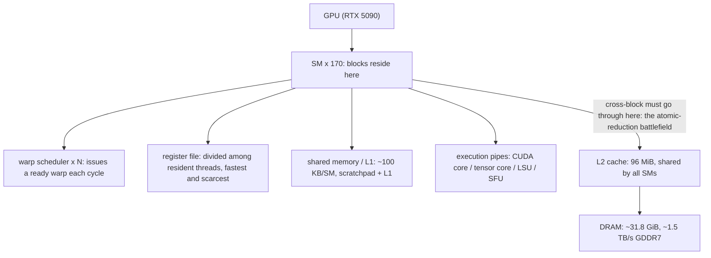
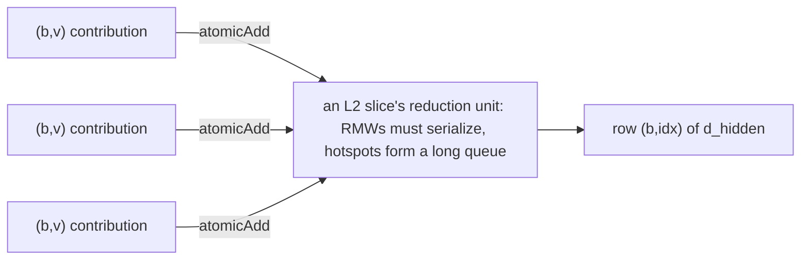
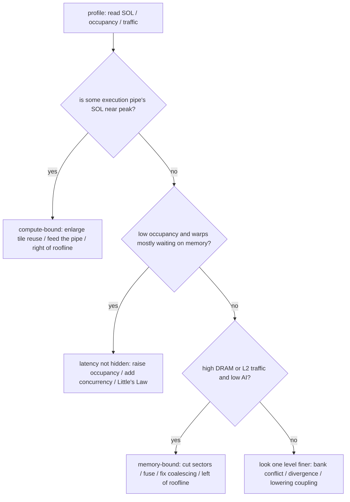
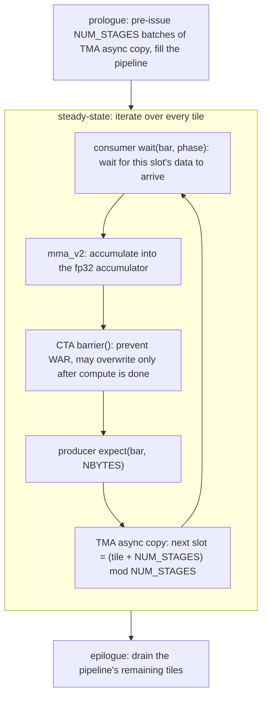
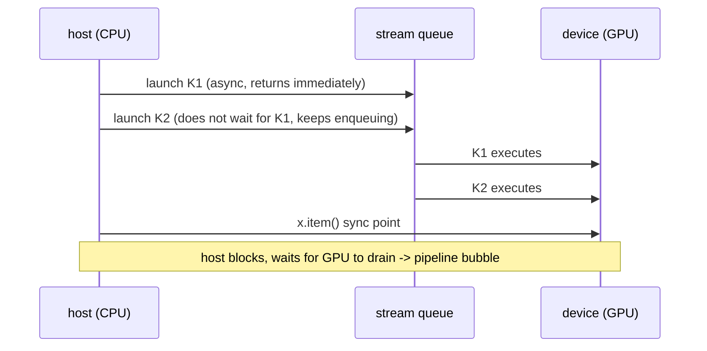
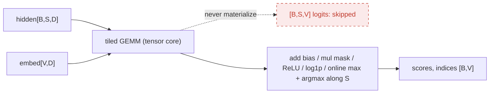
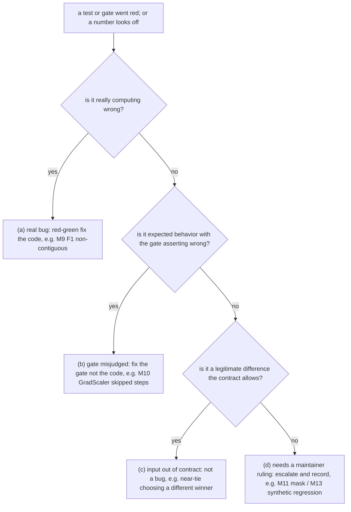

<!--
Role note: this article is a "pedagogical derived artifact." It produces no new
experimental facts. Every "measured here" number in it is quoted from the runs of record
already documented in this repository's DEVELOPMENT.md / ARCHITECTURE.md, and is cited in
the form "DEVELOPMENT.md M11 §3" so you can go back to the original evidence and check it,
instead of trusting this article's retelling.

Tagging convention (uniform throughout — please keep the two kinds of numbers apart):
  • 【Measured here · …】 + (DEVELOPMENT.md / ARCHITECTURE.md §…) — a documented measurement
    that belongs ONLY to this one RTX 5090 / sm_120 machine;
  • [external source] — a stable, foundational concept or industry fact quoted from public
    docs, papers, or blogs; NOT a sparton measurement on this machine.
The two markers must never be mixed: a number carrying an [external source] tag describes a
general fact at the hardware or algorithm level, not a measured result of this repository on
this machine.

Do not treat this article as a repository changelog; it does not replace the three reference
documents ARCHITECTURE / DEVELOPMENT / METHODOLOGY.
-->

# From Backend Engineer to GPU Kernel: A Full Optimization Record of a Sparse-Retrieval Head

> Subtitle: **Hardware · Abstraction · Compilation · Method · Practice — the sparton case on an RTX 5090**

This is a long article about GPU kernel optimization, written for engineers who have some backend or low-level-systems experience but not much GPU experience. Throughout, it keeps borrowing systems concepts you already know — cache, concurrency, lock contention, hot keys, capacity models — to build analogies for what happens on a GPU, and after every analogy it marks the point where that analogy breaks down.

The goal of this article is concrete: **after reading it, you should be able to carry out, on your own, a kernel refactor and optimization of the same nature as the case here**. That means reading the hardware, reading the toolchain, and using one reusable method (profile → model → prototype → gate → review) to make a real operator fast — and knowing when you **should stop**. The last chapter gives you a checklist you can follow step by step.

We will not give a vague "intro to GPU programming." Instead, this article runs throughout on one real project, **sparton** — a SPLADE-style sparse-retrieval scoring head — and follows its optimization journey from M5 to M13. Every design decision, every trade-off, every implementation, and even every **failure and rollback** comes from engineering evidence documented in the repository.

---

## Why This Article Is Worth Finishing

Let's put the results up front (details, sources, and the measurement discipline come later in the body; here we just build intuition):

| Milestone | What it did | Result (measured here) | Source |
|---|---|---|---|
| **M10** | Promoted the Gluon optimized forward to the default backend | forward **−24%** (1.181 → 0.900 ms); peak extra memory **9.86 MiB vs 140.50 MiB** (≈14×) | DEVELOPMENT.md M10 |
| **M11** | Rewrote the backward with "sort + segmented reduction" | backward **−32%…−41%**; on a real query record, L2 reduction sectors **408.03M → 1.55M** (264×) | DEVELOPMENT.md M11 §1/§6 |
| **M12** | Originally planned to keep rewriting the forward | **Closed the milestone legitimately without changing a single line of kernel code**: the first profile proved the forward already drives the tensor pipe to 92–94%, with no scheduling slack left to optimize | DEVELOPMENT.md M12 |
| **M13** | Split the backward's segmented kernel into two complementary kernels | another **1.46×…1.60×** on real data | DEVELOPMENT.md M13 §1 |

The most notable row is **M12**. A whole milestone went through a full cycle of profiling, modeling, and decision-making, and its final output was an evidence-backed "this road is closed" — without a single line of kernel code. This is still recorded as a **legitimate and valuable delivery**. A method that can tell "finished" apart from "just gave up" matters more than any single speedup. That is exactly what this article wants to hand you.

> **The one-sentence promise**: numbers do not transfer. The "measured here" values in this article belong only to this one machine (RTX 5090 / sm_120 / torch 2.12 / Triton 3.6), this one shape, this one data distribution. **What transfers is the method, plus a way of "seeing" the GPU.** That is why the whole article strictly separates two kinds of tags: **【Measured here · …】** (with a `DEVELOPMENT.md / ARCHITECTURE.md §…` citation) is a value documented on this machine — **do not extrapolate it**; **`[external source]`** (such as `[NVIDIA CUDA Best Practices]`, `[Triton Tensor Layouts]`, `[SPLADE, SIGIR'21]`) marks a stable, foundational fact from public docs or papers, used to build your mental model — it is **not** a sparton measurement on this machine. Whichever tag you see tells you who the number "belongs to."

---

## Table of Contents and Reading Paths

<a id="toc"></a>

- [Chapter 0 — Introduction: Reasoning Backward from the Results](#ch0)
- [Chapter 1 — A GPU Is Not a Faster CPU: Hardware Hierarchy and Execution Model](#ch1)
- [Chapter 2 — The Toolchain: From PyTorch op to SASS, Abstraction Layers and the Compilation Pipeline](#ch2)
- [Chapter 3 — The Case-Study Patient: SpartonHead, a Sparse-Retrieval Head That Never Materializes Logits](#ch3)
- [Chapter 4 — Methodology at a Glance: The Performance-Optimization Loop and Bottleneck Classification](#ch4)
- [Chapter 5 — Case Studies: Five Battles from M5 to M13](#ch5)
- [Chapter 6 — GPU Performance-Optimization Methodology and Technique (Full Version)](#ch6)
- [Chapter 7 — Wrapping Up: What "Done" Means](#ch7)
- [Appendix — This Repository's Environment Pitfalls (Quarantined)](#appendix)

**Two reading paths**:

- **Beginner (linear)**: read from Chapter 1 through Chapter 7 in order. Chapters 1 and 2 are the foundation — please do not skip them.
- **Senior engineer (fast path)**: `Chapter 0 → Chapter 1 → Chapter 2 → Case 3 (M11) → Case 4 (M12) → Case 5 (M13) → Chapter 6 → the Chapter 7 checklist`. Cases 1 and 2 (naive→Gluon forward, review and gating) are relatively light, but every case opens with a four-line "Case at a glance" box; on the fast path, scan that box first, then decide whether to read deeper. Case 5 will point back to Case 2's lesson that "green ≠ coverage"; Case 1 gives the hardware fence where the conclusion flips on an H100. Even if you are in a hurry, it is worth scanning at least the "backend ↔ GPU analogy table" and the "abstraction-level mapping table" in Chapters 1 and 2 — every later case is built on these two tables.

---

<a id="ch0"></a>

# Chapter 0 — Introduction: Reasoning Backward from the Results

To many people, GPU kernel optimization looks like black magic: change a tile size and it gets 10% faster, and nobody can say exactly why; rewrite it a different way and it gets slower, and again nobody can explain it. This article sets out to break that mystique.

Our core claim is a single sentence: **GPU performance optimization is a falsifiable engineering discipline of "first name the bottleneck resource, then ask which level of change can move it."** It does not rely on inspiration; it relies on three things:

1. **You can see it**: use the right instrument (profiler, IR dump) to observe the right level, and know which "measurement regime" each number belongs to.
2. **You can compute it**: before writing any kernel, first write a **runnable analytic traffic model** that puts a price on every candidate.
3. **You can verify it**: every prototype is checked **cell-by-cell numerically before it is timed**; every conclusion is re-checked against a saved transcript.

None of these three is actually foreign to a backend engineer. They correspond to the load tests, capacity models, and A/B experiment discipline you have already done. The difference is this: **the kind of "bottleneck resource (binder)" on a GPU is not the kind you are used to.** It is not necessarily the CPU, not necessarily disk IOPS; it may be the tensor pipe, an L2 reduction sector (a sector is the 32-byte granularity of memory access — expanded in §1.5 / §1.8), a register quota, or a layout chosen by the compiler. So the first two chapters of this article spend the most space helping you build this "binder vocabulary." Once the vocabulary is in place, the five real cases in Chapter 5 prove, one after another, that **the same question — "which level of change can move this binder?" — got three completely different answers in M11, M12, and M13**. Understand those three answers and you have grasped the core of the whole methodology.

Now let's lay the foundation.

---

<a id="ch1"></a>

# Chapter 1 — A GPU Is Not a Faster CPU: Hardware Hierarchy and Execution Model

If you come to the GPU carrying CPU intuitions, almost every one of those intuitions will turn around and bite you. The CPU world is: **a few very strong cores**, each with out-of-order execution, branch prediction, and a deep multi-level cache, all aimed at minimizing the **latency of a single thread**. The GPU world is the exact opposite: **thousands of very weak execution lanes**, with almost no out-of-order execution and a shallow cache, all aimed at pushing **total throughput** as high as possible by using **massive concurrency** — and at using "there's always other work to do" to **hide** the hundreds-of-cycles latency of a single memory access.

That one-word difference (hide latency vs. minimize latency) is the root of every performance intuition in this chapter and in the whole article:

> **The CPU uses a big cache to "eliminate" latency; the GPU uses a huge amount of in-flight concurrency to "hide" latency.** The CPU spends its transistor budget on "making a single thread run fast" (out-of-order, prediction, big cache); the GPU spends the same budget on "keeping tens of thousands of lanes busy at the same time." So a single GPU lane is dumb — no out-of-order, expensive branching — but it wins back the loss through **sheer numbers** and **zero-overhead hardware scheduling**. The latency-oriented design and the throughput-oriented design are two completely different worldviews.

This chapter will make clear the GPU's two hierarchies — the **hardware hierarchy** and the **execution / programming hierarchy** — and the **mapping between them**. These two hierarchies and their correspondence are the foundation for everything that follows. All the concrete platform numbers in this chapter come from this repository's validation platform (ARCHITECTURE.md §2.1):

> 【Measured here · RTX 5090 / sm_120】NVIDIA GeForce RTX 5090, compute capability `(12, 0)` (i.e. sm_120), **170 SMs**; warp size 32; at most 1024 threads per block; **at most 1536 threads per SM (= 48 warps)**; shared memory 49152 B/block by default, 101376 B/block opt-in, 102400 B/SM; about 31.8 GiB of device memory; **L2 cache 96 MiB** (ARCHITECTURE.md §2.1).

## 1.1 Start with the hardware: how a GPU is stacked up

From the top down, the hardware is nested layer by layer:

- **GPU (the whole card)**: this machine is one RTX 5090. Inside, it is made of many **SMs (Streaming Multiprocessors)** — this machine has **170**. The SM is the GPU's "core," but it is not the same kind of thing as a CPU core: it does not chase single-thread speed; it is a "throughput machine that keeps dozens of warps fed at once."
- **The key parts inside an SM**:
  - **warp scheduler**: every cycle it picks one "ready" warp and issues its next instruction. An SM usually has several warp schedulers (each managing a batch of warps), so one SM can issue several instructions per cycle. **The unit of scheduling is the warp, not the thread.** Remember one more property: each cycle the scheduler can issue an instruction from a **different ready warp** — last cycle it issued warp A, this cycle it can switch to warp B, at almost no cost, because the registers and PC of all resident warps always stay on the SM and are never swapped out. This is the hardware capital behind §1.7's "hide latency with concurrency."
  - **register file**: a large block of registers (on the order of about 64K 32-bit registers/SM for this generation, as a typical magnitude `[NVIDIA CUDA C Programming Guide]`), **divided among all threads resident on this SM**. It is one of the fastest and scarcest resources on the GPU; §1.6 shows how it directly determines occupancy.
  - **shared memory / L1**: a block of on-chip fast storage (about 100 KB/SM on this machine). Physically it is the same SRAM; it can serve both as a programmer-managed **scratchpad** (shared memory) and as a hardware **L1 cache**. This is a layer the CPU does not have: a "cache" whose contents you can explicitly control.
  - **execution units / pipes**: the **CUDA core** that does scalar floating-point/integer work; the **tensor core** that does small matrix multiply-accumulate (the workhorse of deep-learning compute); plus the **LSU** (load/store unit, memory access) and the **SFU** (special function unit, for transcendentals like `exp` / `log` / `rsqrt`). Note that the tensor core and the CUDA core are **two independent pipes**: one being saturated does not mean the other is. Case 4 will use this point.
- **Off-chip (shared by all SMs)**: an **L2 cache** (96 MiB on this machine) and a large block of **DRAM** (device memory, about 31.8 GiB on this machine, physically GDDR7). **L2 is the only "shared relay layer" between all SMs.** Cross-block data exchange and atomic reductions all meet here; it is the central battlefield of the backward kernel (Case 3).

Think of an SM as a throughput machine **whose resources are welded in at the factory**, and a lot of scheduling intuition gets simpler. Four things on an SM are fixed in total amount: **warp slots** (48 on this machine, ARCHITECTURE.md §2.1), the **register file**, the **shared memory**, and the throughput of each execution pipe. Every block you launch, when it moves onto an SM, **carves a slice out of each of these four**. How many blocks an SM can hold at once is essentially a **bin-packing problem**: whichever of the four runs out first is the ceiling. That bin-packing problem is §1.6's occupancy; its two most common bottlenecks (register and shared memory) are exactly the stars of the two bullets above. Fix this frame — "four fixed resources" — in your mind first, and occupancy, divergence, and latency hiding all grow out of it naturally.



A **sense of scale** worth remembering: 170 SMs × 48 warps/SM × 32 lanes/warp ≈ **260,000** lanes can be "on the books" at the same time. The entire design philosophy of the GPU is about how to keep these 260,000 dumb lanes from sitting idle, not about making any one of them run blazingly fast. The next section explains how these lanes are organized and how they get locked together to execute.

## 1.2 SIMT: the lockstep of 32 lanes, and divergence — its unique trap

The GPU's execution model is called **SIMT (Single Instruction, Multiple Threads)**. It sits between the CPU's SIMD and multithreading: you **write the kernel as if you were writing scalar threads** (each lane has its own index and its own private registers), but the hardware **issues instructions in units of warps**. The 32 lanes of one warp execute **the same** instruction in one issue, each just acting on different data.

Put the three models on one spectrum and SIMT's position becomes clear. **SIMD** (like the CPU's AVX) is a single instruction stream where the programmer must **explicitly** pack data into vector lanes and align widths by hand; **SMT / multithreading** is several **independent** instruction streams; **SIMT** sits in the middle — you write scalar per-lane code (the programming model feels like multithreading), but the hardware binds 32 lanes into one warp executing in lockstep (the execution model feels like SIMD). This seam — **"programming model ≠ execution model"** — is the common source of the divergence, coalescing, and layout traps. You think you are commanding 32 independent threads; the hardware is really running one instruction acting on 32 lanes of data. Every "counterintuitive" thing later in this chapter traces back to this seam.

This brings a performance trap the CPU does not have at all: **warp divergence**.

| Scenario (a warp hits `if (x > 0)`) | activity of lanes in the warp | how it executes | effective throughput |
|---|---|---|---|
| **no divergence** (all 32 lanes take the same branch) | all active | one issue executes that branch | full throughput |
| **divergence** (half take if, half take else) | while executing the if branch, lanes going to else are masked; vice versa for the else branch | the two branches execute **serially** (one branch at a time; lanes not on the current branch are masked) | cut in half (diluted by the number of branches) |

The mechanism is this: all lanes in a warp share one instruction stream, and on a branch the hardware **executes the branches one at a time**. While executing one branch, the lanes not taking it are **masked** to inactive — they occupy cycles but produce no useful work. Only after both branches have run does the warp reconverge. **So a branch inside a warp is not "split up and run separately" but "run in turn, waiting for each other,"** at the cost of diluting throughput by the number of branches.

Written as a rough cost model: if a warp splits into k distinct paths, the hardware must walk them serially one by one, and the effective throughput drops to roughly

$$T_{\text{eff}}\approx \frac{T_{\text{peak}}}{k}$$

where k is the number of distinct paths this warp actually walked (worst case is 32, i.e. all 32 lanes going their own way). Be sure to keep this separate from CPU branch misprediction: the CPU penalty is the pipeline flush from a single "wrong guess" (a dozen-plus cycles, and only when the guess is wrong); the GPU penalty is the structural serialization of **having to walk both paths**, regardless of how accurate any prediction is. So there is no "branch predictor" to rely on on the GPU; the only thing you can save is "don't let a single warp fork."

Two refinements you must know (both show up in Case 5):

- **Predication**: for very short branches, the compiler often does not actually use a branch; instead it **computes both sides and then selects the result by a predicate** (like `result = cond ? a : b` compiled into a branch-free select). This avoids control-flow divergence but pays with redundant computation. **Pushing suppression logic into a load's `mask` argument, instead of writing it as an `if`, exploits exactly this.** In Case 5, M13 uses a per-row mask instead of a branch — avoiding divergence while **not breaking the load's vector width** (why a branch breaks vector width is left for Chapter 2's discussion of layout).
- **Volta+ independent thread scheduling (ITS)**: from sm_70 onward, each thread has its own PC and call stack, reconvergence is more flexible, and you can even do producer-consumer synchronization within a warp `[NVIDIA CUDA C Programming Guide]`. **But it did not make divergence free** — divergent paths still execute serially. Lay out the sm_70 dividing line clearly `[NVIDIA CUDA C Programming Guide]`:

| Dimension | pre-Volta (≤ sm_6x) | Volta+ (sm_70+, ITS) |
|---|---|---|
| PC (program counter) | one per warp | one per thread |
| call stack | one shared by the whole warp | independent per thread |
| reconvergence | fixed convergence points nailed down by the compiler | finer interleaving within a warp, converge on demand |
| producer-consumer sync within a warp | not possible | possible (with `__syncwarp()` to keep explicit inter-lane synchronization) |
| does divergence still serialize | yes | still yes |

The last row is the key one: ITS makes intra-warp control flow **more flexible and safer** (it won't deadlock because the compiler assumed lockstep), but it **did not** change the throughput cost of "divergent paths execute serially." Confusing "more flexible" with "free" is the most common misreading of ITS.

> **Analogy & boundary**: a warp ≈ "32 workers who must stay in step, sharing one instruction tape." **Boundary**: CPU threads can branch independently and move forward independently; the 32 lanes in a warp cannot — diverge and they take turns. When writing a kernel, **keep the lanes in a warp on the same path and reading neighboring addresses as much as possible** — those are the two most basic disciplines; the latter is the coalescing we cover next.

Lockstep also pays a dividend: **the 32 lanes in a warp can exchange data directly without going through shared memory**, using **warp-level primitives** `[NVIDIA CUDA C Programming Guide]`: `__shfl_sync` (one lane reads another's register directly), `__ballot_sync` (collect each lane's predicate into a 32-bit mask), and `__reduce_*_sync` (sum or min/max across a warp in one step). An intra-warp reduction can therefore be a **shuffle tree** of `log₂32 = 5` levels, all in registers, never touching shared memory and needing no barrier. You will see their true forms in SASS: `SHFL` (shuffle), `VOTE` (ballot), `REDUX` (warp-level reduce).

That shuffle tree halves five times: each step uses `__shfl_down_sync` to move the back half onto the front half and add, all done in registers, never touching shared, never setting a barrier `[NVIDIA: Using CUDA Warp-Level Primitives]`.

| Step | operation (`__shfl_down_sync`) | lanes still active afterward |
|---|---|---|
| 0 | 32 lanes each hold one value | 32 |
| 1 | offset 16, front half adds the back half | 16 |
| 2 | offset 8 | 8 |
| 3 | offset 4 | 4 |
| 4 | offset 2 | 2 |
| 5 | offset 1, the whole warp's sum lands in lane 0 | 1 |

Remember this halving structure: **an intra-warp reduction is 5 levels of register operations; only an inter-warp reduction needs shared / atomic.** The two-level reduction (shuffle within a warp, shared between warps) is the skeleton of almost every efficient reduction kernel; sparton's forward max and backward sum are both built on this skeleton.

This matters for reduction-heavy operators (sparton takes max along `S`, and the backward sums along a run): **an efficient reduction is usually a two-level structure of "shuffle within the warp, shared/atomic only between warps."** In Case 5, part of why that `tl.cumsum` is expensive is that it lowers to a long chain of `SHFL` (`tt.scan` + SHFL tree). A shuffle is not free; 5 levels means 5 levels of dependency latency.

## 1.3 The execution hierarchy, and its mapping to the hardware (the most important relationship in this chapter)

When you launch a kernel (a parallel function on the GPU), you are describing an **execution hierarchy**. From the top down it is:

- **grid**: all the work of one kernel launch. At launch you specify the grid's shape (for example, "a 1-D grid of 4096 blocks"). The grid is not resident on hardware; it is just the list of "all the work to do this round."
- **block (also called CTA, Cooperative Thread Array)**: the grid is cut into many blocks. **A block is scheduled as a whole onto one SM and resides there, never split across SMs**, and once it is on an SM it runs to completion there (non-preemptive). Threads within a block can communicate through shared memory and synchronize with a barrier like `__syncthreads()`. **"Can cooperate" stops at the block boundary** — this is the hardest physical constraint in GPU programming.
- **warp**: every 32 threads in a block are packed into a warp, the SIMT lockstep unit from the previous section, and also the **smallest unit the scheduler schedules**.
- **thread / lane**: the smallest unit of execution, just one lane in a warp, owning its own private registers.

Line the two hierarchies up, and you get the one mapping table you should remember most from this chapter. It is the anchor for **every** API abstraction (Chapter 2):

| Execution / programming level | maps to which hardware level |
|---|---|
| grid (one launch) | one round of work for the whole GPU (not resident on hardware) |
| block / CTA | resides on **one** SM, runs to completion (non-preemptive) |
| warp (32 lanes, SIMT lockstep) | issued by one of the SM's warp schedulers |
| thread / lane | one execution lane + private registers |

"A block is nailed to one SM" — this single fact implies almost every conclusion later in this chapter: within a block you can use fast shared memory to cooperate; between blocks you can only go through the much slower L2/DRAM, and usually also need atomics or splitting into multiple kernels; how many registers/shared a block uses decides how many blocks an SM can hold at once (occupancy); blocks have no ordering guarantee — who goes first is up to the hardware scheduler. From this also follows a corollary that runs through the whole backward case: **the GPU has no "whole-grid barrier."** To make all blocks finish and then enter the next phase together, the only portable way is to **end the current kernel and launch a new one**. A kernel boundary is the de-facto grid-level synchronization point. Complex operators (the backward is the typical one) are naturally split into a chain of kernels for exactly this physical reason: each kernel boundary buys one "everyone has arrived." The three-stage "prep kernel → sort → reduction kernel" in Case 3 is, in essence, buying two global synchronizations with two kernel boundaries.

> **Analogy & boundary**: think of a block as "a unit of work nailed to one machine that only goes offline when it finishes," and a warp as "32 workers sharing one instruction tape." **Boundary**: how many such work units this "machine" (SM) can run at once is not specified by you — it is computed from how much register/shared each of them consumes. That is the occupancy we cover next.

## 1.4 The memory hierarchy and scope: level and "who can see it" correspond

GPU memory is a strict hierarchy, and **the visibility (scope) of each level corresponds exactly to one level of the execution hierarchy.** This level ↔ scope correspondence is the essence of the GPU memory model. Memorize it side by side with the execution hierarchy from the previous section:

| Memory level | capacity | bandwidth (this machine) | scope (who can see it) | corresponding execution level | backend analogy |
|---|---|---|---|---|---|
| **register** | ~KB / thread | nearly free (operand level) | **thread-private** | thread | registers / thread-local |
| **shared memory / L1** | ~100 KB / SM | on-chip, far higher than L2 | **shared within a block** | block | NUMA-local memory / in-core scratchpad |
| **L2 cache** | 96 MiB | ~6.6 TB/s | **whole device (global)** | grid | a last-level cache shared across cores |
| **DRAM (device memory)** | ~31.8 GiB | ~1.5 TB/s | **whole device (global)** | grid | main memory |

> 【Measured here · RTX 5090 / sm_120】L2 ~6.6 TB/s and DRAM ~1.5 TB/s are the achievable fabric rates measured at M12 (at 89–91% busy), frozen into `scripts/m13_traffic_model.py` as `L2_ACHIEVABLE = 6.6e12` / `DRAM_ACHIEVABLE = 1.5e12` (DEVELOPMENT.md M12 §4). For comparison, host DDR is about 100 GB/s: the GPU's DRAM is an order of magnitude faster than that, and L2 is about 4–5× faster than DRAM.

Bandwidth is "how many bytes per second you can move"; the other dimension is **latency** — "how many cycles one access must wait." Memorize each level's latency magnitude and lifetime side by side (orders of magnitude, not measured here, and they drift with architecture) `[Modal GPU Glossary]`:

| Memory level | whose lifetime | access-latency magnitude (cycles) |
|---|---|---|
| register | thread (gone when the warp exits) | ~0, operand goes straight into the instruction |
| shared memory | block (reclaimed as soon as the block exits) | tens |
| L2 cache | grid / device | hundreds |
| DRAM (device memory) | grid / device (persists across kernels) | hundreds to thousands |

This table gives two design disciplines. First, **moving data you will reuse from DRAM into shared** trades a hundreds-of-cycles access for a tens-of-cycles one; this is the entire motivation for tiling / staging (§1.9 and Case 1). Second, **latency is either saved or hidden**: the hundreds of cycles of DRAM latency you cannot save can only be hidden by "having other ready warps to issue" — that is the very reason occupancy exists (§1.7). Bandwidth decides whether you can feed the pipe; latency decides how many warps you must keep around to avoid idling. These two accounts must be computed separately.

Remember this correspondence: **register ↔ thread, shared ↔ block, global (L2/DRAM) ↔ grid.** It gives two engineering disciplines directly: **to make lanes within a block cooperate, use shared memory (fast, but invisible once you leave the block); to exchange data between different blocks, you can only go through L2/DRAM (slow, and you need atomics or splitting into multiple kernels).** The backward kernel must gather the contributions of thousands of `(b,v)` into the same row — this is cross-block cooperation, so it is **destined** to fall onto L2; the entire battle of Case 3 is on this layer.

## 1.5 Sector and coalescing: the smallest granularity of GPU memory access, and the vital point of the backward kernel

There is one access granularity you must burn into your brain: **the GPU does not access global memory by the byte, but by the sector = 32 bytes moved as a batch** (one cache line = 128 bytes = 4 contiguous sectors). Since Pascal (sm_6.x), L1 serves global loads at a **32-byte** granularity `[NVIDIA CUDA Best Practices Guide]`. This means: **you read 4 bytes, the hardware moves at least 32.** The cost of one warp's load is not "how many bytes the 32 lanes read," but "how many sectors this load touched in total."

This leads to the number-one discipline of GPU memory access: **coalescing**. Look at three access patterns of the same warp:

| One warp (32 lanes) each reads one fp32 (4 B) | coalesced (contiguous, aligned) | contiguous but first address off by 4 B | scattered (gather by an out-of-order index) |
|---|---|---|---|
| addresses of the 32 lanes | $0,4,8,\dots,124$ (contiguous 128 B) | $4,8,\dots,128$ (still contiguous 128 B, but crosses a sector boundary) | land in 32 different sectors |
| sectors touched | 4 (128 B) | 5 (160 B) | up to 32 (1024 B) |
| useful / moved bytes | $128/128 = 100\%$ | $128/160 = 80\%$ | $128/1024 \approx 12.5\%$ |
| conclusion | full bandwidth | wastes 20% just from misalignment | same useful data, **8×** the traffic moved |

Left: 32 lanes read contiguous, aligned 128 bytes; the hardware coalesces them into **4 full sectors**, every byte is used, bandwidth utilization is about 100%. Right: gather by an out-of-order index, and the 32 lanes land in 32 **different** sectors; the hardware is forced to move **32 sectors = 1024 bytes but uses only 128** — 8× more traffic, and bandwidth utilization drops to about 12.5% `[NVIDIA: How to Access Global Memory Efficiently]`. The middle column is the easiest to overlook: the access is contiguous, but only because the first address does not land on a 32-byte boundary, it touches one extra sector and wastes 20% of the traffic. The pointer returned by `cudaMalloc` is aligned to at least 256 bytes, so this kind of "misalignment" usually comes from your own index offset or an offset inside a struct. This is the same reasoning as why §2.4's TMA descriptors force 16-byte alignment: keep the hardware's batch moves landing on whole-sector boundaries as much as possible.

**The vital point of sparton's backward is right here**: it must gather the row `hidden[b, idx, :]` by the index that the forward argmax chose — a naturally scattered access. How to rescue this gather from "scalar-level, sector-wasting" back to "wide load, sectors filled" is the entire technical content of Case 5 (M13); and the L2 congestion caused by "thousands of contributions hitting the same destination sector" is the entire content of Case 3 (M11). Two flagship cases, both rooted in this section's sectors.

> **Analogy & boundary**: coalescing is the backend's "batch random small IO into sequential large IO." **Boundary**: there is no software batching layer here; coalescing is done by the hardware **per warp, on the spot**. The only lever you have is to **make neighboring lanes access neighboring addresses**. And "which address a neighboring lane accesses" is decided by the tensor's **layout** (which dimension is contiguous, who claims it). So coalescing becomes a layout problem in Chapter 2, and in Case 5 it becomes a layout problem **back-anchored** by the compiler.

**Coalescing governs global memory; shared memory has a twin discipline: bank conflicts.** In hardware, shared memory is cut into **32 banks** (matching exactly the 32 lanes of a warp), each bank 4 bytes wide, with addresses interleaved across banks (word 0 in bank 0, word 1 in bank 1 … word 32 back in bank 0). As a formula, $\text{bank}=(\text{addr}/4)\bmod 32$ (addr is the byte address, each word 4 bytes). The rules `[NVIDIA CUDA C Programming Guide]`:

| A warp's access pattern to shared memory | result |
|---|---|
| 32 lanes hit 32 **different** banks | 1 transaction (full speed) |
| all 32 lanes read **the same address** (broadcast) | 1 transaction |
| $k$ lanes hit **different addresses in the same bank** | $k$-way conflict, serialized into $k$ transactions |

A classic pitfall: store data as `shared[lane][k]` in 32 columns, and on a column access all lanes hit the same bank (a 32-way conflict, 32× slower). The classic fix is **padding** (store as 33 columns, `shared[N][33]`): with 32 columns, neighboring rows of the same column are 32 words apart, and $32\bmod 32 = 0$, so all 32 lanes pile onto the same bank; change the row width to 33, and neighboring rows are 33 words apart, $33\bmod 32 = 1$, so the 32 lanes scatter neatly into 32 different banks and the conflict disappears. Another trick is **swizzle** (use bit operations to rearrange shared addresses and scatter accesses across banks). **Gluon's `NVMMASharedLayout` / swizzle does exactly this**: Case 1's forward uses it to stage the embed tile into shared while avoiding bank conflicts.

> **Analogy & boundary**: a bank conflict is like the backend's "multiple requests hash to the same shard and are forced to queue." **Boundary**: the "shard" here is a fixed 32 banks, decided by the low bits of the address; you cannot add shards, you can only **change the data layout** (padding / swizzle) so accesses spread out. And there is an iron rule (METHODOLOGY.md §B5.2): **measure bank conflicts with a profiler, do not guess them from the shape of the code.** The compiler's swizzle is often not what you pictured in your head.

## 1.6 Occupancy: a "quota" relationship, not a knob

**Occupancy = the number of warps actually resident on an SM / the maximum number of warps that SM can hold.** On this machine each SM holds at most 1536 threads = **48 warps**; that is the denominator, fixed and unchanging.

What decides the numerator? A **resource quota**. Two things per SM are limited and fixed: the **register file** and the **shared memory** (about 100 KB). For a block to be resident, it must occupy `registers per thread × number of threads` of registers, plus the shared memory it declares. **How many blocks an SM can hold at once depends on which resource runs out first** — register, shared, or the warp-count ceiling, whichever of the three is tightest. As a formula, the number of blocks an SM can hold simultaneously is the minimum of three ceilings, and occupancy is computed from it:

$$\text{blocks/SM} = \min\!\left(\left\lfloor\frac{R_{\text{file}}}{R\cdot T}\right\rfloor,\ \left\lfloor\frac{S_{\text{SM}}}{S_{\text{blk}}}\right\rfloor,\ \left\lfloor\frac{W_{\max}}{W_{\text{blk}}}\right\rfloor\right),\qquad \text{occupancy}=\frac{\text{blocks/SM}\cdot W_{\text{blk}}}{W_{\max}}$$

where $R$ is registers per thread, $T$ is threads per block, $R_{\text{file}}$ is the whole register file, $S_{\text{SM}}$ and $S_{\text{blk}}$ are shared memory per SM and per block, and $W_{\max}$ and $W_{\text{blk}}$ are the warp ceiling per SM and warps per block. The arithmetic below singles out the register term $\lfloor R_{\text{file}}/(R\cdot T)\rfloor$ and computes it for you.

This is not a knob where "bigger is better"; it is a **trade-off quota** where one thing gives as another takes. Work through it once as an arithmetic problem; from now on, this is the opening move when designing any kernel.

Under the register limit, how many blocks can an SM hold? Compute it this way:

- register file: a typical $64\text{K} = 65{,}536$ 32-bit registers / SM for this generation `[NVIDIA CUDA C Programming Guide]`;
- a block occupies $R \cdot T$ registers, where $R$ = registers per thread, $T$ = threads per block;
- Case 5's real config $R = 255,\ T = 256$: $R \cdot T = 255 \times 256 = 65{,}280$, which nearly eats the entire register file;
- a second block needs another $65{,}280$ and does not fit $\Rightarrow$ only 1 block per SM = 8 warps = $8/48 \approx 16.6\%$ occupancy.

> 【Measured here · RTX 5090 / sm_120】in Case 5, one of M13's backward kernel configs uses **255 registers per thread**, and after one 256-thread (8-warp) block fills the register file, that SM **can hold only this one block**, giving occupancy = 8/48 ≈ **16.6%** (DEVELOPMENT.md M13 §2). The arithmetic above is the origin of that 16.6%.

Shared memory is **another** throttle: if a block declares 50 KB of shared while the SM has only about 100 KB, then no matter how thrifty the registers are, at most 2 blocks can coexist. **Whichever of the two valves closes all the way first is the occupancy ceiling.** Also distinguish two terms: the profiler's **theoretical occupancy** (the ceiling computed from quotas) and the **achieved occupancy** (the actual running average), where the latter is further dragged down by tails and load imbalance `[AMD GPUOpen: Occupancy Explained]`.

Remember this causal chain: **use more register/shared → fewer blocks per SM → lower occupancy.** Why does occupancy matter? The next section gives the one and only reason: it is not an end in itself, but the capital for hiding latency.

## 1.7 Hiding latency with concurrency: a Little's Law view

How does a CPU deal with a cache miss (hundreds of cycles)? With out-of-order execution, fetching independent instructions from later in the **same thread** to fill the wait. The GPU cannot do this — its lanes are too simple. The GPU's approach switches dimensions: **hold dozens of warps at once, and whoever's data has arrived and is ready gets issued next cycle.** When one warp is waiting on memory, the scheduler immediately switches to another ready warp. **The switch is almost zero-cost**, because the context of all warps (registers, PC) always stays resident on the SM and is never swapped out `[NVIDIA / AMD GPUOpen]`. This is where SIMT saves money: it trades space (resident registers) for time (zero-cost switching).

How much concurrency is needed to hide how much latency? This is a **Little's Law** question (an old friend of backend capacity planning):

> **work in flight = latency × throughput.** To keep a memory pipe whose latency is about L cycles **busy every cycle**, you need roughly **L independent memory requests in flight at once**. Warps are the containers that hold these in-flight requests, and occupancy is the ceiling on **how many you can have in flight at once**.

$$N_{\text{in-flight}} \approx L_{\text{mem}} \times r_{\text{issue}}$$

Read it as: to hide $L_{\text{mem}}$ cycles of memory latency, while issuing $r_{\text{issue}}$ memory accesses per cycle, you must hold about $L_{\text{mem}}\cdot r_{\text{issue}}$ independent in-flight requests at once. It is the same formula as backend capacity planning's "queue depth = arrival rate × service time," just with different protagonists. **The physical meaning of occupancy is the depth ceiling of this "latency-hiding queue."** It also explains the counterintuitive conclusion in the next paragraph: once the queue is deep enough, making it deeper is pointless.

So **occupancy is essentially the depth of the "latency-hiding queue."** The more resident warps, the better the guarantee that "there is always a ready warp to issue," and the less likely the execution pipe is to idle. Too low an occupancy produces a state where "all warps are stuck waiting on memory and the execution pipe idles" — exactly the disease the old backward kernel in Case 3 suffers from (SOL compute only 6.14%, almost the whole time spent waiting).

> **Analogy & boundary**: this is the backend's async IO / high queue depth. You would not have a thread synchronously wait for one network round trip; you fire off thousands of in-flight requests and handle whoever comes back first. **Boundary**: the GPU's "switch" is done by hardware every cycle, with no software scheduler and no context-save overhead; the cost is front-loaded into "you must keep enough resident warps around," and that in turn is capped by the register/shared quota.

But be sure to avoid the most common misconception: **occupancy is not "higher is better"; it is a means, not an end.** If the execution pipe is already fed (e.g. the tensor pipe is saturated), adding occupancy is pointless — no matter how deep the queue, the exit is already blocked. This article gives you two hard proofs: in **M12** (Case 4) occupancy is only 16–24%, but the tensor pipe is already at 92–94%, so raising occupancy is wasted effort; in **M13** (Case 5) two configs with very different occupancy (16.6% vs 24.8%) **run in exactly the same time**, directly disproving that "occupancy is the binder." **"Occupancy is low" is never a conclusion, only a phenomenon to be explained.** Behind it could be poorly-hidden latency (should raise it) or a saturated pipe (raising it does nothing). Telling these two cases apart is the job of §1.9's roofline.

## 1.8 Atomics are throughput contention on L2, not a lock

When a backend engineer hears "multiple threads accumulating into the same place," the first instinct is to add a lock and then worry about lock contention. The GPU's counterpart is the **atomic operation** (like `atomicAdd`), but its cost model is completely different and the intuition must be rebuilt.

When thousands of lanes do `atomicAdd` to global memory (DRAM, via L2), each accumulation is a **read-modify-write (RMW)**. The hardware does not actually move the data back to the SM to compute and write back; on modern GPUs the global atomic **completes the RMW right in L2** (L2 has its own ROP/reduction units). But the key point is this: **RMWs to the same address must serialize** — they queue up and serialize on the **L2 slice** that address belongs to.



So the cost is not "threads blocked on one mutex," but **the L2 reduction-sector throughput being saturated.** If many lanes happen to accumulate into **the same destination address**, the L2 slice that address sits on becomes a hotspot. This is exactly the backend's **hot row / hot key / hot shard**, except here the "key" is the index computed by the forward, and data skew shows up as long queues on the sectors of a few slices.

> **Analogy & boundary**: `atomicAdd` is like "fire-and-forget pushing an accumulate request into a slice's reduction queue," and the bottleneck is the slice's processing throughput. **Boundary**: it is not a mutex; there is no "thread blocks and waits" semantics; and the optimization direction is **not "shrink the critical section"** but **reduce the total number of reduction sectors hitting L2** — first merge, on-chip (in shared/registers), the contributions destined for the same place, then write them out in one shot. Remember the phrase "reduce the total sector count": it is the objective function of Case 3's entire battle.

Let's plant a sense of magnitude first:

> 【Measured here · RTX 5090 / sm_120】before optimization, one real query's backward call issues **408 million (408.03M) reduction sectors** to L2. Case 3 (M11) will show you how to drive it down to **1.55 million (1.55M)** — **264×** (DEVELOPMENT.md M11 §1). This 264× is not "tuned out of parameters" but a structural gain from replacing scatter atomics with "sort first, then segmented-merge."

## 1.9 Tensor core and roofline: two passages that decide life or death

The **tensor core** is the **matrix-multiply-accumulate (MMA) specialized unit** in each SM. In one go it eats two small matrix tiles A and B, computes $D = A\cdot B + C$ (multiply-accumulate into an accumulator), and emits the D tile. Most deep-learning compute (GEMM, conv, attention) ultimately lands on the tensor core. It is **a separate, independent pipe** alongside the CUDA core, so "tensor pipe saturated" and "low occupancy" can hold at the same time — Case 4 uses exactly this point. The tensor core has **strict layout requirements** on operands (which dimension is contiguous, how it is laid onto lanes); Chapter 2 will come back to this specifically.

Across hardware generations, the MMA instruction families differ greatly in shape and issue unit. Read it against Case 1's "generation timeline" table (that one covers card → instruction family → whether it compiles on this machine; this one covers shape and issue model) `[SemiAnalysis: Tensor Core Evolution][gau-nernst: tcgen05]`:

| Instruction family | capability | issue unit | fp16 tile (M×N×K) | where operands live |
|---|---|---|---|---|
| `mma.sync` (this machine's `mma_v2`) | sm_70–sm_120 | warp (32 lanes) | 16×8×16 | registers |
| `wgmma.mma_async` (WGMMA) | sm_90 (Hopper) | warpgroup (4 warps) | 64×N×16 (N=8..256) | A in registers / B in shared |
| `tcgen05.mma` (TCGen05) | sm_100 (datacenter Blackwell) | one thread issues for the whole CTA | larger, fully async | shared / tensor memory (TMEM) |

Notice one through-line across the three generations: **the issue unit gets larger (warp → warpgroup → whole CTA), more asynchronous, and operands migrate from registers toward shared / tensor memory.** All these changes are to feed ever-wider tensor cores, at the cost of ever-heavier layout constraints. So "knowing how to choose layout" only becomes more valuable (echoing §2.4). This machine's sm_120 sits in the leftmost row; the hardware background for "why only `mma_v2`" in Case 1 is right here.

**How do you feed the tensor core? Through the data reuse that tiling brings.** This is the core mechanism of all GPU GEMM optimization and deserves a clear explanation. An $M\times K \cdot K\times N$ GEMM has $2\cdot M\cdot N\cdot K$ FLOP but only $M\cdot K + K\cdot N$ input elements. **Each input is used many times.** Tiling cashes in this reuse:

Compare the DRAM read counts of naive vs. tiled:

- **naive**: to compute $C_{i,j}$, read the $i$-th row of $A$ and the $j$-th column of $B$ from DRAM once each $\Rightarrow$ each input element is read $O(N)$ times.
- **tiled**: cut $A,B$ into small blocks $[B_M \times B_K]$, $[B_K \times B_N]$ and move them into shared/registers, let one block be reused by $B_M \times B_N$ outputs, then slide and accumulate along $K$ $\Rightarrow$ each input element's DRAM read count drops from $O(N)$ to $O(N/B_M)$.
- result: arithmetic intensity is raised, pushing it from memory-bound toward compute-bound.

**The bigger the tile, the more reuse, the higher the AI; but the bigger the tile, the more register/shared it occupies, the lower the occupancy.** This is why `BLOCK_M/N/K` is the number-one autotune knob, and why "enlarge the tile" is always a good idea **with a ceiling**: up to the point of register spilling or occupancy collapsing. sparton's forward **fuses** this tiling and the later epilogue (bias/mask/ReLU/max) into **one kernel**, so as soon as the GEMM tile is computed it is not written back to DRAM but reduced on-chip directly. This is what §3.2's "never materialize" looks like at the kernel level.

Here we plant **a fence that flips with the hardware**, because it is the core of Case 1: **the tensor-core instruction this machine (sm_120) can use is `mma_v2`, which is the same `mma.sync` family that Triton's `tl.dot` lowers to** (ARCHITECTURE.md §2.2). Newer instruction families — Hopper's (sm_90) **WGMMA** (warp-group level, asynchronous, max shape 64×256×16) and datacenter Blackwell's (sm_100) **TCGen05** (one thread issues on behalf of the whole CTA, operands moved to shared/tensor memory, making the MMA fully async) `[SemiAnalysis: Tensor Core Evolution][gau-nernst: tcgen05]` — **crash the compiler fatally on this machine** (detailed in Case 1). Change a hardware generation and this conclusion reverses, so be sure to understand it with the fence "it belongs only to sm_120."

**Roofline** is the one-page model for judging "what is bottlenecking you." The core quantity is **arithmetic intensity (AI) = FLOP ÷ bytes accessed**. Draw it on one chart: AI on the x-axis, achievable FLOP/s on the y-axis, with two ceilings — a sloped one (bandwidth-limited: `AI × bandwidth`) and a flat one (peak-compute-limited) `[NERSC Roofline][Modal GPU Glossary]`. Where the two lines cross is the **ridge point**:

> **The arithmetic intensity at the ridge = peak compute (FLOP/s) ÷ peak bandwidth (B/s).** AI to the **left** of the ridge → **memory-bound**, you are locked by bandwidth, and the remedy is to reduce/coalesce memory access and raise reuse; AI to the **right** of the ridge → **compute-bound**, you are locked by compute, and the remedy is to feed the compute pipe. This machine's memory ceilings are the two numbers from §1.8 / §1.4: DRAM ~1.5 TB/s; if data stays in L2, about ~6.6 TB/s.

As a formula, the arithmetic intensity at the ridge point (also called machine balance) is

$$I^{*}=\frac{\pi_{\text{peak}}}{\beta_{\text{peak}}}$$

where $\pi_{\text{peak}}$ is peak compute (FLOP/s) and $\beta_{\text{peak}}$ is peak bandwidth (B/s). Make "which side of the ridge your operator lands on" into a diagnosis table — the two sides are two diseases with two cures:

| AI relative to ridge | bottleneck | performance ceiling | cure |
|---|---|---|---|
| AI < $I^{*}$ (left of ridge) | memory-bound | $\text{AI}\times\beta_{\text{peak}}$ (locked by bandwidth) | reduce / coalesce memory access, raise reuse, fuse operators |
| AI > $I^{*}$ (right of ridge) | compute-bound | $\pi_{\text{peak}}$ (locked by compute) | feed the compute pipe, enlarge tile reuse |

This table is the "diagnostic triage desk" for every later case: an operator first estimates with AI which side it should land on, then profiling nails it down. Raising AI (pushing memory-bound toward compute-bound) almost always relies on **reducing bytes accessed** (fuse, reuse, don't materialize), not on adding compute. Cases 3 and 4 verify this intuition from the two sides respectively.

The single most important sentence: **the same operator, under different shapes, can land on either side of the ridge.** The watershed between Case 3 and Case 4 is right here: **M11's backward is memory-bound** (stuck on L2 reduction sectors, with extremely low AI: each atomic moves a sector for just one addition), while **M12's forward is compute-bound** (tensor pipe driven to 92–94%, because it maximizes the reuse of GEMM tiles, so AI is very high). **Two diseases, two cures.** Bringing the memory-bound cure (fuse, reduce access) to a compute-bound kernel only wastes effort; this is the root of M12's "zero-code close."

Compute AI for both ends of sparton, and you can judge **a priori** which side of the ridge each lands on:

- **Forward GEMM, if it materializes the intermediate logits**: $\text{FLOP} = 2\cdot B\cdot S\cdot D\cdot V$; extra DRAM $\approx$ write+read $[B,S,V] = 4\cdot B\cdot S\cdot V$ bytes (bf16) $\Rightarrow$ AI is pushed down by this huge intermediate traffic $\Rightarrow$ leans **memory-bound**. That M5 row is $2374$ MiB write+read $\approx 4.6$ GiB.
- **Forward GEMM, fused and not materializing**: FLOP unchanged, extra DRAM $\approx 0$ (intermediate stays on-chip) $\Rightarrow$ inputs read only once, AI raised $\Rightarrow$ **compute-bound**. Case 4 measures tensor pipe at 92–94%, nailing this down.
- **Backward hidden_grad (scatter)**: each active $(b,v)$ does $D$ `atomicAdd`s (about $D$ additions), touching $D/8$ sectors ($=4D$ bytes) $\Rightarrow$ FLOP/byte $\approx D/(4D)=1/4$ $\Rightarrow$ extremely low $\Rightarrow$ heavily **memory-bound**.

This opening move — **"compute AI first, then judge the ridge side"** — gives you a falsifiable hypothesis before profiling: the forward should be optimized toward compute (feed the tensor core), the backward toward memory (reduce sectors). The five later cases spend the whole time verifying or refuting priors like these. This is the full use of roofline as a "one-page model."

## 1.10 Numeric precision: why GEMM uses low-precision inputs but fp32 accumulation

Most of deep learning's compute dividend comes from **low precision**. But low precision is not "use half precision everywhere"; it is a careful division of labor. First learn all these formats `[NVIDIA / architecture whitepapers]`:

| Format | bit width (sign/exp/mantissa) | dynamic range | typical use |
|---|---|---|---|
| **fp32** | 1 / 8 / 23 | large | master parameters, accumulator |
| **tf32** | 1 / 8 / 10 | same as fp32 | the tensor core's internal format when it takes fp32 inputs (Ampere+) |
| **bf16** | 1 / 8 / **7** | **same as fp32** | training activations/weights: large range, hard to overflow |
| **fp16** | 1 / 5 / 10 | **small (±65504)** | inference/training: more precise but **easy to overflow** |
| **fp8** (e4m3/e5m2) | 1 / 4 / 3 etc. | very small | Hopper+ low-precision GEMM |

The key hardware fact is this: **the tensor core multiplies low-precision inputs but accumulates in an fp32 accumulator** (e.g. `fp16 × fp16 → fp32`). Why? Because one GEMM accumulates hundreds or thousands of products along the K dimension. Accumulate in fp16 and two mechanisms quickly destroy the result: one is **swamping (big numbers eating small ones)** — once the accumulator grows large, a newly-arriving small product is rounded away during exponent alignment, as if it was never added; the other is **overflow** — fp16's narrow dynamic range makes a long summation chain easy to blow past the ceiling. fp16's mantissa is only 10 bits, corresponding to a machine epsilon of about $2^{-11}$; accumulate a few hundred terms and the relative error quickly runs out of control; only fp32's 23-bit mantissa can withstand such long-chain accumulation. **Low precision saves bandwidth and multiplier area; the fp32 accumulator preserves numeric correctness.** These two are not contradictory — they are a division of labor.

This division is written directly into sparton's **numeric contract** (ARCHITECTURE.md §3): the `naive` / `optimized` forwards **accumulate logits in fp32** (more precise than hybrid's input-precision logits — this is intentional); the backward's gradient buffers are all fp32. It also explains two real phenomena in Case 2: **(1)** under AMP (automatic mixed precision), master parameters are fp32 and activations are fp16, so the top of the wrapper needs `autocast_canonicalize` to align them; **(2)** fp16's ±65504 ceiling is exactly the root of why GradScaler overflows and skips steps early on. This is not a bug, but a physical consequence of fp16's narrow range.

> **If you remember only one thing about precision**: **use low precision only where it can be tolerated (inputs, activations, storage); wherever a long accumulation chain happens (accumulator, reduction, master parameters), keep fp32.** Hold this and you will not write a kernel that is "fast but NaN."

## 1.11 Tying it all together: a decision flow for "feeding 260,000 lanes"

The concepts in Chapter 1 are not an isolated list but the branches of one decision tree. Go back to the sense of scale at the start: 170 SMs × 48 warps × 32 lanes ≈ 260,000 lanes. The GPU's whole task is to keep them from sitting idle. When a kernel is not fast enough, ask three things in order, and that is enough for the opening: is it idling because "the compute pipe cannot be fed," because "latency is not hidden," or because "bandwidth cannot move it"? The three ways of idling map to three completely different cures, and grabbing the wrong cure is wasted work.



This tree is the hardware-level rehearsal of step ① ("name the binder") in Chapter 4's "performance-optimization loop." The three branches are each nailed down by one set of this chapter's concepts: the right side by **roofline + tensor core** (§1.9), the middle by **occupancy + Little's Law** (§1.6 / §1.7), the left by **sector + coalescing + atomics** (§1.5 / §1.8). Each of the five later cases walks to some leaf of this tree: Case 3 walks to the left (memory-bound, reduce sectors), Case 4 walks to the right (compute-bound, already fed, no cure available), Case 5 walks to that bottom leaf of lowering coupling. Burn this tree into your head, and facing a slow kernel you have a diagnostic map for where to step first, instead of tuning by feel.

## Chapter summary: the backend ↔ GPU analogy master table

Compress this chapter into one table. **Every analogy comes with a "boundary" column.** Analogies are scaffolding for getting started fast; cross the boundary and they will deceive you, so be sure to remember the boundary along with the analogy.

| Backend world | GPU counterpart | analogy boundary (stop applying it past here) |
|---|---|---|
| thread pool (worker count limited by memory quota) | resident warps on an SM / occupancy | the "switch" is done by hardware every cycle, with no software scheduling overhead; worker count is capped by the register/shared quota |
| serial if-else within the same warp | warp divergence | not a branch-misprediction penalty; it is the two branches of one warp **running in turn**, and the cure is to keep one warp on one path / use predication, mask |
| NUMA-local memory | shared memory (per-block) | not "slow memory reachable remotely," but **completely invisible to other blocks**; valid only within one block's lifetime; also doubles as L1 cache |
| lock contention / hot row | atomics / L2 reduction-sector contention | not a blocking mutex; the cost is sector throughput, and the cure is to **reduce the total sector count** |
| shuffle / group-by | sort by destination + segmented reduction | there is no network; the "partition key" is a computed index, and data skew shows up as hot sectors |
| cache hierarchy (L1/L2/L3) | register / shared / L2 / DRAM | there is one extra layer of programmer-managed shared; L2 is not a "coherent shared cache" in the backend sense |
| batch random small IO into sequential large IO | coalescing | there is no software batching layer; the hardware coalesces per warp on the spot; you can only influence it by choosing the right **layout** |
| queue depth / backpressure | occupancy / warp stall | occupancy is the depth of the "latency-hiding queue," not the throughput target itself (Little's Law) |
| is it CPU-bound or IO-bound? | roofline: compute-bound or memory-bound? | the same operator can switch sides under different shapes; two sides of the ridge are two cures, do not grab the wrong one |
| the CPU's SIMD (manually fill vector lanes) | SIMT (write scalar, execute in warp lockstep) | not "auto-vectorization"; you write per-lane scalar code, the hardware locks steps per warp, and both divergence and coalescing grow from the seam "programming model ≠ execution model" |
| compensated summation / high-precision accumulation tricks | the tensor core's fp32 accumulator | not a software trick, but given free by hardware; low precision is used only for inputs and storage, and long-chain accumulation always stays fp32 |

> **If you remember only one thing**: **the GPU "hides" latency with a huge amount of in-flight work, instead of "eliminating" it with a big cache.** Occupancy, coalescing, atomics, tensor core, roofline — every concept in this chapter can be re-derived from this one. Come with CPU intuitions and you will hit walls everywhere; come with this one and you can derive all five later cases yourself.

> **Try it yourself**: pick the shape of a real operator in a model you have at hand and do two arithmetic problems. (1) If it has to materialize a `[B, S, V]` tensor in the middle, how many bytes is that? Compare it to how big the final output is. The bigger the gap, the more worthwhile fusion is — this is exactly why Chapter 3's sparton exists. (2) If some config uses N registers per thread and T threads per block, how many such blocks can this machine hold per SM at most? Hints: 48 warps/SM is the warp ceiling, and $N\cdot T$ vs the 64K register file is another ceiling — take the tightest. These two problems are your opening move every time you design a kernel from now on.

---

<a id="ch2"></a>

# Chapter 2 — The Toolchain: From PyTorch op to SASS, Abstraction Layers and the Compilation Pipeline

Chapter 1 gave you the hardware's two hierarchies. This chapter gives you the **software-side abstraction layers**, and the most crucial point: **how the software abstractions map back, layer by layer, onto the hardware hierarchy.** We do not write kernels directly in machine code; we stand on a tower of abstractions: `PyTorch op → Triton → Gluon`, with a whole compilation pipeline below that translates your Python into SASS (the machine assembly the GPU actually executes). **Half the work of optimizing a GPU kernel is understanding and managing the mapping at each layer of this tower**: what you wrote at the upper layer, what the middle compiler chose based on it, and what it finally became as instructions on the hardware.

## 2.1 Overview of the abstraction layers: how it aligns with Chapter 1's hardware hierarchy

Start with the panorama. Three layers of API abstraction, each mapping the work onto Chapter 1's hardware concepts:

| Hardware layer (Chapter 1) | CUDA model | Triton concept | Gluon concept |
|---|---|---|---|
| whole GPU / grid | grid | the grid of a kernel launch | same |
| **SM (one block resident)** | block / CTA | **one program instance = one tile** | program + `warps_per_cta` |
| warp (32 lanes / SIMT) | warp | the compiler decides how to cut warps | `threads_per_warp` |
| thread-private registers | thread-local | the compiler decides how a tile lands in registers | `size_per_thread` |
| shared memory | `__shared__` | `tl.*` auto-staging | explicit shared descriptor |
| tensor core | `mma.sync` | `tl.dot` | `mma_v2` |

There is only one way to read this table: **the further right, the more explicit control the programmer has over the "mapping."** The three API layers are three floors of the same tower of abstractions. **The lower the abstraction, the more control you take back, and the more details you must mind**:

- **CUDA C++**: you write threads, `__shared__`, `mma.sync` directly; all control is in your hands, but you manage indices, banks, and synchronization by hand — verbose and error-prone.
- **Triton**: you only say "this is a tile, do these operations on it"; **the compiler decides for you** how the tile is cut into warps, how it lands in registers, and whether it goes through shared memory. Fast to develop, but the "execution plan" is not in your hands.
- **Gluon**: you **write the mapping out by hand** (those `BlockedLayout` parameters, explicit shared descriptors, explicit async copies). It is the most verbose, but when the compiler's choices happen to become the bottleneck, only this layer can reach them.

This "ladder of control" is the entire background for **Case 1** (why descend from Triton to Gluon) and **Case 5** (getting trapped by a compiler's layout decision, then escaping with explicit structure). **Which layer to choose depends on which layer your bottleneck lands on.** This sentence becomes an actionable criterion at the end of §2.4.

When to use which layer? METHODOLOGY.md §2 gives an actionable comparison table (this is the repository's engineering criterion, not a universal law):

| Use Triton | Use Gluon |
|---|---|
| want to quickly wrap a custom op, and the compiler's auto-chosen layout is good enough | the bottleneck is exactly layout / shared memory / async copy / warp specialization / architecture-specific scheduling |
| mostly elementwise, reduction, small GEMM, softmax, fusion | need fine control over register / thread / warp / CTA allocation, or to tune bank conflicts |
| value portability and code size, willing to give up the last few percent | chasing near-peak on one fixed hardware generation |
| an autotune sweep over tile / warp / stage is enough | Triton's abstraction happens to hide the very layer you must change |

There is only one way to read it too: **keep the abstraction as high as possible, until the bottleneck forces you to descend.** Descend one layer and you shoulder one more layer of detail; do not descend unless necessary. Case 1 is a real record of "being forced down by the bottleneck."

## 2.2 The PyTorch layer: the custom op is an ABI, the saved-tensor set is the stable boundary

At the top layer, your kernel must enter the framework as a PyTorch operator, so it can take part in autograd, be captured by `torch.compile`, and be composed with other operators. This repository registers with `torch.library.custom_op`, and every operator has an **explicit schema string**. These four schemas are the project's ABI (ARCHITECTURE.md §3.6):

```text
sparton::fused_sparton_fwd (Tensor hidden, Tensor embed, Tensor? bias, Tensor mask) -> (Tensor, Tensor)   # hybrid forward
sparton::naive_fwd         (Tensor hidden, Tensor embed, Tensor? bias, Tensor mask) -> (Tensor, Tensor)   # naive forward
sparton::optimized_fwd     (Tensor hidden, Tensor embed, Tensor? bias, Tensor mask) -> (Tensor, Tensor)   # optimized forward
sparton::fused_sparton_bwd (Tensor grad_out, Tensor max_scores, Tensor max_idx, Tensor hidden,
                            Tensor embed, Tensor? bias, Tensor mask)              -> (Tensor, Tensor, Tensor?)  # shared backward
```

Note a few engineering details that all the later cases will use:

- **`Tensor?` means nullable** (bias can be `None`). The schema is written out explicitly, not inferred from Python types, because an inferred schema does not support an `Optional[Tensor]` return value (ARCHITECTURE.md §2.6). This is a real constraint behind "why you cannot take the lazy way."
- **The three forwards are each registered separately, but all hook their autograd to the same backward op `fused_sparton_bwd_op`.** This means the backward only needs to be written once and is shared by all backends.
- **The saved-tensor set for autograd = {max scores, max indices, hidden, embed, bias, mask}.** This is the stable boundary repeatedly exploited throughout this article.

Why is the saved-tensor set a "stable boundary"? Because **as long as the saved-tensor set does not change, you can swap out the entire backward algorithm without touching the forward op or the autograd wiring.** This is schema-safe. M11 swapped the backward from "the old atomic kernel" to "sort + segmented reduction," and M13 swapped it again to "split dual kernels," and **neither time touched the forward, the op name, or the autograd registration**, exactly because the saved-tensor set held (ARCHITECTURE.md §3.6 / §4.2).

> **Analogy & boundary**: a schema ≈ your RPC/IDL contract; the saved-tensor set ≈ the "implicit state contract" behind the interface. **Boundary**: changing the saved-tensor set is not backward-compatible the way adding an optional field is; it requires a new op name, because any graph that captured the old op depends on that set of saved tensors.

**Why must you wrap a custom op around it at all, instead of calling the kernel directly?** Because `torch.library.custom_op` gives you not a simple "wrapper" but four things that let the kernel exist as a **first-class citizen** in the PyTorch ecosystem `[PyTorch: custom ops]`:

- **autograd registration**: use `register_autograd` to connect the forward to the backward you wrote, so the kernel can backpropagate gradients. The three forwards sharing one backward are connected here.
- **fake / meta kernel**: a "fake implementation" that only computes the **output shape/dtype, without touching the data**. `torch.compile` uses it for shape propagation during tracing, without actually running your CUDA kernel. Without it, compilation breaks the graph or errors out.
- **functionalization contract**: the custom op declares to the framework "whether I modify inputs in place." Declare it clearly, and `torch.compile` can safely reorder, fuse, and reuse buffers.
- **graph capture stays unbroken**: registered as a custom op, it is an **opaque but legal node** in `torch.compile`'s graph. The compiler bypasses its internals but preserves the optimizations on both sides, instead of breaking the graph here (a graph break).

> **Analogy & boundary**: a custom op ≈ giving a piece of hand-written assembly a "function prototype + calling convention + side-effect declaration," so the high-level optimizer dares to do things around it. **Boundary**: the fake kernel must match the real kernel's shape semantics **word for word**, or the shapes match at compile time and it crashes at run time. This is another place where "the contract must be executable," and a rehearsal for Chapter 3's theme.

## 2.3 The Triton layer: write tiles, not threads

Triton is a **tile-based SPMD (single-program, multiple-data)** DSL. Its core abstraction is a single sentence:

> **One program instance = the work of one tile = mapped onto one block on one SM.**

What you write is not "what thread #7 does," but "what this one tile (say a small `[BLOCK_M, BLOCK_N]` block) does": `tl.load` brings a block of data in from global memory, `tl.dot` does the matrix multiply, `tl.sum` / `tl.cumsum` do reduction / scan, `tl.store` writes it back; you handle boundaries with `mask` and declare compile-time constants with `tl.constexpr`. **As for how this tile is internally cut into 32 lanes, how it lands in registers, and whether it goes through shared memory — the compiler decides for you.** Remember the pair `tl.sum` (reduction) and `tl.cumsum` (scan): their sensitivity to layout differs enormously, and they are the detonator of Case 5.

The knobs you can influence (but not precisely specify) for this mapping hang off each `triton.Config` of `@triton.autotune`. **Each knob corresponds directly to one of Chapter 1's hardware resources.** Lined up side by side, you can see what each twist moves:

| autotune knob | what it decides | which Chapter 1 resource it moves | cost of turning it up |
|---|---|---|---|
| `BLOCK_M/N/K` (tile shape, as meta-params) | how big a block one program handles | tile reuse / register / shared occupancy | too big → register spill, occupancy collapse, mask overhead |
| `num_warps` | how many warps this block is cut into | warp scheduler parallelism | too many → less register budget per warp |
| `num_stages` | the depth of the software pipeline | shared memory usage (more stages = more buffers) | more stages hide more latency, but eat shared and lengthen live ranges |
| `maxnreg` | the register ceiling per thread | register-file quota → occupancy | squeeze too hard → spill to local memory (slow) |
| `num_ctas` | how many CTAs in one cluster (Hopper+) | inter-block cooperation granularity | architecture-dependent, use with care |

`autotune` **measures** the fastest among a set of candidate `Config`s (note: measures, not estimates), and uses `key=[...]` to decide "how much the shape must change before re-selecting." Its mechanism is worth spelling out, because the next three pitfalls all grow from here:

- **The first time it meets a new `key`, it runs all candidate `Config`s a few times each**, picks the fastest, and caches it into `best_config`; afterward the same `key` hits the cache directly and no longer tunes. **So the first run is always slow** (it is tuning); do not take it as steady state.
- **The search space must be small enough for CI**: do not pile up too many candidates, or one tuning pass gets expensive. You can use `early_config_prune` (or a performance model) to **prune obviously infeasible configs before running**, e.g. shared over-budget or register spill. sparton's optimized forward is a **bounded policy bank** (11 policies, ARCHITECTURE.md §4.3) — not a brute-force sweep, but a selection from a family known to work.
- **`TRITON_PRINT_AUTOTUNING=1` prints the chosen config, but it does not print on a cache hit** (already tuned, so it just uses it). Case 4 trips on exactly this: it looked like no tuning happened, but it actually hit the old cache.

Three pitfalls that follow, all of which this article hits: **(1)** the `key` omits a performance-relevant dimension → a config tuned for shape A is silently reused on shape B (Case 3, cost about 7%); **(2)** Triton 3.6's JIT cache key **includes the function's starting line number**, so adding two lines of comment above a kernel re-keys it and quietly re-tunes (Case 4's hidden trap); **(3)** two kernels that must complement each other **each autotune a shared parameter independently**, choosing incompatible values and silently dropping work (Case 5's fatal bug). `autotune` buys roughly 2× nearly for free (Case 1), but you must guard its `key` and cache hygiene yourself.

Here is a **real, minimal** Triton kernel: sparton's backward preprocessing kernel (`src/sparton/_backend_hybrid.py:413`). For each `(b, v)` entry it computes the gradient scaling factor `g`, and the "destination-row sort key" `keys = b*S + idx` it must accumulate into:

```python
@triton.jit
def bwd_prep_kernel(scores_ptr, grad_ptr, idx_ptr,         # input pointers
                    g_ptr, idx32_ptr, keys_ptr, n_active_ptr,  # output pointers
                    total, seq_len, vocab_size, num_rows,
                    BLOCK: tl.constexpr):
    offs = (tl.program_id(0) * BLOCK + tl.arange(0, BLOCK)).to(tl.int64)  # the slice this program owns
    in_range = offs < total
    scores = tl.load(scores_ptr + offs, mask=in_range, other=0.0).to(tl.float32)
    grad   = tl.load(grad_ptr   + offs, mask=in_range, other=0.0).to(tl.float32)
    idx    = tl.load(idx_ptr    + offs, mask=in_range, other=0)
    valid  = scores > 0                                    # only positive scores have a gradient
    g      = tl.where(valid, grad * tl.exp(-scores), 0.0)  # gradient scaling factor
    b      = (offs // vocab_size).to(tl.int32)
    keys   = tl.where(valid, b * seq_len + idx.to(tl.int32), num_rows)  # destination-row key; sentinel for invalid entries
    tl.store(g_ptr    + offs, g,                 mask=in_range)
    tl.store(keys_ptr + offs, keys,              mask=in_range)
    # device-side atomic accumulation of the "active-entry count," used later as a loop bound; no host sync
    block_active = tl.sum((valid & in_range).to(tl.int32))
    tl.atomic_add(n_active_ptr, block_active, sem="relaxed")
```

Reading this code, you should be able to spot several typical Triton idioms: `tl.program_id(0) * BLOCK + tl.arange(0, BLOCK)` lets each program claim a contiguous slice (this is the partition of grid-to-work); `mask=in_range` handles the tail boundary where the last slice does not fill `BLOCK`; `tl.where` does **branch-free conditional selection** (recall §1.2: branch-free = no divergence); and the last two lines atomically accumulate each block's counted `block_active` into a **global counter**. This device-side count is a key trick in Case 5: it lets the downstream kernel run a bounded `for` loop using a **loop bound computed on the device** (instead of a number synced back to the host), and a `for` (not a `while`) is exactly what determines whether the software pipeline can open up (detailed in Case 5). **One prep kernel fuses 7 elementwise launches into 1, and computes the downstream loop bound on the side.** The value of fusion is not only saving launches, but also saving one host-device round trip.

> **Analogy & boundary**: writing tiles vs. writing threads is like writing SQL vs. hand-writing loops — you declare *what*, the compiler decides *how*. **Boundary**: the SQL optimizer is mature enough that you barely manage the execution plan; Triton's "execution plan" (layout / vector width / pipeline) is often the vital point of performance, and it can be back-decided from a place you would never expect.

> **If you remember only one thing from the first half of this chapter**: **you write tiles, the compiler decides layout, layout decides the final instructions.** This propagation chain `source → layout → instructions` is the answer to every later "why is this written form slow / fast."

## 2.4 The Gluon layer: write the layout out — the explicit binding of hardware and API

When the things Triton's compiler "decides for you" happen to become the bottleneck, you need the next layer: **Gluon** (Triton's experimental low-level kernel language, sharing the same compilation pipeline as Triton). Gluon **hands back to your explicit control** the things Triton hides: a tensor's register/warp layout, the placement of shared memory, async copies, producer-consumer synchronization, and pipeline scheduling.

The most central concept is **layout**. The most basic layout type is `BlockedLayout`, with four parameters (METHODOLOGY.md §B5.1; ARCHITECTURE.md §2.3):

| `BlockedLayout` parameter | meaning |
|---|---|
| `size_per_thread` | how many elements each lane owns |
| `threads_per_warp` | how a warp lays its 32 lanes across the dimensions |
| `warps_per_cta` | how many warps a block uses |
| `order` | dimension order (which one is contiguous in memory) |

**This is what "the mapping function from tensor element → (warp, lane, register)" looks like written out explicitly.** It is the thing that truly **binds** Chapter 1's hardware hierarchy to this chapter's API hierarchy. Look at a worked example from the official tutorial `[Triton: Tensor Layouts]`:

with `size_per_thread=[2,4]`, `threads_per_warp=[16,2]`, `warps_per_cta=[2,2]`, `order=[1,0]`, multiplying dimension by dimension gives the tile shape one layout covers:

$$[\,2\times16\times2,\ \ 4\times2\times2\,] = [\,64,\ 16\,]$$

- each lane owns $2\times4 = 8$ elements (in registers);
- one warp uses $16\times2 = 32$ lanes, laid out as a $[16, 2]$ lane grid;
- one CTA uses $2\times2 = 4$ warps;
- `order=[1,0]`: dimension 1 is most contiguous in memory (neighboring lanes claim neighboring addresses along dimension 1);
- the distribution order is CTA → warp → lane → register, and all lanes own the same number of elements.

Three of these parameters bring three hard consequences (all pointing back to Chapter 1):

- **`order` → coalescing**: `order` decides which dimension is contiguous in memory and claimed by neighboring lanes. Let neighboring lanes fetch along the **contiguous dimension** and §1.5's coalescing holds; choose `order` backward and a warp's 32 lanes scatter into 32 sectors, and the load degrades to scalar.
- **`size_per_thread` (along the contiguous dimension) → vector width**: how many elements each lane owns along the contiguous dimension decides whether they can be packed into a **wide load** (`LDG.E.128` moving 4×fp32 vs. scalar `ld.global.b32` moving 1).
- **`size_per_thread × threads_per_warp × warps_per_cta` → register usage → occupancy**: the product of these three is the number of elements one CTA claims, which converts directly into register pressure and thus (the arithmetic of §1.6) decides how many CTAs an SM can hold.

**So choosing a layout is a dilemma: make `size_per_thread` big and the load is wide, but registers grow and occupancy collapses; make it small and occupancy is preserved, but the load degrades to scalar and sector bandwidth is wasted.** In Case 5, M13's backward gather is stuck on exactly this dilemma; more insidiously, what stuck it was not the layout you wrote, but **the layout the compiler back-derived from a downstream scan and forced onto this tile** (§2.5's "layout back-propagation").

Gluon also gives you direct entry to two more hardware mechanisms, which together form the skeleton of an **asynchronous software pipeline**:

- **TMA (Tensor Memory Accelerator)**: a **hardware DMA engine** that can move a multi-dimensional tile from global memory into shared memory **asynchronously**, without occupying compute threads during the move (compute and movement overlap). The cost is that it requires the source tensor to satisfy alignment constraints: 16-byte aligned base, 16-byte aligned non-last-dimension strides, and a contiguous last dimension (`strides[-1] == 1`), see ARCHITECTURE.md §2.3.
- **mbarrier (memory barrier object)**: a **producer-consumer semaphore** in shared memory. After TMA initiates a copy (the producer), the consumer (the part doing `mma_v2`) uses the mbarrier to wait for the "data is ready" signal before reading.

Lay out TMA's alignment constraints clearly (ARCHITECTURE.md §2.3) and you understand why the forward's tile dimensions cannot be chosen at random:

| Constraint | requirement | why |
|---|---|---|
| base address | 16-byte aligned | the hardware DMA moves aligned blocks |
| non-last-dimension stride | 16-byte aligned | same |
| last dimension | contiguous (`strides[-1]==1`) | TMA does contiguous moves along the innermost dimension |
| `BLOCK_K` (fp16 + 128-byte swizzle) | ≥ 64 | the minimum granularity of the swizzle descriptor |

This is the hardened, API-level incarnation of §1.5's "align to whole sectors": TMA simply writes alignment into the descriptor's validity check, and construction fails outright if it is not met. It forces you to think through memory alignment when writing the kernel.

This protocol forms the classic **prologue → steady-state → epilogue** three-stage pipeline (the real skeleton of Case 1's Gluon forward, ARCHITECTURE.md §5.1):



The core idea is exactly the same as the backend's **double-buffering / pipelining**: **always prefetch block i+k asynchronously while computing block i**, using compute to hide movement latency. `NUM_STAGES` is the pipeline depth (how many shared buffers rotate); slots are reused cyclically with `tile % NUM_STAGES`; before overwriting a slot you just read, you must insert a CTA `barrier()` to prevent a **WAR (write-after-read) hazard** — otherwise the next batch of TMA might overwrite the data before the consumer finishes reading. The `num_stages` autotune knob tunes exactly this: deeper hides more latency, but each extra stage eats one more share of shared memory.

**Here we must immediately put up a fence**: on this machine (sm_120), the tensor-core instruction Gluon uses, `mma_v2`, **is the same `mma.sync` family that Triton's `tl.dot` lowers to** (ARCHITECTURE.md §2.2). In other words, on this machine, **Gluon's advantage is not "being able to use a stronger matrix instruction," but "being able to manually control staging / layout / synchronization / scheduling."** Change a hardware generation (H100/B200) and the conclusion changes. There, families like WGMMA/TCGen05 are stronger, and Case 1 will cover that reversal specifically.

When should you descend from Triton to Gluon? In one sentence: **when your bottleneck is exactly the layer Triton decides for you that you need to change by hand** (layout, shared memory, async copy, warp specialization, architecture-specific scheduling). Otherwise, stay in Triton and let `autotune` sweep tile/warp/stage — that is usually enough.

## 2.5 The compilation pipeline: how a piece of Python becomes SASS (the IR concept)

This section is the heart of this chapter, and also a prerequisite for understanding Case 5. **The Python kernel you write does not become machine code in one step; it goes through a multi-level compilation pipeline; each level is an IR (Intermediate Representation) at a different abstraction level, and each level does its own optimization.** Why so many levels? This is the compiler-world idea of **progressive lowering**: each level cares about only one kind of problem, solves it cleanly, and hands off to the next. The upper level cares about "what tensor operation is this," the middle level cares about "how do these elements lay onto warps and registers," and the lower level cares about "which exact load instruction to issue." Triton's front half is built on **MLIR** (TTIR/TTGIR are MLIR dialects), the back half is handed to **LLVM** (LLIR → PTX), and finally NVIDIA's **ptxas** assembles the PTX into a cubin targeting the specific architecture `[PyTorch: Triton Kernel Compilation Stages]`. **Gluon and Triton share the same pipeline.** The only difference is the front end: Gluon lets you nail the layout down before entering TTGIR, instead of letting the middle layer choose for you.

Triton/Gluon's chain, from top to bottom, is (METHODOLOGY.md §6.1):

| Stage (executed top to bottom) | what it is / what this level fixes |
|---|---|
| `@jit` Python source | the kernel you wrote, parsed by the front end into TTIR |
| TTIR (Triton IR) | tile-level operations, hardware-independent, no layout yet |
| TTGIR (Triton GPU IR) | assigns layout + GPU optimization: **layout is fixed here** (`#blocked` / `sizePerThread` / `order` / swizzle / scan lowering / pipeline) |
| LLIR (LLVM IR) | general-purpose compiler intermediate representation |
| PTX | NVIDIA's virtual ISA, forward-compatible, not yet real machine code |
| cubin | the product `ptxas` assembles from PTX, containing the real machine code |
| SASS | the instructions actually executed on the GPU (visible via `nvdisasm -c` disassembly) |

You do not need to be able to write these IRs, but you need to know **what question each level can answer**:

| The question you want to ask | which level to look at | what to look at |
|---|---|---|
| Did the layout I chose in Gluon survive? How does the compiler vectorize / pipeline? | **TTGIR** | the `sizePerThread/threadsPerWarp/order` of `#blocked`, the lowering of `tt.scan` / reduce, swizzle, pipeline depth |
| Is the actually-emitted load wide or scalar? Is there register spill? What form is the atomic? | **PTX / SASS** | `LDG.E.128` (128-bit wide load) vs. scalar `ld.global.b32`; `ld.local`/`st.local` (spill); `REDG.E.ADD.F32x4` (4-wide vectorized reduction); `REDUX.*` (warp-level reduce) |

**Now for a fact that is deadly in Case 5 but is actually a universal concept** (METHODOLOGY.md §6.2):

> **Triton back-derives the layout from "the operator that consumes this tile"; that layout then propagates back along the data flow, deciding the load vector width when the tile is loaded.**

Its direct corollary is worth carving into your mind:

> **Reduction is insensitive to layout; scan is sensitive to layout.** A tile fed only to `tl.sum` (reduction) lets the compiler freely use a very wide vector load (`LDG.E.128`); but if it is fed to `tl.cumsum` (prefix-sum/scan along rows), the compiler anchors it to a narrow "each lane owns one row" layout. So the same gather tile, only because there is one extra downstream scan, collapses its load from 128-bit wide to scalar.

This sounds very counterintuitive: **"the way I load data is decided by what I do after loading it."** But this is exactly the real behavior of GPU compiler layout propagation. Make it concrete as a TTGIR comparison and you will remember it (illustrative, Triton 3.6 behavior):

the same `[CHUNK, BLOCK_D]` gather tile, only because the downstream operator differs, gets two completely different layouts from TTGIR:

| Downstream operator | chosen `#blocked` layout | actual load | consequence |
|---|---|---|---|
| **(A)** `tl.sum` (reduction) | `sizePerThread=[1,8]`, `order=[1,0]` | each lane takes 8 along the contiguous dim → `LDG.E.128` (wide) | layout is free, wide load possible |
| **(B)** `tl.cumsum` (scan, along rows) | `sizePerThread=[1,1]` + `tt.scan {axis=1}` | each lane takes only 1 along the contiguous dim → scalar `ld.global.b32` (narrow) | to hold `BLOCK_D` of scan state, registers shoot up → occupancy collapses |

In Case 5, the reason the backward kernel's gather load is slow is, at its root, that its vector width is anchored to (B) by the downstream `tl.cumsum` tile. Now that you understand this concept **in advance**, by Case 5 it is an "application" rather than a "bolt from the blue." **Reading the `#blocked` and `tt.scan` in TTGIR, you can confirm in five minutes whether you got (A) or (B).** That is much faster than guessing from ncu counters.

How do you see these IRs? Three ways (details in Case 5, METHODOLOGY.md §6.1):

1. **Read it directly from memory**: each compiled kernel keeps all stages in memory. Walk from `jit_fn.device_caches` (under autotune the wrapped function is `.fn`) to `CompiledKernel`, and read its `.asm` dict, with keys `ttir / ttgir / llir / ptx / cubin / source`.
2. **Dump to disk**: set `TRITON_KERNEL_DUMP=1` (with `TRITON_DUMP_DIR`) to land the above on disk; `MLIR_ENABLE_DUMP=1` additionally adds per-pass IR (to see what each compilation pass changed).
3. **Disassemble to SASS**: run `nvdisasm -c` on the cubin.

This repository even keeps a standing tool, `scripts/dump_backward_ir.py`, dedicated to dumping the autotune choices + per-config IR/SASS for the backward kernel family. **This is a zero-GPU-cost operation to "confirm the lowering result."** Before you pick a config family and actually run a benchmark, glance at the IR first to confirm the compiler really lowered it the way you think: did the layout survive? Is the load wide or scalar? Is there spill? Reading IR costs no GPU, yet it can tell you "this road is closed" before you waste a whole round of benchmarking.

> 【Measured on Triton 3.6; re-verify after upgrade】 conclusions like "scan anchors layout" and "while does not pipeline" above are all compiler behaviors measured on Triton 3.6.0, and **upgrading Triton means they must be re-verified**. But the real meta-skill to learn is not these specific conclusions; it is: **conclusions expire, but the ability to re-verify a conclusion in five minutes with an IR dump does not.**

## 2.6 Profilers: which instrument observes each level, and the "regime separation" iron rule

You already have the hardware hierarchy, the API hierarchy, and the compilation hierarchy. The last piece of the puzzle is **observation**: which instrument to look at each level with, and one discipline you must never violate.

| Tool | observes which level | answers what question | trap |
|---|---|---|---|
| `triton.testing.do_bench` | end-to-end wall clock | "is it actually fast?" (**the sole authority on latency**) | take the **second consecutive run** (after the cache is warm); it flushes L2 |
| `ncu` (Nsight Compute) | single-kernel hardware counters | "why is it slow?" occupancy, SOL, warp stall reasons, sector counts, tensor-core activity | **it serializes + flushes, the kernel duration is inflated, never use it as latency** |
| `nsys` (Nsight Systems) | timeline / kernel list | "where is time spent across kernels?" each kernel's share | a share within a single regime, not absolute latency |
| `compute-sanitizer` | correctness | are there races / out-of-bounds / reads of uninitialized memory | racecheck / memcheck / initcheck; **the time it measures is meaningless** |
| IR dump | the compiler's decisions | "what did the compiler actually lower to?" | zero GPU cost; but a static IR site ≠ the actual runtime instruction (Case 5 trips on this) |

Behind this table is an **iron rule** (METHODOLOGY.md §A.2; ARCHITECTURE.md §2.5):

> **A number is meaningful only within the "measurement regime" it belongs to; comparing numbers across regimes is the most common self-deception in this craft.**

Concretely: to sample counters, `ncu` **serializes and replays** each kernel one at a time and flushes the cache, so the kernel duration it reports is **systematically inflated**. Use it as latency and compare against `do_bench`, and you will necessarily reach a wrong conclusion. `ncu` is for looking at **structure, counters, ratios**, e.g. **SOL (Speed Of Light)**: the measured throughput of some hardware unit (tensor pipe, L2, DRAM, L1TEX) as a percentage of its theoretical peak `[NVIDIA Nsight Compute Profiling Guide]`. SOL literally means "speed of light," the physical limit this hardware unit can reach; when a unit's SOL approaches 100%, it is saturated and is the prime suspect for the binder. The "tensor pipe 92–94%" and "uniform pass LTS 61–67%" that recur in later cases are SOL readings: they tell you **which unit is near saturation** (= the binder candidate), but **their absolute duration cannot be used as latency**. The division of labor is: `do_bench` is the latency authority; `ncu` is for structure / SOL / counters; `nsys` gives each kernel's share; the sanitizer gives correctness, but its time is garbage. **Four instruments each look at one level, and numbers may not be mixed between them.** Every measurement table in Cases 3, 4, and 5 will note which regime it came from; that itself is a demonstration of this discipline.

> **If you remember only one thing**: **optimizing a GPU kernel is half about managing the `source → layout → instructions` propagation chain (see it with an IR dump), and half about strictly observing "a number is meaningful only within its instrument's regime" (measure it with the right profiler).** Black magic begins with "making a decision from a number in the wrong regime."

> **Try it yourself**: write two nearly identical small Triton kernels, one doing `tl.sum` over a `[64, 128]` tile and the other doing `tl.cumsum`, then dump their TTGIR and SASS (you can follow the style of `scripts/dump_backward_ir.py`). Compare: are their `#blocked` layouts the same? Is one load `LDG.E.128` while the other degrades to scalar? Seeing "scan anchors layout" with your own eyes beats reading this section ten times.

## 2.7 The host side: launch overhead and the CPU↔GPU async model

The previous six sections were all inside the GPU. But a kernel is **launched by the CPU (host) and executed by the GPU (device)**, and this host↔device boundary has its own cost model — one a backend engineer especially needs to rebuild intuition for:

- **A kernel launch is asynchronous**: the host calls a kernel once, which just **pushes it into a CUDA stream's queue** and returns immediately, and the GPU executes asynchronously. Host and device can therefore overlap; but each launch has a **fixed host-side overhead** (typically a few to tens of microseconds), independent of how much work the kernel does.
- **So more kernels = stacked launch overhead**: splitting one operator chain into 7 small kernels means 7 launches + 7 queue round trips. This is the second layer of benefit from Case 3's prep kernel **fusing 7 elementwise launches into 1**; the first layer is saving DRAM round trips.
- **Host-device synchronization is a "pipeline bubble"**: any operation that reads a GPU result back to the host to make a decision (`.item()`, `.cpu()`, a host branch depending on a kernel result) **forces the async to stall** and wait for the GPU to drain. This is why Case 5's prep kernel uses a **device-side atomic count** to compute the loop bound, rather than syncing back to the host — it avoids one bubble.



This boundary also explains the **launcher v2 technical debt** that Chapter 7 will cover: it is a **~0.119 ms/call host-side overhead** that only bites when "someone calls this head alone as a low-latency small operator"; when the GPU-side time is ≥1 ms, it is covered by async overlap. **The ultimate weapon for reducing launch overhead is CUDA Graph** `[NVIDIA CUDA C Programming Guide]`: **record** a sequence of fixed launches into one graph, then **replay it once** to re-run the whole graph, so N host-side launch overheads collapse into one. The cost is that once the graph is recorded, the shapes and control flow are fixed. It suits "shape-stable, many-and-fragmented-kernel" inference loops, and not scenarios where shapes jump around. Here you only need to remember: **kernel count and host sync both have a price**, and CUDA Graph is the standard answer when launch truly becomes the bottleneck.

## 2.8 How to read a profile: from a slow kernel to a named binder

Combine Chapter 1's binder decision flow (§1.11) with this chapter's instrument table (§2.6) and you get a procedure you can follow. With a kernel that "feels slow," walk this order and you can usually translate "slow" into a concrete binder within five minutes:

1. **First get a latency baseline with `do_bench`** (take the second consecutive run, after the cache is warm). This is the only authority on "fast or not." Without it, every later "got faster" has no frame of reference.
2. **Use `ncu` to look at structure, not duration.** Read three sets of numbers: each hardware unit's **SOL** (who is near peak), **occupancy** (is the queue deep enough), and the **dominant warp-stall reason** (what are warps waiting on). Remember that ncu's kernel duration has been inflated by replay; **never** compare it with do_bench.
3. **Feed the readings into the §1.11 tree**: a pipe's SOL near peak means compute-bound; all units low, occupancy low, warps all waiting on memory means latency not hidden; high DRAM or L2 traffic with low AI means memory-bound.
4. **Cross-validate with an analytic estimate** (Chapter 4's traffic model). When the profile says memory-bound and your byte account independently points to the same place, the binder is nailed down. Two independent pieces of evidence are far harder than one.
5. **If you reach the strange leaf of "neither saturated nor anywhere near the floor,"** it is most likely a lowering-layer matter (layout, vector width). Then switch tools: dump the IR (§2.5, §6.1), and confirm at zero GPU cost what the compiler actually lowered to.

The whole procedure has one iron rule, a direct application of §2.6's: **each number is meaningful only within its instrument's regime.** do_bench gives latency, ncu gives structure, IR gives lowering; each answers one question, and numbers may not be mixed. Cases 3, 4, and 5 are three full live runs of this procedure, and you can check your own reading against them step by step.

---

<a id="ch3"></a>

# Chapter 3 — The Case-Study Patient: SpartonHead, a Sparse-Retrieval Head That Never Materializes Logits

Now meet our "patient." All five later cases operate on it, so this chapter first makes clear its **mathematical contract, compute profile, and correctness constraints**. You will find that its backward happens to be a shape very familiar to a backend engineer: **a group-by / shuffle by key.**

## 3.1 What it computes: a SPLADE-style sparse scoring head

A minimal background for readers not familiar with machine learning: **SPLADE (SParse Lexical AnD Expansion model)** is a family of **learned sparse retrieval** methods `[SPLADE, SIGIR'21]`. It wants to stitch two worlds together: the interpretability of traditional **BM25 / inverted index**, usable with off-the-shelf retrieval engines; and the semantic ability of neural models. The approach encodes a piece of text into a vector that is **as long as the vocabulary but mostly zero** — each dimension corresponds to one term in the vocabulary, and the value represents "how strongly this text activates that term." At retrieval time, the query vector and the doc vector do a sparse dot product, just like BM25 scoring, but each term's weight is **learned**, and it can even assign weight to words not present in the original text but semantically related; this is the "expansion" in the name.

Its operator kernel looks like this `[SPLADE, SIGIR'21]`: reuse BERT's **MLM head** (masked-language-model head, i.e. the decoder that projects the hidden state back to full-vocabulary logits), compute a logit for each token and each term, then pass it through a **log-saturation + ReLU** transform, and finally pool along the token dimension:

the weight of term $v$ `[SPLADE, SIGIR'21]`:

$$w_v = \operatorname{pool}_s\ \log\!\big(1 + \operatorname{ReLU}(\text{logit}_{s,v})\big)$$

- $\operatorname{ReLU}(\cdot)$: zeroes negative logits — this is the source of sparsity (together with the sparsity regularizer).
- $\log(1+\cdot)$: log-saturation, suppressing a few words' over-large activations and stabilizing the distribution.
- $\operatorname{pool}_s$: the original SPLADE used sum-pooling; SPLADE-max (the later mainstream) uses max-pooling.

`SpartonHead` computes exactly this sparse vector, and chooses the **max-pooling** branch (`max_s`). This choice directly determines that its backward is an **argmax scatter**: each term's gradient flows back only to "the token position that won the max." In other words, its backward is naturally the bridge to the backend world in §3.3. In the repository, $\log(1 + \operatorname{ReLU}(\cdot))$ is `log1p(relu(·))`, which you will see verbatim in the math contract below.

Its mathematical contract is as follows (ARCHITECTURE.md §3.1). Inputs and outputs:

| Tensor | direction | shape | meaning |
|---|---|---|---|
| `hidden` | input | `[B, S, D]` | batch, sequence length, hidden dim; the per-token representation the backbone emits |
| `embed` | input | `[V, D]` | vocabulary × hidden-dim decoder weights (row-major) |
| `bias` | input (optional) | `[V]` or `None` | bias |
| `mask` | input | `[B, S]` | the standard tokenizer's attention_mask, binary `{0,1}` |
| `scores` | output | `[B, V]` | sparse representation (dtype follows hidden) |
| `indices` | output | `[B, V]` | `int64` |

For each batch row `b` and vocabulary id `v`, let $m_{b,v}$ be the running max (one GEMM produces raw, multiply by mask to suppress padding, take max along $s$):

$$
\begin{aligned}
\text{raw}_{b,s,v} &= \langle \text{hidden}_{b,s,:},\ \text{embed}_{v,:}\rangle + \text{bias}_v \\
\text{masked}_{b,s,v} &= \text{raw}_{b,s,v}\cdot \text{mask}_{b,s} \\
m_{b,v} &= \max\!\Big(0,\ \max_{s}\ \text{masked}_{b,s,v}\Big) \\
\text{scores}_{b,v} &= \log\!\big(1 + m_{b,v}\big)
\end{aligned}
$$

- `indices[b,v]` = the first $s$ that **strictly** refreshes the running max (argmax uses strict `>`, ties take the smallest index).
- The baseline 0 is intentional: if all valid logits are negative, then $m_{b,v}=0$, `scores` $=0$, and the corresponding index has no meaning (the correctness contract below uses this point).

The intuition: for each word `v`, find across the whole sequence **the token position that activates it most** (take max along `S`), and use that position's strength (passed through ReLU and log1p) as this word's sparse weight. The baseline 0 is intentional: if all valid logits are negative, this word's score is 0 and the corresponding index has no meaning. The correctness contract below turns this into an assertion boundary.

## 3.2 Compute profile: where the FLOP are, where the bytes are, and why it never materializes the whole logits block

**The FLOP are in the GEMM**: `hidden[B,S,D] × embed[V,D]ᵀ → [B,S,V]`, which is $2\cdot B\cdot S\cdot D\cdot V$ multiply-adds. A standard large matrix multiply, landing on the tensor core.

**But the devil hides in the intermediate tensor.** That `[B, S, V]` of logits — if you dutifully **materialize** it (write it into DRAM device memory), how big is it? Compute it, taking a real row from this repository's M5 baseline:

> 【Measured here · RTX 5090 / sm_120】`B=16, S=512, V=151936`, bf16: the materialized logits = **2374 MiB** (about 2.3 GiB); while the final output `scores + indices` is only **23.18 MiB**. **About 100× apart** (DEVELOPMENT.md M5; fp16 is the same width, same byte count).

The 100× is not just a memory-saving issue, it is a **roofline issue**: if you write the 2.3 GiB intermediate out and read it back, this operator instantly becomes memory-bound (locked by the 1.5 TB/s DRAM bandwidth), and the tensor core spends most of its time waiting on memory. **Never materializing `[B, S, V]`** deletes this 2.3 GiB DRAM round trip entirely, keeps data on-chip, and raises arithmetic intensity, so the operator earns the right to be compute-bound. Case 4 will measure the forward's tensor pipe at 92–94%; that is exactly what "not materializing" buys.

The method is **fusion**: press the GEMM and the later add-bias / mask / ReLU / log1p / take-max-along-S all into **one kernel**, reduce along the sequence while computing the GEMM, and emit only `[B, V]`. The data flow is as follows, with the big intermediate box crossed out:



**online max** is the key technique of the fusion, and it is the same trick as FlashAttention's **online softmax**: stream over the logits along `S` block by block, keeping only a **running max `m`** and its corresponding **argmax**. For each new tile, whoever's value strictly exceeds `m` updates `m` and arg. **So you never need to store the whole `S`-dimension of logits at once.** Memory usage drops from `O(S)` to `O(1)`, and the working set stays in registers. This is "reduce while streaming": not store-all-then-take-max, but stream-past-and-discard, keeping only the running state. A backend engineer is no stranger to this pattern — it is **streaming aggregation / incremental reduce**, except here the cost model switches to the GPU's registers and sectors.

## 3.3 The backward is a group-by / shuffle — a bridge for backend engineers

The forward is a GEMM, for which a backend engineer may not have intuition. But **the backward happens to be the shape you know best.** Look at the backward contract (ARCHITECTURE.md §3.1):

$$
g_{b,v} =
\begin{cases}
\text{grad\_out}_{b,v}\cdot \exp(-\,\text{scores}_{b,v}), & \text{scores}_{b,v} > 0 \\[2pt]
0, & \text{otherwise}
\end{cases}
$$

$$
\begin{aligned}
\text{d\_bias}_{v} &\mathrel{+}= \sum_{b} g_{b,v} \\
\text{d\_embed}_{v,d} &\mathrel{+}= \sum_{b} g_{b,v}\cdot \text{hidden}_{b,\,\mathrm{idx},\,d} \\
\text{d\_hidden}_{b,\,\mathrm{idx},\,d} &\mathrel{+}= g_{b,v}\cdot \text{embed}_{v,d}
\end{aligned}
$$

where $\mathrm{idx} = \text{indices}_{b,v}$.

Where do these three gradient lines come from? Derive them once on the side; this is exactly the template for "how to hand-write a backward for a fused kernel" (walk the chain rule back along the forward).

Let the winning position be $\mathrm{idx}$, and $m = \text{raw}_{b,\mathrm{idx},v}$ be the running max (with $m>0$, otherwise score=0 and the gradient is 0). Differentiating backward along the forward:

$$\frac{\partial\,\text{score}}{\partial m} = \frac{1}{1+m} = \exp(-\,\text{score})$$

because $1+m = e^{\text{score}}$, so $g = \text{grad\_out}\cdot \exp(-\,\text{score})$. This is where $g$ comes from. Then take partials of $m = \langle \text{hidden}_{b,\mathrm{idx},:},\ \text{embed}_{v,:}\rangle + \text{bias}_v$ with respect to its three inputs:

$$
\frac{\partial m}{\partial\,\text{bias}_v}=1,\qquad
\frac{\partial m}{\partial\,\text{embed}_{v,:}}=\text{hidden}_{b,\mathrm{idx},:},\qquad
\frac{\partial m}{\partial\,\text{hidden}_{b,\mathrm{idx},:}}=\text{embed}_{v,:}
$$

Multiply each by $g$ and you get the three gradient lines above.

Two key points: **(1)** the max gradient flows back only to **the one winning position** `idx` (the max's partial with respect to non-winners is 0), so the backward is a **scatter by idx**, not a dense backprop along the whole `S`; **(2)** `exp(-score)` expresses `1/(1+m)` using the already-computed `score`, avoiding recomputation. This is a typical fused-backward trick: **reuse quantities the forward already saved.** Remember the saved-tensor set included max scores? It is for exactly this step.

Stare at the `d_hidden` line: for each active `(b, v)`, its gradient must **scatter** and accumulate into row `(b, idx)` of `d_hidden`, where `idx = indices[b, v]` is a **data-dependent** destination chosen by the forward argmax. In other words:

> **`indices` is the partition key; aggregating all `(b, v)` contributions by destination row `(b, idx)` is a group-by.** Scatter into the same row = accumulate into the same `d_hidden` row = Chapter 1's **L2 hotspot**. More transferably: **the backward of any max / argmax-pooling is a scatter group-by by the argmax destination.** sparton is just one concrete instance; you will run into the same shape in the argmax paths of max-pool, top-k, and attention.

Real data has **severe data skew**: on real tokenized batches, **20%–46% of vocabulary entries share the same argmax position** (DEVELOPMENT.md M11 §4). That is, a large number of `(b, v)` want to accumulate into the same `(b, idx)` row — exactly the backend's most-feared **hot key**. All the brilliance of Case 3 (M11) is about how to turn this "scatter group-by" from an atomic storm into the ordered aggregation of "sort by key first, then segmented reduction."

And the `d_embed` / `d_bias` lines are different: they are `sum_b`, where each `v` is an **independent, single-writer partition** (no contention across `v`). This lets them use an "exclusive-owner" form with no atomics at all. Case 3 will show this contrast.

## 3.4 Three backends: one design space, one semantic contract

sparton maintains three forward implementations at once (ARCHITECTURE.md §1, §5). This itself is an engineering decision worth learning:

| backend | how it does the forward | role |
|---|---|---|
| **hybrid** | a TorchInductor-compiled tiled matmul + one Triton reduction kernel; materializes `[B,S,V_tile]` per vocabulary tile (not the whole thing) | the compatibility path, must stay behaviorally stable; also the reference for the other implementations |
| **naive** | one Triton kernel fusing GEMM and reduction with `tl.dot`; does not materialize logits | the debug baseline: isolates "fusion semantics" from "Gluon-specific crash modes" |
| **optimized** | one Gluon kernel, TMA + `mma_v2` + policy autotune; does not materialize logits | **the default** (since M10); the production path |

Why keep three? **naive is the isolation reference**: when Gluon has a strange problem, naive helps you judge whether "the fusion logic is wrong" or "the Gluon lowering went wrong." **hybrid is the compatibility fallback**: environments without Gluon can still run. The three share **the same numeric contract and the same backward.**

They all obey the same **layering rule** (ARCHITECTURE.md §4.1), calling top-down layer by layer:

| layer | responsibility |
|---|---|
| `SpartonHead.forward` | entry point |
| `<backend>_forward(...)` | the only public wrapper |
| `autocast_canonicalize(...)` | emulates `torch.autocast`, so fp32 master parameters work under AMP |
| `validate_forward_inputs(...)` | contract checks, raises named errors |
| `.contiguous()` | canonicalize to a dense tensor |
| `sparton::<backend>_fwd` | custom op (assumes inputs are already validated and contiguous) |

**The wrapper is the only public callable; the op assumes inputs are already validated and contiguous.** This layering becomes the root cause of a real bug in Case 2 (M9).

## 3.5 First write "what is correct" as assertions, then talk about "faster"

The most dangerous moment in optimization is when you start changing things before you have clearly defined "correct." sparton **freezes several error-prone semantics into executable contracts**:

- **Tie semantics**: `running_max` updates with **strict `>`**, so within one backend, ties take **the smallest sequence index** (ARCHITECTURE.md §3.2).
- **Near-ties across backends are "unspecified"**: `naive` / `optimized` accumulate logits in fp32, `hybrid` in input precision. When two logits differ by within one ULP, different backends may legitimately choose different winners. So **tests on random inputs cannot assert exact index equality**, only a **tolerance contract**:

```python
# tests/test_sparton_kernel.py:141  assert_index_contract(...)
masked = reference_masked_logits(hidden, embed, bias, mask)  # PyTorch reference implementation
ref_max = masked.max(dim=1).values
chosen  = masked.gather(1, idx.unsqueeze(1)).squeeze(1)
active  = scores.float() > 0                                  # meaningful only where the score is positive
gap     = (ref_max - chosen)[active]
assert (gap <= atol + rtol * ref_max[active].abs()).all()    # the logit at the chosen index must be close to the true max
```

**"Where the score is positive, the logit at the chosen index must fall within tolerance of the true maximum."** This assertion lets different-precision backends legitimately choose different approximate winners, while still catching a real bug. Only in **deliberately constructed deterministic cases** (intentionally creating ties, masking the winner) does it assert exact index equality, to nail down the tie policy.

- **The mask is a binary `{0,1}` contract, and there is a maintainer ruling** (ARCHITECTURE.md §3.3): under a binary mask, the backward is already exact **without** a `mask[b, idx]` factor — a masked winner has score 0, and the `scores > 0` guard has already zeroed its gradient. A reviewer once thought "the missing mask factor is a bug"; the maintainer ruled: within the contract it is exact; supporting a non-binary weighted mask is an **extension**, not a bug fix.

> **Note**: these decisions (ties take the smallest index, zero baseline, the binary-mask ruling) are **engineering decisions this repository made**, not mathematical laws of SPLADE. **The point is not to memorize these specific decisions, but to understand that "someone must make these decisions and write them as executable assertions."** Otherwise you do not even have a decidable "correct," and optimization is building on quicksand.

> **If you remember only one thing**: **first write "what is correct" as an executable reference implementation and assertions, especially boundaries like ties, then talk about "faster."** Without a contract, there is no decidable optimization. You will mistake a legitimate near-tie difference for a regression and "fix" it, and break the code.

---

<a id="ch4"></a>

# Chapter 4 — Methodology at a Glance: The Performance-Optimization Loop and Bottleneck Classification

The foundation is laid. Before entering the five cases, this chapter gives you a **map** and a **vocabulary**, so the cases can be narrated as "step N of the loop" rather than as a pile of anecdotes. The full methodology is in Chapter 6 — by then you will have seen each rule "bleed" with your own eyes, and only then does it stand firm.

First, the big background in one sentence. Any non-trivial task follows a plain **Operating Loop**: **set direction → probe before designing → split the plan into ordered, independently-landable small tasks (and explicitly write down "what not to touch") → run one gate after each task → record the evidence when done.** This part is general engineering discipline, not the focus of this article. The focus is its specialized version for GPU performance work: the **Performance-Optimization Loop**.

## 4.1 The Performance-Optimization Loop

This is the methodological spine of the article. It is the **compressed version** of the finer loop in METHODOLOGY.md §A.3. **Wherever the article later says "step ①–⑨," it means the following nine steps** (not METHODOLOGY's original numbering). Treat it as an ordered checklist:

- **① Name the binder**: first profile the current state, ask which level can move it.
- **② First write the analytic traffic model** (a runnable script), then verify it against counters.
- **③ Benchmark on the real data distribution** (synthetic uniform will deceive you).
- **④ Prototype behind a registry, verify cell-by-cell before timing.**
- **⑤ Op-level timing decides the conclusion / kernel-level profile shows the structure.**
- **⑥ Audit the autotune key.**
- **⑦ Answer lowering questions with IR / SASS.**
- **⑧ Run the sanitizer whenever ownership semantics change.**
- **⑨ Stop at a named, documented residual bottleneck.**

Of these nine steps, **the first two are the ones beginners are most likely to skip and the most valuable.** ① "First name the binder, then ask which level of change can move it" — this step decides whether all later effort lands on target. The whole M12 milestone is the counterexample: it used a sibling kernel's prior but did not first profile the real artifact. ② "First write a runnable traffic model" — it puts a price on every candidate before you write a single line of kernel. M11 used it to eliminate one candidate at zero code, and M13 used it to eliminate three at zero code.

## 4.2 The bottleneck classification table: translating "slow" into "stuck on what"

The "name the binder" in ① is not black magic; there is a lookup table (METHODOLOGY.md §3.3). It translates **symptoms** into **bottleneck categories**, the **counters** to look at, and the **first action**:

| Symptom | likely bottleneck | which counter to look at | first action |
|---|---|---|---|
| low arithmetic intensity, high DRAM traffic | **memory-bound** | GB/s, DRAM-traffic share | fuse operators, reduce reads/writes, improve coalescing, cache reusable data |
| low tensor-core active cycles | **compute pipe underfed** | tensor-core utilization, issue rate | enlarge tile reuse, tune `BLOCK_M/N/K`, async copy/TMA, change layout |
| low occupancy, too many registers | **register pressure** | register count, occupancy, spill traffic | shrink the tile, split the accumulator, use `maxnreg` with care, shorten live ranges |
| many shared-memory bank conflicts | **shared layout** | bank-conflict stall rate | swizzle the layout, tune vector width, tune alignment |
| high sync/barrier stall | **pipeline / scheduling** | barrier stall cycles | reduce barriers, finer staging, warp specialization, persistent |
| large variance in per-block time | **load imbalance** | variance in block execution time | persistent kernel, grouped scheduling, cut work more evenly |

Cases 3, 4, and 5 correspond to different rows of this table: M11 is row 1 (memory-bound), M12 is row 2 (but **already fed**, so there is no cure — this is a "disease" the table cannot treat), and M13 is a more hidden situation: it looks like row 3, register pressure, but the root cause is in layout coupling, and only splitting the kernel can move it. **This table is a starting point, not an endpoint.** It gives you a first hypothesis; the real binder must be nailed down by the later traffic model and IR.

## 4.3 Five words: the measurement discipline of GPU performance work

The conclusions of performance work rest entirely on measurement, and measurement is extremely easy to deceive yourself with. Five words you must internalize (METHODOLOGY.md §A.2):

1. **A gate = one command + one number** (a test count, a millisecond range, a ratio, a tolerance), **never an adjective.** "Got faster" is not a gate; "the second do_bench run is 0.897 ms, within ±5% of the baseline" is.
2. **The A-vs-A noise band**: first measure **the same config** several times to get its own fluctuation band (autotune-choice jitter is about ±5% on this machine); only when the A-vs-B difference **exceeds** this band is it a signal. In Case 4, the 10% threshold happens to fall inside the noise band — it alone cannot settle the case.
3. **Pre-registration**: the decision rules and exit numbers must be written down **before** measuring. A rule decided afterward can be honest, but must be written down honestly as "decided afterward," not disguised as pre-registration.
4. **Classify before fixing**: facing a "failure," first classify, then act. Four verdicts: (a) a real bug; (b) expected behavior but the gate asserted wrong (fix the gate, not the code); (c) input out of contract (a legitimate difference, not a bug); (d) the contract itself needs a maintainer ruling (escalate, do not "fix" it yourself). **Fix without classifying, and the fix is probably wrong.**
5. **The analytic traffic model**: a runnable byte/sector formula written in terms of problem dimensions, verifiable against counters. It is the product of step ② of the loop, and the spine of the whole performance memo.

## 4.4 Rule → which case lets you see it bleed

| Rule | which case demonstrates it |
|---|---|
| write the traffic model before the code | Case 3 (M11), Case 5 (M13) |
| profile the artifact you intend to change, do not trust a sibling kernel's prior | Case 4 (M12) |
| benchmark on the real distribution | Case 3 (M11) |
| verify cell-by-cell before timing | Case 5 (M13, where it caught a fatal bug on the first run) |
| answer lowering questions with IR/SASS | Case 5 (M13) |
| run the sanitizer when ownership semantics change | Case 3 (M11), Case 5 (M13) |
| stop at a named residual bottleneck | all of them, especially Chapter 7 |

> **If you remember only one thing**: **Profile → name the binding resource → ask "which level of change can move it."** These three steps are the start of the whole loop and the watershed between "engineering" and "tuning blind."

---

<a id="ch5"></a>

# Chapter 5 — Case Studies: Five Battles from M5 to M13

Now put the concepts and method of the first four chapters to the test in five real milestones. Every case is told with the same skeleton: **start → evidence → decision → implementation → validation → methodology moment → what you can take away**. As you read, consciously map each step back to Chapter 4's loop and to the concepts of Chapters 1 and 2. This mapping exercise is exactly the preparation for "being able to do this kind of work on your own after reading."

The through-line of the five battles: **Case 1** takes the forward from "it runs" to "it competes" (naive → Gluon); **Case 2** takes it from "it competes" to "the default" (review + gates); **Case 3** rewrites the backward, turning an atomic storm into ordered aggregation (the flagship case for backend readers); **Case 4** is a "qualified failure" — the profile overturns the prior, and the milestone closes at zero code; **Case 5** gnaws at the backward's residual, where the bottleneck hides in the compiler's layout (the flagship case for kernel depth).

## Case 1 (M5→M8): from "it runs" to "it competes" — the naive baseline and the Gluon TMA forward

> **Case at a glance (cold-reader entry)**
> - **The patient**: the forward is a GEMM — `hidden[B,S,D] × embed[V,D]ᵀ → [B,S,V]`. That `[B,S,V]` intermediate is huge (§3.2 computes it to about 100× the output), so it must be fused and never materialized.
> - **State on entering this case**: at this point only hybrid (the compatibility path) runs; naive is newly added, a **debug baseline** fused with `tl.dot`; the Gluon version (i.e. optimized) does not yet exist.
> - **The question to answer**: how does a fused forward go from "it runs" to "near cuBLAS"? Why keep three implementations at once?
> - **Position in the loop**: this case demonstrates the **opening move** — first write a correct baseline, then trade autotune for an "almost-free 2×," and finally decide on the "ladder of control" (§2.1) whether to descend to Gluon.

**Start.** The forward must be a fused GEMM that does not materialize logits. The simplest implementation is `naive`: one Triton kernel that fuses the GEMM and the along-sequence reduction with `tl.dot`. First write it **correctly**, as the baseline — this step can never be skipped. Without a known-correct baseline, every later "got faster" has no frame of reference.

**Evidence.** The initial naive used a **fixed tile**, and the result was honestly slower than hybrid (DEVELOPMENT.md M5, do_bench regime):

> 【Measured here · RTX 5090 / sm_120】`B=4, S=512` bf16: hybrid+bias **3.825 ms**, naive+bias **7.849 ms** — naive is twice as slow.

A fixed tile is a trap: it uses the same `BLOCK_*` for all shapes, while the optimal tile varies with shape. The improvement is **bounded autotune**: hang a set of candidate `Config`s on naive (a dozen or so `(BLOCK_S, BLOCK_V, BLOCK_D, warps, stages)`), and let it measure and pick the fastest per `(S, D, V)` (DEVELOPMENT.md M8):

> 【Measured here · RTX 5090 / sm_120】for the same row `4×512`, after adding bounded autotune naive+bias drops from 7.849 ms to **4.025 ms** — **about a 2× speedup, just by letting the compiler try tiles, without changing a line of kernel logic.**

**Autotune costs almost no effort and buys roughly 2×.** Distinguish two kinds of autotune here: naive tunes the **tile shape** (`BLOCK_*`, warps, stages); optimized tunes a whole **policy** (layout + staging + swizzle, 11 in all, ARCHITECTURE.md §4.3), and autotune **selects one** of them, not a blind sweep of the whole space. Both obey the same discipline: the candidate set must be small enough for CI (§2.3). But even tuned, naive still cannot beat a carefully hand-written implementation on GEMM-dominated shapes — which leads to `optimized` (Gluon).

**Decision: why Gluon.** Here is a **fence that must be put up**. On this machine (sm_120), the tensor-core instruction Gluon uses, `mma_v2`, **is the same `mma.sync` family that `tl.dot` lowers to** (ARCHITECTURE.md §2.2). So choosing Gluon is **not for "a stronger matrix instruction,"** but for **manual control** of the things Chapter 2 covered: TMA async movement, shared-memory staging, mbarrier synchronization, pipeline scheduling. Triton decides these for you, and the forward's last bit of performance must be squeezed out of exactly this layer.

**Implementation.** The skeleton of the Gluon forward (ARCHITECTURE.md §5.1) — you should recognize every part from Chapter 2:

```text
grid covers (batch b, vocab tile n0)                # each program handles one vocabulary tile
running_max[BLOCK_N] = 0;  running_idx[BLOCK_N] = 0
for s0 in range(0, S, BLOCK_M):
    acc[BLOCK_M, BLOCK_N] = TMA + mma_v2 main loop(along K)  # async-stage A/B tiles, fp32 accumulate
    vals = (acc + bias) * mask[b, s0+row]              # add bias, multiply mask
    rows with s0+row >= S contribute 0                 # batch-boundary S tail
    tile_max, tile_arg = max/argmax along rows (strict >)
    update running state with strict >
scores = log1p(relu(running_max));  write out scores, running_idx
```

Here, TMA moves the `[BLOCK_N, BLOCK_K]` embed tile asynchronously into shared memory (using `NVMMASharedLayout`), then transposes on read via `.permute([1,0])` (ldmatrix-transpose) — **avoiding physically transposing embed in global memory**. Staging uses per-stage mbarriers: `producer expect → two async copies → consumer wait`, cycling slots with `tile % NUM_STAGES`, and inserting a CTA `barrier()` after reading shared to prevent a WAR hazard. Because the local `gl.max` has no `return_indices`, argmax uses an explicit `gl.reduce` over `(value, row_index)`, ties taking the smaller index. This is not a small thing but a **hidden tax** of descending to the experimental layer: `gl.max(return_indices=True)` has a buggy lowering path on this machine's Triton and must be worked around; and the workaround (an explicit `gl.reduce` over `(value, index)`, ties taking the smaller) happens to nail the tie contract down again. **Use a bleeding-edge layer, and you must be ready to take over its bugs.** This is an account you must accept up front when choosing a lower rung of the ladder of control.

**A GPU-specific engineering constraint: the capability whitelist.** You might think: just write a `try/except` that "tries WGMMA, falls back to mma_v2 on failure," right? **Not here.** On sm_120, the Gluon front end accepts WGMMA / TCGen05, but the failure happens at the **LLVM instruction-selection stage, as a fatal process abort, not a catchable Python exception** (ARCHITECTURE.md §2.2):

```text
LLVM ERROR: Cannot select: intrinsic %llvm.nvvm.wgmma.commit_group.sync.aligned
```

The process dies outright; you cannot catch it. **So capability dispatch must be done before compilation, with a static whitelist** (`select_mma_family`: capability major ≥ 8 → `mma_v2`, otherwise error). These uncatchable capabilities must be probed once in a **subprocess** (`scripts/probe_mma_matrix.py`), then frozen into a whitelist, rather than handled with a runtime `try/except`.

> **Methodology moment · when failure is a process-level abort, the degradation path must move forward** (METHODOLOGY.md §A.6, §B5.5). The backend's "graceful runtime degradation" fails here: you cannot catch at runtime a failure that crashes the whole process. The countermeasure is to move probing forward to deployment time (subprocess probe + static whitelist). This is the same reasoning as feature-probing a C extension that may panic the whole process.

**Validation.** The GEMM gate (M7, `M=4096, K=768, N=30522`, do_bench regime):

> 【Measured here · RTX 5090 / sm_120】fp16: `POLICY_ID=8, 64×64×64/3/2×2, 1.038 ms, 185.0 TFLOP/s, reaching 86.452% of cuBLAS`.

86% of cuBLAS — for a kernel that also does a fused epilogue on the side, that is good enough. On memory (M8, dev shape): optimized's peak extra memory is **9.86 MiB**, while hybrid, because it must materialize tiled logits, is **140.50 MiB** (about 14×). What §3.2's "never materialize" saves, put on the scale, is exactly this number.

There is also a small lesson hidden here that "ratios can deceive." The same M8 round measured this row on a larger stress shape:

> 【Measured here · RTX 5090 / sm_120】stress shape (`M=4096, K=1024, N=50257`, fp16): `POLICY_ID=6, 128×64×32/4/4×2, 2.059 ms, 204.7 TFLOP/s, 173.585% of cuBLAS` (DEVELOPMENT.md M8).

173% does not mean "73% faster than cuBLAS." It means: in the L2-flushed regime, cuBLAS happens to be very slow on this shape, so the ratio is distorted. So the memo records the **absolute value 2.059 ms**, not that ratio. This is a field application of §2.6's "a number is meaningful only within its regime": **a cross-regime ratio does not carry; if you must report, report absolute latency.**

**What you can take away.**
- **First write a correct baseline, then talk about fast.** A fixed tile is a trap; autotune buys roughly 2× nearly for free.
- Distinguish two kinds of autotune: tuning the tile shape, or selecting within a **bounded policy bank**. The latter is "pick from a family known to work," not a blind full-space sweep.
- When choosing to descend to Gluon, first ask clearly "which layer is the descent for." On this machine it is staging / layout / synchronization, **not** a stronger instruction; descending also means taking over that layer's bugs (the `gl.max` pitfall).
- **Ratios can deceive you across regimes** (the 173% row). If you must report, report absolute latency, not an isolated ratio.
- **Fatal failures must move forward to deployment-time probing**; you cannot rely on runtime degradation.

**Why hardware generations matter: the tensor-core instruction family keeps changing.** Put this fence into the history of the tensor core's evolution and you understand why "the same code, on a different machine, flips the conclusion" `[SemiAnalysis: Tensor Core Evolution][gau-nernst: tcgen05]`:

| Generation | architecture (representative card) | compute capability | tensor-core MMA instruction family | signature feature |
|---|---|---|---|---|
| 1st | Volta (V100) | sm_70 | `mma.sync` (HMMA) | FP16 inputs, FP32 accumulation |
| 3rd | Ampere (A100) | sm_80 | `mma.sync` + `cp.async` | BF16/TF32, async copy |
| 4th | Hopper (H100) | sm_90 | **WGMMA** (`wgmma.mma_async`) | warp-group-level async, TMA, FP8 |
| 5th | Blackwell datacenter (B200) | sm_100 | **TCGen05** | tensor memory, single-thread issue, FP4 |
| — | Blackwell consumer (RTX 5090) | **sm_120** | **only `mma_v2` (= `mma.sync` family)** | this machine: WGMMA/TCGen05 intrinsics abort at compile |

> 【A conclusion that flips with hardware】 the conclusion above that "`mma_v2` is the only tensor-core path, whitelist excludes WGMMA/TCGen05" **belongs only to this machine's row (sm_120 + this machine's toolchain)** (ARCHITECTURE.md §2.2). On an H100 (sm_90), **WGMMA is the native first choice**; on a B200 (sm_100) it is **TCGen05**. Change to those machines and your capability whitelist must **reverse** to select them in, and Gluon's advantage shifts from "manual staging/layout" to "being able to use larger matrix instructions that are warp-group level, asynchronous, with operands in tensor memory." Note the big direction of the instruction families: **each generation is more asynchronous and larger-shape, with operands moving from registers toward shared / tensor memory.** This is to feed ever-wider tensor cores (recall §1.9: layout constraints only get more important). This is exactly what this article keeps stressing: **do not extrapolate numbers and hardware conclusions; what you extrapolate is the method.**

## Case 2 (M9→M10): from "it competes" to "the default" — review, contracts, and gates

> **Case at a glance (cold-reader entry)**
> - **The patient**: still that forward from Case 1; by now optimized is already faster.
> - **State on entering this case**: optimized is faster, but still experimental, forward-only, not yet promoted; the default is still hybrid. "Faster" does not equal "can be the default."
> - **The question to answer**: how do you let a faster implementation **take over production safely**?
> - **Position in the loop**: this case is outside the performance loop and demonstrates a set of engineering disciplines: contract symmetry, coverage, integration gates, the noise band, one-switch rollback (corresponding to §4.3's "five words").

**Start.** The optimized forward is already faster, but "faster" does not equal "can be the default." M9 is a round of productionization review (fixed 14 findings, **deliberately touching no kernel body, no autotune config, no schema**). This discipline of "move only one seam at a time" is itself part of the review: it keeps one review's diff varying only along the single dimension of "productionization." M10 is the actual promotion to default. These two milestones teach: **how to let a faster implementation take over production safely.**

Those 14 findings (numbered F1..F20 in the review, DEVELOPMENT.md M9 §1.1) are not a random list of bugs; they fall into a few **reusable categories**. The taxonomy below is worth taking away more than any single finding:

| Finding category | the question it asks | representative in this case |
|---|---|---|
| **contract symmetry** | are the three backends' wrappers symmetric line by line? | F1: hybrid missed `.contiguous()` → corrupted gradients |
| **test vs contract** | does the test assert what the contract actually promises? | F2: random inputs asserting exact index equality (too strong) |
| **coverage vs green** | does an all-green suite actually reach the new path? | F3: only reached the fallback policy |
| **input robustness** | do unusual inputs (non-contiguous, empty, extreme shapes) break it? | F1's non-contiguous slice |
| **observability** | when something breaks, is the diagnostic info enough to localize it? | silent import, logging levels |

**Evidence: the three findings most worth learning.**

- **F1 — non-contiguous input corrupts gradients (a stride bug any backend engineer gets instantly).** The old hybrid path stored the **raw tensor** into autograd, while the backward computed the flat offset **assuming dense strides**. When the input is a non-contiguous slice, the offsets are all wrong and the gradient is corrupted. First write a regression test and run it red on the unmodified code (DEVELOPMENT.md M9 F1, red→green):

```text
FAILED tests/test_sparton_kernel.py::test_forward_backward_handles_noncontiguous_inputs[hybrid]
  assert_close(hidden.grad.float(), ref_hidden.grad.float(), atol=2e-3, rtol=2e-3)
  AssertionError: Tensor-likes are not close!
  Mismatched elements: 94 / 160 (58.8%)
  Greatest absolute difference: 3.6494140625
1 failed, 2 passed
```

The root cause and the fix are both clean: naive/optimized's wrappers already do `.contiguous()` before entering the op, but hybrid's wrapper did not. Add it to `hybrid_forward`, make the three backends symmetric, and red turns green. **This is exactly the value of Chapter 3's layering rule**: the three wrappers must be symmetric line by line, and whoever skips a step has a bug.

- **F2 — the test asserts more than the contract.** Under random input, the old test asserted exact index equality; but Chapter 3 said different-precision backends legitimately choose different winners at near-ties. The fix: random cases switch to `assert_index_contract` (the tolerance contract), deterministic cases keep exact equality. **A test must not assert what the contract did not promise.**

- **F3 — green does not equal coverage.** The whole milestone test suite was all green, yet it **only reached optimized's fallback policy** (all test shapes were too small to trigger the non-fallback autotune candidates). The fix: add 6 `slow` tests that **assert the runtime candidate set is larger than fallback**. Remember this lesson: **green only proves "the paths that ran are correct," not "the paths that should run did run."** Case 5 will see the same disease recur.

The test suite grew from 47 to 105 (the fast loop is 90).

**M10 decision and gates: an AMP bug caught by a gate.** Promoting the default is not "measure whether it's fast," but passing a chain of gates each carrying a number, laid out as a ledger (DEVELOPMENT.md M10):

| Gate | what it checks | criterion (command + number) |
|---|---|---|
| 1 correctness | full suite | pytest all green |
| 2 dev performance | forward / forward+backward | forward −24% (1.181→0.900 ms), f+b −12% (2.642→2.325 ms) |
| 3 memory | peak extra memory | optimized 9.86 MiB vs hybrid 140.50 MiB, ≤2× output |
| 4 grid performance | 9-row canonical grid | forward 19–27% faster per row |
| 5 shape soak | numeric across shapes | 384/384, max score err 0.001953, max idx gap 0 |
| 6 training / AMP | synthetic + real training parity | caught a real bug (see below) |
| 7 docs | README / AGENTS / CHANGELOG | default switch + fallback switch documented |

The form of this ledger is worth remembering more than any single number: **every gate is "one command + one number," not one of them an adjective** (§4.3's first word). Among them, **gate 6 caught a real bug**: the "dtype equality" check M9 added turned AMP (automatic mixed precision) into a hard `TypeError` on every backend. The reason is that under AMP master parameters are fp32 and activations are fp16, so unequal dtypes were rejected. The fix is `autocast_canonicalize`: at the top of the wrapper, emulate `torch.autocast` semantics and canonicalize fp32 parameters to the autocast dtype. **This bug is invisible to unit tests; it was forced out by an integration gate.**

The same gate chain also has a **"classify before fixing" example**: under fp16 AMP, GradScaler's initial scale is too large, and the first few steps overflow and are skipped. This is **expected behavior**, not a bug. The verdict is type (b): **fix the gate (let it tolerate early skips), do not change the code.**

The shape soak passed fully: `384/384 passed, max score err 0.001953, max index gap 0.000000`. Forward −24% (1.181 → 0.900 ms), fwd+bwd −12% (2.642 → 2.325 ms).

**A fact you must face honestly: training is not bit-reproducible.** The atomic accumulation order of the backward changes run to run, amplified in the chaotic early regime of training. So parity cannot be judged by "are two losses equal," but must **first establish the same-config's own noise band**: rerun with the same seed and same backend, and the loss still differs by about 20% (later refined by M13 measurement to 16–38%). **Before reading any cross-config difference, first measure your own noise band.** This discipline is a lifesaver in Case 4: there the forward's 10% gap happens to fall inside the noise band, and it alone cannot settle the case. Promoting the default also comes with a **one-switch rollback**: `SPARTON_BACKEND=hybrid`. A good promotion always comes with a switch you can step back in one move.

> **Methodology moment · gates find integration bugs that unit tests cannot see; promotion = an evidence package with a one-switch rollback** (METHODOLOGY.md §A.2). The AMP bug and the training noise band are not "is it written correctly" questions but "what happens when it plugs into the real system" questions. Only gates, especially integration gates like the training smoke, can force them out.

**What you can take away.** Faster ≠ can-be-default. To let an implementation take over production, you need **symmetric layering** (F1), **tests that do not over-assert** (F2), **tests that actually cover the new path** (F3), **integration gates** (AMP), **your own noise band** (training), and a **one-switch rollback**.

## Case 3 (M11): rewriting the backward — when the bottleneck is "an atomic storm on a hot row"

> **Case at a glance (cold-reader entry)**
> - **The patient**: the backward is a scatter group-by by the `idx` the argmax chose (§3.3: `indices` is the partition key, scatter into the same row = L2 hotspot).
> - **State on entering this case**: this backward kernel is the project's earliest, never-touched atomic kernel, shared by all three backends; the forward is already optimized (Cases 1, 2), the backward is still as it was.
> - **The question to answer**: it "idles everywhere yet is just not fast" — what exactly is the binder? Which level of change can move it?
> - **Position in the loop**: this case is the most complete demonstration of the nine-step loop, especially ② (model before code) and ③ (real distribution before trust).

First lay the whole reasoning chain in a table (step numbers correspond to §4.1's nine-step loop); each later section fills one of its cells:

| Loop step | what it is in Case 3 |
|---|---|
| ① name the binder | profile: SOL 6.14% / occupancy 16.54% / 96.57M reduction sectors → it is the L2 reduction sector, not bandwidth |
| ② model + price candidates | per-buffer sector formula (hidden_grad is 97%) → B2a capped by measurement, B2b eliminated at zero code |
| ③ real distribution | dense + hot keys, invisible to synthetic uniform |
| ④ prototype + verify | host sort + segmented reduction; 264 cells verified cell-by-cell |
| ⑧ sanitizer | ownership changed (atomic→plain store), racecheck / memcheck / initcheck all 0 |
| ⑨ residual | the embed kernel's gather latency (Case 5 will correct the attribution) |

This is the flagship case for backend engineers. The core of the backward is Chapter 3's group-by scatter, and right now it is an atomic storm.

**Start + evidence: a kernel that "idles everywhere yet is just not fast."** The backward kernel had not changed since M2. The first step, profile it (`ncu_backward_target.py`, ncu regime, DEVELOPMENT.md M11 §2):

> 【Measured here · RTX 5090 / sm_120】dev shape: duration 1.35 ms, **SOL compute only 6.14%**, DRAM 8.67%, **occupancy 16.54%**, register/thread **248**, **L2 reduction sectors 96,573,192**. Classification: **latency-bound, occupancy limited by register pressure; not bandwidth-bound** (DEVELOPMENT.md M11 §2).

A backend engineer reads this picture at a glance: **every execution unit is ≲10% utilized, yet the kernel is just slow** — like a service where everyone is waiting on the same lock. Recall §1.7: occupancy 16.54% is too low, latency is not hidden. Where is the lock? On L2's reduction sectors.

Switch to a corner shape, the same disease: 4.39 ms, SOL compute 8.78%, occupancy 24.75%, reduction sectors **330,627,760**. All units still ≲21%, the binder unchanged (DEVELOPMENT.md M11 §2). Translating this set of readings into a verdict is exactly the use of §4.2's bottleneck table: DRAM SOL is only 8.67% (dev) → not bandwidth-bound; all compute units ≲10% → not compute-bound; occupancy 16.54% is very low and warps are all stuck waiting → latency not hidden; and 96,573,192 L2 reduction sectors point to the only explanation: **thousands of atomics queue up and serialize on L2's reduction units.** This is the mechanism behind the words "latency-bound" in the blockquote above, and the true form of §1.8's "atomics are L2 throughput contention, not a lock."

Derive that 96.57M sector count once and you understand its origin (the formal version of §1.8's problem):

- each active $(b,v)$ scatters its gradient into one row of `d_hidden`, a total of $D$ elements → $D$ `atomicAdd`s.
- one `atomicAdd` hits one 32-byte sector; $32/4 = 8$ fp32 elements exactly fill one sector.
- if coalesced along $D$: $D$ elements → $D/8$ sectors.
- total = number of active $(b,v) \times\ D/8 = f\cdot B\cdot V\cdot D/8$ (where $f$ = active fraction).

Real data has **f = 1** (dense, because the sparsity regularizer is still warming up), with severe destination collisions (Chapter 3's hot key). **This formula is the spine of the next step "model before code."** It tells you: to reduce sectors, either reduce the active volume (cannot — f=1 is the data), or change the structure of "who accumulates with whom into the same place."

**The key to the decision: write the analytic traffic model before the code.** Before touching any kernel, write each buffer's reduction sectors as a formula and verify against the counters (DEVELOPMENT.md M11 §3):

| buffer | reduction-sector formula | dev prediction | corner prediction |
|---|---|---|---|
| `hidden_grad` (scatter by idx) | $f\cdot B\cdot V\cdot D/8$ | 93.7 M | 311.2 M |
| `embed_grad` | $V\cdot D\cdot \lceil B/\mathrm{BLOCK\_B}\rceil/8$ | 2.93 M | 19.4 M |
| `bias_grad` | $V\cdot \lceil B/\mathrm{BLOCK\_B}\rceil/8$ | 0.004 M | 0.019 M |
| **predicted total** | | **96.6 M** | **330.6 M** |
| **measured** | | **96.57 M** | **330.63 M** |

**Prediction and measurement agree to four significant figures.** This model nails two things on the spot: first, under the chosen config $\lceil B/\mathrm{BLOCK\_B}\rceil = 1$, so the atomics for `embed_grad` / `bias_grad` are **already single-writer**, taking only about 3% of the reduction traffic — they are not the bottleneck; second, **`hidden_grad` scatter takes about 97% of the reduction traffic, and is unchanged under any "v-major" reshuffle; only "grouping by destination" can reduce it.** This conclusion lets a later candidate (B2b) be **legitimately eliminated before a single line of code is written.** The model proves it cannot move that 97%.

What about B2a? It is a reasonable-looking middle option: change embed/bias to exclusive-owner plain stores (eliminating that 3% of atomics), but keep `hidden_grad` atomic-scatter. The result is exactly as the model predicted: only **1.126–1.216×** on real data (DEVELOPMENT.md M11 §5.3), L2 traffic cut by only about 6% (§5.1). Why so little? Because the model already said: **97% of the traffic sits on the hidden_grad scatter, and B2a does not touch it with one finger.** This is the most valuable payoff of "price the candidates with a model first": B2a is proven by measurement to cap at about 1.2×, and B2b is out without even writing the code. **You cannot bypass the dominant 97% by optimizing the 3%.** This "move the dominant term first" discipline transfers to any performance work.

**The other half of the decision: benchmark on the real distribution.** Here is a trap that nearly capsized things: measuring with **synthetic uniform input** misses both decisive properties of real data at once — real data is **dense** (f=1.0000, because the FLOPS regularizer is still warming up) and has **20–46% of the vocabulary sharing the same argmax** (the hot key on query records). The distribution statistics in the model **must be computed from real captured inputs** (`V_active/S ≈ 10417` (query) / `976–1302` (doc)), not estimated.

Why must you use the real distribution? Put the key statistics of the two inputs side by side and the gap is obvious (DEVELOPMENT.md M11 §3/§4):

| Property | synthetic uniform input | real tokenized input |
|---|---|---|
| active fraction f | tunable (e.g. 0.10, sparse) | 1.0000 (dense, regularizer still warming up) |
| share of vocabulary sharing the same argmax | about 0.4%–4% (i.e. 1/S, almost no collision) | 20%–46% (query records, severe hot key) |
| active words per row `V_active/S` | small | ≈10417 (query), 976–1302 (doc) |

The two columns are two different worlds. sort + segmented (the cure for hot keys) gets only about 1.1–1.2× on synthetic uniform but 2.1–2.4× on real queries, and the root of that is this table.

> **Methodology moment · model before code, real distribution before trust** (METHODOLOGY.md §A.3 steps ②③). The traffic model prices every candidate (B2b is thereby out at zero code); the real distribution exposes the hot key that uniform synthetic would hide. **Use uniform traffic to stress a real-world system full of hot keys, and you will optimize in the wrong direction.**

**Implementation: turn the atomic storm into ordered aggregation.** Since the binder is "atomic contention scattering into the same destination row," the cure is the trick a backend knows best: **sort by destination first, then segmented reduction.**

| Stage | before (atomic storm) | after (sort + segmented reduction) |
|---|---|---|
| contributions arrive | `(b,v)` arrive out of order, each contribution issues one atomic | ① host `torch.sort` sorts by destination-row key → same destinations form a contiguous run |
| writing `d_hidden` | thousands of atomics slam the same few rows (row `(b,idx)`) → **hotspot** | ② segmented reduction: each run merges on-chip first, issuing only **≤2** partial-sum atomics |

This is exactly a **map-reduce**: `torch.sort` is the map side **partitioning by reducer** (sorting contributions destined for the same row together), and the segmented scan is the reduce side **aggregating in place**. **Each destination run issues about 2 partial-sum atomics instead of one per contribution** — this is the structural source of driving 96.57M sectors down to a few million. The whole backward becomes three kernels: ① the prep kernel (the very `bwd_prep_kernel` from Chapter 2, fusing 7 elementwise launches into 1 on the side); ② the **exclusive-owner** embed/bias kernel (each `v` is single-writer, **plain stores, zero atomics** — recall §3.3: `d_embed` is `sum_b`, naturally with no cross-`v` contention); ③ the sort + segmented-reduction hidden-grad kernel.

**A GPU-specific autotune trap: the key omitted a dimension.** The segmented kernel's performance depends strongly on `seq_len` (it decides run length), but the old kernel's autotune key did not include `seq_len`. The consequence: a config tuned with query (S=24, long runs) is **silently reused** on document (S=192, short runs), at a cost of about **7%** (DEVELOPMENT.md M11 §5.2). **This is "the cache key omitted a dimension."** The fix is to put `seq_len` into the segmented kernel's key.

**Validation.** The decision matrix (264 cells × 2 runs, do_bench regime, B3 = the promoted segmented design, DEVELOPMENT.md M11 §5.3):

| Input distribution | uniform | zipf | **real query** | **real doc** |
|---|---|---|---|---|
| B3 speedup | 1.126–1.214× | 1.160–1.295× | **2.153–2.385×** | **1.368–1.677×** |

The reduction in reduction sectors (ncu regime, M11 §6): dev `96.57M → 3.49M` (27.7×), corner `330.63M → 6.40M` (51.7×), **real query record `408.03M → 1.55M` (264×)**. The backward overall is **−32%…−41%** on the canonical grid.

Break down that dev 1.01 ms into how much each of the four kernels takes (DEVELOPMENT.md M11 §6): prep 0.012 + embed/bias 0.214 + sort 0.016 + segmented hidden-grad **0.766** ms. **That one segmented kernel eats 70% of the time.** This pointer points directly at what Case 5 attacks.

Choosing B3 as the promotion target is not the vague "it is the fastest," but passing a chain of **pre-registered criteria** (DEVELOPMENT.md M11 §5.3): first, B3 beats B2a on every real cell; second, B3 is ≥1.1× on every synthetic cell (no regression); third, the mechanism is transparent and the gain is explained by the model, not black magic; fourth, determinism is strictly better (see below). **A promotion decision is passing a set of clauses written before the measurement, not picking a good-looking number after measuring.**

There is also a beautiful by-product: **determinism comes from structure, not luck** (M11 §7). Because embed/bias became exclusive-owner plain stores, their gradient-norm run-to-run fluctuation is **exactly 0** (for both legacy and segmented; while `hidden_grad` still has about 1.14e-07 of atomic-order fluctuation). **A single-writer ownership structure directly buys exact determinism.** This is a clean example of "structure determines numeric properties."

Having changed the ownership semantics (atomic → plain store, `torch.empty` outputs), you must run the sanitizer. `compute-sanitizer`'s racecheck / memcheck / **initcheck** are all 0. Among them, initcheck mechanically verified the claim "`torch.empty` is safe without zeroing," because the exclusive-owner unconditionally covers every element. Chapter 3's "first write correctness as assertions" becomes, here, a tool mechanically proving it.

> **Methodology moment · run the sanitizer when ownership semantics change** (step ⑧ of this article's loop; METHODOLOGY.md §A.3). Changes like atomic → plain store and `zeros` → `empty` — about "who is responsible for writing which block" — are hotspots for races and reads of uninitialized memory; initcheck is exactly the instrument for mechanically verifying `empty`'s safety.

**What you can take away.**
- **Model first, then write code**: the model lets you eliminate candidates at zero code and settle the 97%/3% account.
- **Optimization must land on the dominant term**: B2a, touching only the 3%, caps at about 1.2×; the real lever is in that 97%.
- **The real distribution** overturns the picture synthetic input gives you (dense, hot key).
- Turning a scatter atomic storm into **sort + segmented reduction** is the general move for group-by-style backwards on the GPU.
- **An ownership structure can directly buy determinism**; run the sanitizer when you change it.

> 【Foreshadowing】 at M11's promotion, 16 document cells reached only 1.35–1.43× (short of the pre-registered 1.5× expectation) and were honestly recorded as a "deviation," with a **named residual bottleneck** attached: the embed kernel's gather latency. But this lesson is not revealed until Case 5 — **this residual bottleneck's attribution was later proven partly wrong by M13's new profile** (the real binder is the gather's re-read, not the g/idx stream). **The residual-bottleneck record itself must be re-verified by the next milestone.**

## Case 4 (M12): a qualified failure — when the profile overturns your prior

> **Case at a glance (cold-reader entry)**
> - **The patient**: still that forward kernel; by now it is the default implementation and no longer materializes the intermediate tensor (the product of Cases 1, 2).
> - **State on entering this case**: the forward looks about 10% short of matching same-shape cuBLAS. Someone wants to rewrite it with a persistent kernel or warp specialization to win back that 10%, and the plan is already laid out.
> - **The question to answer**: is this 10% worth attacking? Is the binder "scheduling gaps," or something else?
> - **Position in the loop**: this case is the counter-example for step ① — do not trust a sibling kernel's prior; first profile the very artifact you intend to change.

This case's reasoning chain is very short, because it legitimately terminates at the first step:

| Step | what happened in this case |
|---|---|
| prior (from a sibling kernel) | the GEMM benchmark kernel had only 63.9% tensor pipe, so the guess was there was still scheduling slack to fill |
| ① profile the production kernel | tensor pipe 92–94%, SM active 99.6%, L2 89–91% |
| verdict | compute-bound, essentially no scheduling slack to fill |
| outcome | NO-GO, zero kernel code, milestone legitimately closed |

This case is very short, and **the brevity itself is the lesson**: sometimes the best optimization is proving "it should not be optimized."

**Start: an inherited prior.** After M11, the forward looked to have about 10% of room left to align with cuBLAS. A **sibling kernel** (the benchmark kernel used in the early GEMM bring-up) had once measured tensor pipe at only 63.9% (cuBLAS is 86.6%), so people naturally inferred: the production forward might also have SM-side scheduling slack — drain, barrier stall, or wave tail — that could be filled by a persistent-kernel / warp-specialization rewrite. The plan was even queued up.

**Evidence: the first profile of the production kernel, and the prior collapses on the spot.** Following the earlier discipline, before acting, profile **the very artifact you intend to change**, not a similar sibling kernel. The result (ncu regime, DEVELOPMENT.md M12 / ARCHITECTURE.md §6.5):

> 【Measured here · RTX 5090 / sm_120】the production forward kernel: **tensor pipe 92.3–94.4%**, L2 fabric simultaneously reaching 89–91%, **SM active/elapsed = 99.6%** (16×512). The dominant warp stall is "waiting on the execution pipe," i.e. **compute-bound (compute saturated)**.

This means: **there is no scheduling slack to fill.** The SM barely pauses, and the tensor pipe is already driven to 92–94%. That "there is still scheduling slack" prior came from the benchmark kernel, not the production kernel, and does not transfer.

**Decision: two pre-registered gates, the second fails decisively.** The entry rules were written before measuring:

1. at least one grid row has a gap ≥10%;
2. on the passing rows, tensor pipe <74%, and the dominant stall belongs to the scheduling / barrier family.

The result: the first **passes** (5 rows between 10.16–10.51%; but as the next paragraph shows, this one alone is not enough to settle it), the second **fails decisively** — tensor pipe is 92.3%, **about 18 percentage points above the 74% threshold**, and the dominant stall is compute saturation, not scheduling. The verdict is therefore clean: **NO-GO, zero kernel code, milestone legitimately closed.**

Two details worth recording separately:

- **That 10% threshold happens to fall near the A-vs-A noise band.** run-1's gap is 8.09–9.71%, run-2's is 8.97–10.51%. This clause alone cannot carry the verdict — this is exactly the meaning of Chapter 4's "measure your own noise band first." What actually carries the decision is the second clause: 18 percentage points of margin, far beyond the noise.
- A hidden GPU-toolchain trap: during profiling someone added 2 lines of comment above the kernel, which **re-keyed Triton's compile / autotune cache** — because Triton 3.6's JIT cache key **includes the function's starting line number**. 【Measured on Triton 3.6; re-verify after upgrade】 the meta-lesson is: **while a measurement activity is in progress, do not touch anything near the kernel**, not even a comment. If you must change it, do so before the run or after the last batch.

> **Methodology moment · profile the artifact you intend to change** (METHODOLOGY.md §A.3 step ①). A sibling kernel's prior does not transfer. More importantly: **"produced no code" does not equal "produced no knowledge."** What this milestone produced is an evidence-backed "this road is closed," plus the forward's **terminal residual**: the remaining ≤10.5% gap is "per-cycle pipeline efficiency + L2 pressure at the autotuned 64×64×32 tile shape," a **tile-shape problem, not a scheduling problem**. The next person who wants to touch the forward starts from this record, instead of hitting the same wall again from scratch.

**What you can take away.** Treat a prior as a hypothesis, and falsify it with first-hand profiling; use **pre-registered gates** to avoid rationalizing a forced start after the fact; treat "closing" as a kind of delivery too — a named, documented residual is worth no less than a successful optimization.

## Case 5 (M13): attacking the residual — when the bottleneck hides in compiler lowering

> **Case at a glance (cold-reader entry)**
> - **The patient**: still Case 3's backward, but now in the sort + segmented-reduction form (the product of Case 3).
> - **State on entering this case**: Case 3 left a **named residual** — the gather latency on the segmented hidden-grad kernel. Case 3 itself also said: "this attribution was later proven partly wrong." This case does not require you to remember all of M11's details; they are re-explained below.
> - **The question to answer**: is this residual worth attacking? Why, with no hardware unit saturated, is the kernel still 3.2× off the traffic floor?
> - **Position in the loop**: this case concentrates on step ② (the model kills candidates), step ④ (verify-before-timing is a lifesaver), and step ⑦ (IR + empirical attribution), and it is the article's deepest dive into the lowering layer.

The whole reasoning chain is as follows, with each cell corresponding to a step of Chapter 4's loop:

| Loop step | what it is in Case 5 |
|---|---|
| ① profile | no unit saturated, yet 3.2× off the traffic floor |
| ⑦ statically read IR | failed: the SASS site looks vectorized, but runtime is scalar-level |
| ⑦ empirical attribution | differential compilation + bytes-per-warp-instruction |
| name the binder | the gather width is anchored by the downstream `tl.cumsum`'s layout |
| ② price candidates | of 4 candidates, 3 eliminated by arithmetic at zero code |
| ④ prototype + verify | split into complementary uniform + mixed dual kernels; 176 cells caught a dropped-contribution bug on the first run |
| ⑨ residual | uniform pass LTS 61–67%, while the embed kernel is 82–104% |

This is the flagship case for kernel depth. It turns Chapter 2's concept of "scan anchors layout" into a real, concrete, and costly battle.

**Start + evidence: a kernel where no unit is saturated, yet it is 3.2× off the floor.** Is the backward residual M11 left worth attacking? First profile, then model (ncu regime, DEVELOPMENT.md M13 §2/§4). The strange part: **no unit is saturated** (L1TEX peaks at 66–71%, and occupancy is near its theoretical value), but the segmented hidden-grad kernel is **3.2×** off the traffic floor: the doc record measures 3.31 ms, while the model floor is 1.04 / 1.34 ms. A kernel that is neither saturated nor near the floor usually has its bottleneck not in "some unit's throughput being insufficient" but at a more hidden level.

Where exactly is the backward slow? First look at the time distribution of one call (doc record, nsys regime, DEVELOPMENT.md M13 §2.1):

| Backward stage | time | share |
|---|---:|---:|
| segmented hidden-grad | 2969 µs | **73.7%** |
| embed-grad | 849 µs | 21.1% |
| `torch.sort` | 131 µs | 3.2% |
| payload gather | 40 µs | 1.0% |
| prep | 34 µs | 0.8% |
| hidden zeroing | 3 µs | 0.1% |

70% of the time sits on the one segmented hidden-grad kernel, so this case attacks only it; the other stages are not even worth touching. Look at the shares first, then decide whom to attack — that itself is a discipline.

Statically reading the IR fails this time. The SASS site shows the load is vectorized, but the runtime behavior is scalar-level — this is exactly §2.5's "branch-local SSA separation ≠ layout separation": a vectorized site does not mean it really runs as a wide vector at execution. So we must use the **empirical attribution** pair that Chapter 2 previewed (METHODOLOGY.md §6.2):

**Tool one · differential compilation**: carve the suspicious hot branch out on its own, compile it into a one-off throwaway kernel, and compare its instruction census with the full kernel's, so as to isolate "is this piece of code really the problem."

**Tool two · bytes-per-warp-instruction (one ncu pass is enough)**: look at how many bytes each global-load instruction actually moved:

$$
\frac{N_\text{sectors} \times 32}{N_\text{global-ld}}
$$

The reading rule is: $\approx 3\text{–}4$ B/lane means a scalar load (4 B per lane, sectors heavily wasted); $\approx 16$ B/lane means a v4 wide load (16 B per lane, sectors essentially filled). This measurement bypasses the SASS site's "illusion" and back-derives the real **runtime** width directly from the counters.

**Why is this trick more reliable than counting instructions?** A `LDG` site in SASS can be split into multiple scalar transactions at runtime; static counting cannot see this execution-level split. But `sectors × 32 ÷ load-instruction-count` back-derives the execution width from hardware counters, and the SASS site cannot fool it. What three rounds of counting instructions did not crack, these two tricks cracked in minutes. What is really worth remembering here is not a specific number but the paradigm: **when static reading is blocked, back-derive the mechanism from measured data.**

**The root cause, recognizable now:** the gather load's vector width is anchored by the **layout coupling** of the downstream `tl.cumsum` tile — exactly Chapter 2's "reduction is insensitive to layout, scan is sensitive to layout." The consequence is a structural dilemma: each autotune config either degrades the gather to scalar (L1TEX issue-limited), or, to be vectorized, makes each thread carry `BLOCK_D` floats of scan state, ending up at **255 registers/thread → only 1 CTA left per SM → occupancy 16.6%**, and is then latency-limited instead.

> 【The evidence is itself the mechanism】 two configs from **different occupancy tiers** (16.6% vs 24.8%) run in almost the same time (both in the same ~3.3 ms tier). This directly proves "occupancy is not the binder." When the autotuner keeps flip-flopping between two configs and their times land in the same tier, this "tie" is information about the bottleneck, not noise to be smoothed away.

First quantify "how far from the floor" (DEVELOPMENT.md M13 §4.2, with the floor taken at the two tiers L2 6.6 / 5.1 TB/s):

| kernel @ doc record | traffic floor | measured | off the floor |
|---|---:|---:|---:|
| segmented hidden-grad | 1.04 / 1.34 ms | 3.31 ms | **still 2.0–2.3 ms short** |
| embed-grad | 0.83 / 1.08 ms | 0.89 ms | essentially at the floor |

Is the floor reachable? **The existence proof** is right next door: the embed kernel is also gather-dominated (about 86% of its L2 reads are gather rows), yet runs at **82–104% LTS**, using `LDG.E.128` wide loads, with occupancy only 33%. An isomorphic sibling is already running on that line, which shows the floor is not a paper fantasy.

> **Methodology moment · when static reading fails, attribute empirically; a measured tie is mechanism evidence** (METHODOLOGY.md §6.2). The SASS site will deceive you: it looks vectorized, but at execution it may be scalar; differential compilation and bytes-per-instruction will not. And "two occupancy tiers, same time," this measured equivalence, is some of the hardest evidence you can get for "the binder is not occupancy."

**Decision: kill candidates with arithmetic first, write code only for the survivors.** Of the four candidates, **three are killed by arithmetic before any code is written** (DEVELOPMENT.md M13 §5.1):

| Candidate | judgment |
|---|---|
| widen the gather within the existing structure | the SASS site already shows it in-band; this alone cannot move the root cause, kill |
| fuse the payload kernel | it is only 1.0%, and fusing adds +27% L2 bytes instead, kill |
| purely optimize occupancy / register | the measured tie already disproved "occupancy is the binder," kill |
| d-tile blocking | the gather does not scale with `T_d`, kill |

The survivor is not (a) or (c) alone, but the structural fusion of the two: **split the kernel, break the layout coupling between gather and scan.**

Splitting into dual kernels was not done in one step. It passed through 6 variants, each step trading for one lowering lesson. This is what real kernel iteration looks like (DEVELOPMENT.md M13 §5.4):

| Variant | what it changed | result | lesson learned |
|---|---|---|---|
| v1 `seg_v2` | a separate load for the hot branch | 1.12–1.13× | branch-local SSA separation ≠ layout separation |
| v3.0 split dual-kernel | uniform + mixed, each autotunes CHUNK | verification failed (dropped contributions) | cooperating kernels' shared parameters cannot be tuned separately |
| v3.0 streaming | a streaming kernel changing `while` to `for` | 1.37 ms hits the floor, but op only 1.05× | the mixed pass still sits at 255 registers, 1.86 ms |
| v3.1 1D mixed | 1D mixed walk + device-side count | query 1.47×, doc 1.14×, sparse −33% | the mixed fraction drags down the whole in the sparse regime |
| CHUNK pinned to 64 | granule fixed at 64 | doc 1.48× | the mixed fraction grows with granularity; only small granularity saves |
| mask suppression | suppress mixed chunks with a load mask | doc 1.52×, query 1.50×, sparse −14% | branch-free + mask, only then does the vectorized form survive |

The value of this table is not in any single number but in the trajectory: **real kernel optimization is a chain of "swap a variant, read the IR once, swap another variant," not a flash of inspiration.** Below we single out the most instructive step.

**Implementation: split into two complementary kernels.** The hidden-grad kernel is split into two parts:

- **uniform kernel**: handles the case where "a whole chunk's destinations are all the same." It does branch-free, vectorized, pipelined streaming reduction, issuing one atomic per chunk.
- **mixed kernel**: handles only the case where "there is a run boundary within the chunk," continuing to do segmented scan.

The two kernels' predicates complement each other exactly at the **same shared CHUNK granularity**. After sorting by destination-row key, the contribution stream is cut into segments of `CHUNK=64` each, and each segment is assigned to one of the two kernels by "whether the keys within the block are consistent":

| Chunk type | example (shorthand for a 64-segment) | who claims it | how it is handled |
|---|---|---|---|
| **single-destination** (whole chunk one key) | `k k k k` | uniform kernel | branch-free, wide load, pipelined streaming reduction, one atomic per chunk |
| **contains a run boundary** (key changes within the chunk) | `k k m n` | mixed kernel | segmented scan |

The two kernels' predicates complement each other at the **same CHUNK granularity**, so together they cover each contribution exactly — no overlap, no gap.

Getting "the two kernels together cover with no overlap and no gap" right rests on three invariants that **must be locked together** (ARCHITECTURE.md Core Invariants; they are also the general correctness skeleton of any multi-writer split):

1. **Complement at one granularity**: the uniform pass claims exactly the "single-destination chunks," and the mixed pass claims exactly the "rest." Their predicates must be decided at the **same CHUNK granularity**, otherwise some contribution is claimed by neither (dropped) or by both (double-counted). This is exactly the root of the v3.0 bug: the two kernels each tuned their own CHUNK, and once the granularities disagreed, the complementarity broke.
2. **Sorted-prefix bound**: the reason the prep kernel's device-side active count can serve as a loop bound is that the sort put all active entries before the sentinel ($b\cdot S + \mathrm{idx} < B\cdot S$). Without the sort precondition, "the counted active number" is not a valid contiguous-prefix bound.
3. **Sub-tile composition**: a scan can split a granule into SUB-row small tiles and process them step by step, on the precondition that chunk-local partial sums **can be stitched across tile boundaries** (force `is_end` on the last row, a continued run carries its own partial sum, no start correction needed). This is the same property M11's chunk boundaries relied on.

> **A transferable sentence:** when multiple writers complementarily divide the same work, the "boundary parameter" they agree on must be single-source: one kernel owns the choice, the others read it, and then a host assert self-enforces it. Letting each writer tune its own copy will sooner or later silently drop work; worse, a small shape may deceive you by happening to agree.

**Here is M13's most brilliant bug, and the best advertisement for "verify before timing."** The first version of the split (v3.0) let the two kernels **each autotune their own CHUNK**. As a result the two kernels chose different CHUNKs, the predicate complementarity was broken, and **contributions assigned to neither kernel were silently dropped**, so the gradient was wrong. This bug was caught on the **first run** of the harness by cell-by-cell numerical verification: every cell is compared against the reference implementation before being timed.

More insidiously: **the small-shape reproduction case actually passed**, because on a small shape the two autotuners happened to choose the same CHUNK, and the complementarity held by coincidence. The fix makes the granularity **single-source**: the mixed kernel no longer autotunes but directly reads the `best_config` CHUNK the uniform kernel chose, and a host-side assert nails compatibility down (`src/sparton/_backend_hybrid.py:970`):

```python
granule = uniform_hidden_grad_kernel.best_config.kwargs['CHUNK']  # single source: read uniform choice
sub = min(granule, 64)
assert granule % sub == 0, "mixed pass: SUB must divide GRANULE"   # make the invariant self-enforcing
```

> **Methodology moment · a parameter two cooperating kernels must agree on should be single-source** (METHODOLOGY.md §A.3's "single source" principle, §7). Letting each kernel autotune a shared parameter that "must complement" will silently drop work, and a small-shape reproduction may deceive you because the two tuners happened to agree. The countermeasure: one kernel owns the choice, the other reads it on the host, plus an assert that makes compatibility **self-enforcing**. This bug is also iron proof that "cell-by-cell verification before timing" is a lifesaver.

The implementation also has two direct applications of Chapter 2 concepts. First, **changing `while` to `for` unlocked the software pipeline**: a persistent `while` + sentinel exit serializes each iteration's `keys → check → tile` round trip; after changing to a device-counted bounded `for` loop, the pipeline / vectorized form comes up, and the streaming kernel thereby reaches 1.37 ms, about the floor, 2.4× faster than production. Second, **put the "is it mixed" suppression into the load's mask, rather than writing it as a branch**: a per-row mask broadcasts along the vector axis and preserves the wide load; a branch would re-anchor the layout.

One more important tuning: **CHUNK is pinned at 64**. The mixed fraction rises with granularity, approximately $m \approx \mathrm{runs}\cdot\mathrm{CHUNK}/N$. At CHUNK=256, the mixed pass quadruples; pulling the granularity back to 64 drops doc from 4.069 ms to 2.750 ms.

**Validation + one honest trade-off.** The results (do_bench regime, DEVELOPMENT.md M13 §5.5): real records **1.46–1.60×**, and steps150 document is 1.568–1.596×. Those M11 cells that fell short of the 1.5× expectation now exceed even the old threshold; every canonical grid row holds or improves.

But there is one synthetic regression: the `f=0.10` short-run synthetic cell regresses by **6–16%**, about 45 µs/call. The pre-registered exit clause E4a, read literally, **fails.**

The handling here is a model of "classify before fixing": go back and check the exact wording of the cited authority. E4a cited v1 §9, whose original text is: veto only when some dev shape regresses >5% **and** no >10% gain is obtained on the target shape. But seg_v3 has a 46–60% gain on every real record, so by the original text it should not be vetoed. The final verdict is type (d): a contract-level issue needing a maintainer ruling. The plan is to **promote with two documented deviations, requesting maintainer approval, while keeping a one-switch rollback path** (one commit can re-wire the backward back to M11's segmented design). This synthetic `f=0.10` regression still has no real-data representative to this day.

**The adversarial review caught two problems** (M13 §8):

1. The mechanism gate E5 was originally discharged against the profile of an intermediate variant. A profile is evidence about "the very artifact you profiled," and once the code changes it must be re-discharged. So it was re-measured on the production kernel, and LTS is 61.3%.
2. **The promoted uniform fast path has zero pytest coverage.** Destination runs fall far short of a 64-chunk — this is exactly Case 2's F3 disease recurring: the suite is all green, but only the old path ran, the new fast path did not. So an **activation test** was added: construct long-run input, first assert the **activation property** that "every aligned chunk is single-destination," then compare against the closed-form gradient. The suite grew from 134 to 136:

```python
# tests/test_sparton_kernel.py:1098
# First assert that the new path is actually activated, then assert the result.
keys = (torch.arange(B, ...).unsqueeze(1) * S + idx).flatten().sort().values
chunked = keys.view(-1, _UNIFORM_PATH_CHUNK)
assert (chunked == chunked[:, :1]).all(), "each chunk must be single-destination"
# ... then compare against the closed-form gradient
```

> **Methodology moment · when a new path's activation depends on an input property, first construct the activating input, assert the activation itself, then assert the output** (METHODOLOGY.md §A.4). F3's disease recurring in M13 proves it is a recurring class of trap: a fast path that executes only when "destination run ≥64," if no test specifically constructs such input, an all-green suite is only testing the old path.

**What you can take away.**
- When **tuning hits a structural ceiling** (layout coupling), the answer is to split the kernel, not to keep tuning.
- **A measured equivalence (tie) is mechanism evidence**; an **existence proof** (an isomorphic sibling already at the floor) gives you confidence that it is "reachable."
- **Kill candidates with arithmetic first**, write code only for the survivors; **verify cell-by-cell before timing**, which saved you on the very first run; a parameter two kernels must agree on must be **single-source + self-enforcing assertion**.
- For a regression, **check the authority's original text before judging**; an accepted trade-off must be **documented + keep a one-switch rollback**; a new fast path must have an **activation test**.

---

<a id="ch6"></a>

# Chapter 6 — GPU Performance-Optimization Methodology and Technique (Full Version)

With the five cases done, now extract the transferable parts. This chapter is your **working manual** for doing this kind of work in the future.

## 6.1 Three answers: the whole of the methodology

Compress the five cases into one sentence: **"Which level of change can move this binding resource?"** The same question, three milestones, three completely different answers. This table is the outline of the whole chapter (METHODOLOGY.md §C):

| Milestone | binding resource (binder) | level of change that can move it | outcome |
|---|---|---|---|
| **M11** | algorithm-level **operation count**: L2 reduction sectors are 97%, unchanged under any v-major reshuffle | change "**which operations exist**": host sort + segmented reduction | 264× sector reduction, backward −32…−41% |
| **M12** | tensor-pipe **operation count**: already saturated at 92–94% | **no level to move**: this is not a scheduling problem, no slack to fill | **zero-code close** (a legitimate outcome) |
| **M13** | **lowering coupling**: the gather width is anchored by the `tl.cumsum` tile | **structural split**: split into complementary dual kernels to break the coupling | real data 1.46–1.60× |

Understand these three rows and you understand: **optimization is not "make the code faster," but first precisely locate which layer the binder is on — algorithm operation count, hardware unit, or compiler lowering — then ask which level of change can reach it.** If you cannot reach it, do not move it (M12); if you can reach it but only structure can move it, do not waste effort on tuning (M13).

## 6.2 The performance-optimization loop: every step anchored to the case where it bled

Chapter 4 gave the checklist of this loop. The nine below correspond to §4.1's ①–⑨, each with "where it saved or burned someone":

1. **Name the binder, ask which level can move it** (step ①). M12's whole judgment fell here: you cannot directly reuse a sibling kernel's prior, you must profile the very artifact you intend to change.
2. **First write a runnable analytic traffic model** (step ②). M11 used it to eliminate B2b at zero code and settle the 97% / 3% account; M13 used it to eliminate 3 candidates at zero code. **Model before code.**
3. **Benchmark on the real distribution** (step ③). M11's dense distribution and hot key are exposed only by real captured inputs. **Synthetic uniform input will deceive you.**
4. **Prototype behind a registry, verify cell-by-cell before timing** (step ④). M13 v3.0's dropped-contribution bug was caught on the spot by the first run's verification. **Verify first, then time.**
5. **Op-level timing decides the conclusion, kernel-level profile shows the structure** (step ⑤). The op-level closure must allocate what the production path actually allocates: buffers, sort, host passes must all be counted.
6. **Audit the autotune key** (step ⑥). M11's omitted `seq_len` key is about a 7% silent loss. Auditing is mandatory, but whether to fix is decided by "pricing": M13 also had a similar omitted key, but it was only worth 0.69%, so it was classified as negligible and not fixed.
7. **Answer lowering questions with IR / SASS** (step ⑦; corresponding to METHODOLOGY.md §6.1/§6.2's IR recipe and layout attribution). M13's layout coupling could only be located by reading IR plus empirical attribution.
8. **Run the sanitizer when ownership semantics change** (step ⑧). M11 / M13's atomic → store and `empty` outputs all passed racecheck / memcheck / initcheck.
9. **Stop at a named residual** (step ⑨). The residual record is the entry evidence for the next milestone, but **it itself must be re-verified**: M13 corrected part of M11's attribution.

One more principle runs throughout: **a shared parameter two cooperating kernels must agree on should be single-source.** In METHODOLOGY.md §A.3 this is an independent principle; here this article folds it into the practice of steps ④ / ⑦, because it was verified — in blood — in M13's correctness bug.

## 6.3 Technique checklist: the optimization means of Triton / Gluon

The loop is "how to think"; this section is "what tools you have" (METHODOLOGY.md §B).

First, a master table of moves organized by **bottleneck category**. It complements §4.2's "symptom → bottleneck" table: that table helps you **name** the binder, this one tells you **which set of moves** to play after naming it (METHODOLOGY.md §8):

| Which kind of bound are you | first set of actions | typical knobs / means | what not to do |
|---|---|---|---|
| memory-bound | reduce bytes accessed | fuse, don't materialize, fix coalescing / layout, cache reusable data, raise arithmetic intensity | blindly add occupancy: the exit is already blocked at bandwidth |
| compute-bound | feed the compute pipe | enlarge tile reuse, tune `BLOCK_M/N/K`, async copy / TMA, use tensor-core-friendly dtypes and dimensions | only staring at reducing access: you do not lack bandwidth, you lack feed |
| latency-bound | add concurrency to hide latency | raise occupancy, reduce register / shared usage, tune `num_stages`, reduce atomic serialization | blindly enlarge the tile: it may instead lower occupancy |

Look back at the three core cases, one per category: M11 is memory-bound (reduce sectors), M12 is compute-bound and **already fed** (so no move to play, zero-code close), and M13 looks like register pressure but is really a latency-bound forced out by layout coupling (only splitting the kernel can untie it). **Classify first, then act** — this is the start of the whole method. Below, expand these moves by API layer.

**Triton layer (§4)**:

- **Tile shape and program mapping** (§4.1): the most important knobs are the meta-parameters that define the tile shape, e.g. `BLOCK_M/N/K`, vector width, reduction block, program grouping. Start from a tile family known to work for this operator class, then tune around it. Enlarge the tile only while occupancy / register / shared / mask overhead remains acceptable.
- **Autotuning hygiene** (§4.2): the `key` must cover the shape, dtype, and stride that affect performance; the search space must be small enough for CI; prune with `early_config_prune` or a performance model; use `TRITON_PRINT_AUTOTUNING=1` to see the chosen config. Note: **it does not print on a cache hit**, which is exactly the pitfall M12 hit.
- **occupancy / register / software pipeline** (§4.3): `num_warps` changes the warp count per program; `num_stages` controls the software-pipeline depth, where more stages hide more latency but eat shared and lengthen live ranges; `maxnreg` can squeeze registers but may trigger spill. **Every tuning step must confirm the mechanism with a profiler, not just observe that time went down.**
- **Memory access and fusion** (§4.4): when memory-bound, make load / store contiguous and coalesced, reduce re-reads and intermediate materialization, use mask as needed, and align vectorized loads as much as possible; when compute-bound, keep the accumulator in registers, write only once, and use tensor-core-friendly tile dimensions.
- **Persistent kernel** (§4.5): when there are many tiles and the scheduling overhead or load imbalance is obvious, keep a fixed set of CTAs resident and iterate over multiple work tiles; but if a simple tiled kernel already feeds the device, do not go persistent.

**Gluon layer (§5)**:

- explicit tensor layout (`BlockedLayout`): choose a layout matching register ownership and the access pattern.
- shared-memory swizzle: used to reduce bank conflicts. **Verify conflicts with a profiler, do not guess from the shape of the code.**
- async copy / TMA: stage around prologue → steady state → epilogue.
- warp specialization: assign different warps to producer / consumer, suited to platforms like Hopper+.
- tensor-core pipeline and low precision: design holistically around the MMA instruction form, tile reuse, and dtype.

**IR tools and layout attribution** (§6.1 / §6.2, the technical base of Case 5):

- **IR visibility**: look at `ttir` / `ttgir` / `llir` / `ptx` / `cubin` in the `.asm` dict, turn on `TRITON_KERNEL_DUMP=1` when needed, then look at SASS with `nvdisasm -c`. TTGIR is for looking at layout, scan lowering, pipeline; PTX / SASS is for load width (`LDG.E.128` vs. scalar), spill (`ld.local`), atomic form (`REDG.E.ADD.F32x4`).
- **Five layout-attribution lessons**:
  1. **reduction does not anchor layout, scan anchors layout**;
  2. **branch-local SSA separation ≠ layout separation**: a separate load for the hot branch may look vectorized at the SASS site but still be scalar at runtime; the effective fix is usually structural, e.g. a branch-free kernel split, or pushing suppression into the load mask;
  3. **`while` does not easily pipeline; only a `tl.range` `for` does**;
  4. when static reading is stuck, use **empirical attribution**: differential compilation + bytes-per-warp-instruction;
  5. **a measured tie is mechanism evidence**.

**Common failure modes** (§7):

- tuning only wall-clock time, where the result may just be cache luck;
- over-fusing, where registers grow until occupancy collapses;
- a tile too big, causing spill or mask overhead to dominate;
- an autotune key mismatch, silently reusing the wrong config;
- **two cooperating kernels each tuning a shared parameter that must complement**, ending up silently dropping or double-counting contributions (M13 §5.4);
- ignoring the tail, where non-power-of-2 dimensions often dominate real workloads;
- thinking that changing layout in Gluon is free, when layout conversion has a real cost;
- profiler perturbation: ncu does multiple replay passes, do not read it mixed with the benchmark regime.

## 6.4 Measurement honesty: the four-piece set + the four verdicts

No matter how many techniques you have, without measurement discipline it is just black magic. The four-piece set (METHODOLOGY.md §A.2):

1. **A gate = command + number**;
2. **Measure the A-vs-A noise band first, then compare A-vs-B**;
3. **Profile the very artifact you intend to change**;
4. **Verify cell-by-cell before timing**.

Facing a "failure," classify first, fix later. The four verdicts can be written as a decision tree:



**Fix without classifying, and the fix is probably wrong.** For example, treat a legitimate near-tie difference as a regression and "fix" it, and you very likely break the code.

## 6.5 The minimum viable methodology: do not cargo-cult

The above is the full production-grade discipline. If you are just **writing a kernel on your own for the first time**, do not be scared off. Take the following minimal subset of 5 and it is enough to start:

1. **Write a PyTorch reference implementation + a harness that verifies cell-by-cell before timing.** Without it, everything later is quicksand.
2. **Measure the same-config A-vs-A noise band first.** Otherwise you cannot read any difference.
3. **Profile → name the binder with the bottleneck table.** Do not tune blind.
4. **Write one traffic-model formula.** Even for just one buffer, it will teach you where to put your effort.
5. **Write down the residual before stopping.** A named residual is "this round is done."

Heavyweight disciplines like pre-registration, adversarial review, and transcript reconciliation can wait until you do production-grade work and need to be accountable to others. **Method is for serving judgment, not for performing rigor.**

> **If you remember only one thing:** the same question — "which level of change can move this bottleneck?" — gets three different answers from M11 (algorithm operation count), M12 (no level to move), and M13 (lowering coupling). Learning to ask this question, and honestly accepting its answer — even when the answer is "do not move it" — is the whole of this methodology.

---

<a id="ch7"></a>

# Chapter 7 — Wrapping Up: What "Done" Means

Beginners doing optimization most often get stuck at two extremes: either stopping too early, with big chunks of meat left on the bone; or never being able to stop, grinding endlessly on a 1% residual. This chapter gives a clean definition of "done," plus a checklist you can follow.

## 7.1 Done = the remaining gap has a named, documented bottleneck

"Done" is not "it stopped moving so let it be," but **you can clearly state where the remaining gap is stuck and why this milestone cannot move it.** The terminal residuals of this repository's two tracks (ARCHITECTURE.md §6.5/§6.6) are both this kind of "named residual":

- **Forward (M12 closed)**: tensor pipe driven to 92–94%, and the remaining ≤10.5% is "per-cycle pipeline efficiency + L2 pressure at the autotuned 64×64×32 tile shape." This is a **tile-shape problem, not a scheduling problem**.
- **Backward (M13 closed)**: the uniform pass's LTS is about 61–67%, compared to the embed kernel's 82–104%. The residual is about 0.3–0.4 ms, exposed on the serial-chain latency of the persistent loop's `keys → judge uniform → tile`. The short-run regime is also bounded by the mixed-fraction ceiling.

This kind of residual record is not "conceding defeat" but **the entry evidence for the next person who wants to touch this track**: they start from this record and do not hit the same wall again. And do not forget Case 3's lesson: the residual attribution itself can be wrong and must be re-verified by the next milestone.

## 7.2 "Deferred but with trigger conditions": the launcher v2 technical-debt ticket

"Done" does not equal "no known improvement points left," but **all known improvement points are explicitly filed, with trigger conditions attached.** This repository's launcher v2 is a model (ARCHITECTURE.md §6.7): it can save about 0.051 ms/call of descriptor-rebuild overhead, but is **deferred**, with reasons documented:

1. **No identified latency scenario.** In all documented workloads, this head runs after the backbone, on shapes where GPU time is ≥1 ms, so the host launch overhead is covered. That 0.119 ms/call only bites when "someone calls this head alone as a small-shape low-latency operator," and the repository has no such caller.
2. **The alternative is not proven by comparison.** The paper estimate is about 0.018 ms, under the ≤0.02 ms target with **no margin**, and a prototype was never built; the assumed ~6× gain may really be only 2–3×.
3. Before (1)(2) are settled, churning a validated production path is speculative thrashing.

The trigger conditions are also written clearly:

- a real small-shape low-latency user appears;
- a future forward rewrite would open the kernel signature anyway;
- a Triton autotune API change forces this mechanism open.

Even "how to gate it when revived" is written in advance. This is a **correctly written technical-debt ticket**: a good idea is not repeatedly re-raised, and a bad idea is not repeatedly re-tried.

## 7.3 Hands-on checklist: do one piece of this kind of optimization on your own

Compress the whole article into one checklist you can stick on the edge of your monitor. Walk it top to bottom:

1. **Write the contract**: write "what is correct" as a PyTorch reference implementation + boundary cases, e.g. ties, all-negative, masked.
2. **Build a harness**: a benchmark framework that **verifies cell-by-cell before timing**, with candidate implementations behind a registry, using the production op's signature.
3. **Measure the noise band**: repeat the same config A-vs-A to get its own fluctuation band (about ±5% on this machine).
4. **Profile the current state**: `ncu` for structure / counters, `do_bench` for latency, `nsys` for each kernel's share. **Do not compare numbers across regimes.**
5. **Name the binder**: use the bottleneck classification table to translate "slow" into "stuck on which layer": operation count, hardware unit, or lowering.
6. **Write the traffic model**: as a runnable script, listing each buffer's byte / sector formula, then verify against the counters to within ≤1–5%.
7. **Measure on the real distribution**: capture and replay real input, do not use only synthetic uniform; also know which regimes are covered only by synthetic.
8. **Price the candidates**: use the model to compute each candidate's ceiling first. **If arithmetic can kill it, do not write code.**
9. **Pre-register decision rules and exit numbers**: write them down before measuring.
10. **Prototype + cell-by-cell verification + op-level timing for the conclusion, kernel-level profile for structure.**
11. **Audit the autotune key**: an omitted dimension silently reuses the wrong config; auditing is mandatory, whether to fix depends on the price.
12. **For lowering questions read IR / SASS**: TTGIR for layout, PTX / SASS for load width, spill, atomic form; if static reading is stuck, use differential compilation + bytes-per-instruction.
13. **Run the sanitizer when ownership semantics change**: racecheck / memcheck / **initcheck**.
14. **Write an activation test for a new path**: first assert "the new path is really activated," then assert the output.
15. **Stop at a named residual**: write it down, attach trigger conditions (if any), then stop.

## 7.4 Further reading

After reading this article, the next step is to touch the real thing. Below, organized by this article's knowledge structure, each item is tagged with "go there to supplement which chapter." Treat it as a syllabus, not a pile of links.

**① GPU hardware and execution model (supplements Chapter 1)**

- [Modal GPU Glossary](https://modal.com/gpu-glossary/) — a topic-organized GPU glossary, with separate entries for SM / warp / occupancy / roofline; the fastest way to fill gaps.
- NVIDIA [How to Access Global Memory Efficiently](https://developer.nvidia.com/blog/how-access-global-memory-efficiently-cuda-c-kernels/) and [Unlock GPU Performance: Global Memory Access](https://developer.nvidia.com/blog/unlock-gpu-performance-global-memory-access-in-cuda/) — take §1.5's sector / coalescing all the way down.
- [AMD GPUOpen: Occupancy Explained](https://gpuopen.com/learn/occupancy-explained/) — occupancy is a means, not an end; this explains theoretical vs achieved clearly; the concept is vendor-agnostic.
- [NERSC Roofline](https://docs.nersc.gov/tools/performance/roofline/) — the standard tutorial on roofline / arithmetic intensity / ridge point.
- NVIDIA [Using CUDA Warp-Level Primitives](https://developer.nvidia.com/blog/using-cuda-warp-level-primitives/) — `__shfl_sync` / `__ballot_sync` / `__reduce_*_sync` and intra-warp shuffle reduction, supplementing §1.2's shuffle tree.

**② Tensor core and matrix-instruction evolution (supplements §1.9 / Case 1's hardware fence)**

- [SemiAnalysis: NVIDIA Tensor Core Evolution — Volta to Blackwell](https://newsletter.semianalysis.com/p/nvidia-tensor-core-evolution-from-volta-to-blackwell) — the through-line of `mma.sync → WGMMA → tcgen05`, to understand "the conclusion flips on different hardware."
- [gau-nernst: tcgen05 for dummies](https://gau-nernst.github.io/tcgen05/) and [Colfax: CUTLASS Tutorial — Tensor Memory for Blackwell](https://research.colfax-intl.com/cutlass-tutorial-writing-gemm-kernels-using-tensor-memory-for-nvidia-blackwell-gpus/) — the programming model of next-gen async MMA + tensor memory.

**③ Triton / Gluon and the compilation pipeline (supplements Chapter 2)**

- Triton tutorials: [Matrix Multiplication](https://triton-lang.org/main/getting-started/tutorials/03-matrix-multiplication.html), [Persistent Matmul](https://triton-lang.org/main/getting-started/tutorials/09-persistent-matmul.html), [Debugging](https://triton-lang.org/main/programming-guide/chapter-3/debugging.html); APIs: [triton.autotune](https://triton-lang.org/main/python-api/generated/triton.autotune.html), [triton.Config](https://triton-lang.org/main/python-api/generated/triton.Config.html).
- Gluon tutorials: [Introduction](https://triton-lang.org/main/getting-started/tutorials/gluon/intro.html), [Tensor Layouts](https://triton-lang.org/main/getting-started/tutorials/gluon/layouts.html) (the source of §2.4's worked example), [Async Copy](https://triton-lang.org/main/getting-started/tutorials/gluon/async-copy.html), [Warp Specialization](https://triton-lang.org/main/getting-started/tutorials/gluon/warp-specialization.html).
- [PyTorch: Triton Kernel Compilation Stages](https://pytorch.org/blog/triton-kernel-compilation-stages/) — the official explanation of the chain TTIR → TTGIR → LLIR → PTX → cubin → SASS (the source of §2.5).
- [PyTorch: Custom Operators](https://docs.pytorch.org/tutorials/advanced/custom_ops_landing_page.html) — `torch.library.custom_op`, fake / meta kernel, functionalization, autograd registration, supplementing §2.2's "why wrap a custom op."

**④ Profiling and correctness (supplements §2.6 / loop steps ⑤⑧)**

- NVIDIA [Nsight Compute Profiling Guide](https://docs.nvidia.com/nsight-compute/ProfilingGuide/index.html) — how to read SOL, sections, counters.
- NVIDIA [Compute Sanitizer](https://docs.nvidia.com/compute-sanitizer/ComputeSanitizer/index.html) — racecheck / memcheck / initcheck.

**⑤ Examples of running the whole loop / application background**

- [AMD ROCm: From Naive to Near-Peak GEMM with Gluon](https://rocm.blogs.amd.com/software-tools-optimization/gluon-gemm-tutorial/README.html) — an excellent demonstration of "running the loop end to end"; different vendor, same method.
- [SPLADE (Formal et al., SIGIR'21)](https://arxiv.org/abs/2107.05720) — the algorithmic source of Chapter 3's "patient."

**⑥ This repository's three references (your "original evidence" extension course)**

- `docs/ARCHITECTURE.md`: the built system.
- `docs/DEVELOPMENT.md`: all the evidence from M2 → M13.
- `docs/METHODOLOGY.md`: the working method + §B technique layer.

Every citation like `(DEVELOPMENT.md M11 §3)` in this article points to these files. **Check the original evidence, do not take this article's retelling on faith.**

> **Try it yourself (capstone project)**: pick an elementwise operator chain in your own model, e.g. `bias → activation → dropout`, fuse it into one kernel with Triton, and **walk the full 15-step checklist above**: including writing down your own A-vs-A noise band, one traffic-model formula, and the final terminal residual. Once you finish this, you have truly done one piece of this kind of work on your own.

---

<a id="appendix"></a>

# Appendix — This Repository's Environment Pitfalls (Quarantined)

> These are pitfalls specific to **this machine, this container**, unrelated to GPU development itself. They are isolated here to avoid being mistaken for universal knowledge if mixed into the body. On a different environment, these most likely do not apply.

- **`/tmp` is mounted `noexec`**: the `.so` TorchInductor compiles under `/tmp` cannot be `dlopen`ed. Fix: redirect `TORCHINDUCTOR_CACHE_DIR=/root/.cache/torchinductor` to an executable filesystem.
- **The Triton wheel ships no CUDA headers**: `cuda.h` is missing on a cache-cold compile. Fix: set `CPATH=/usr/local/cuda-13.2/include`.
- **ptxas path**: this workspace's Triton / Inductor probes need `TRITON_PTXAS_PATH=/usr/local/cuda-13.2/bin/ptxas`.
- **`compute-sanitizer` reports "Device not supported" on WSL2**: this is the host needing its debugger interface enabled, **not a problem with the code**; it works on this machine since the post-M11 restart.
- **The hardened environment prefix** (appears only here; the body's code blocks omit it):

  ```bash
  TRITON_PTXAS_PATH=/usr/local/cuda-13.2/bin/ptxas \
  CPATH=/usr/local/cuda-13.2/include \
  TORCHINDUCTOR_CACHE_DIR=/root/.cache/torchinductor \
  PYTHONPATH=src /workspace/venvs/sparton/bin/python
  ```

- **Do not run multiple Triton / Inductor-compiling processes at once**: they fight over cache initialization; run serially to get attributable timing.

---

*End of article. All measured numbers are quoted from runs documented in this repository's `docs/DEVELOPMENT.md` / `docs/ARCHITECTURE.md`, cited inline. This article is a pedagogical derived artifact and produces no new evidence; the numbers belong to this one machine (RTX 5090 / sm_120 / torch 2.12 / Triton 3.6) and cannot be extrapolated. What can be extrapolated is the method.*
